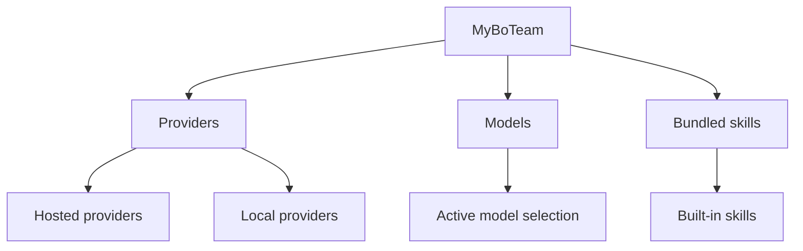
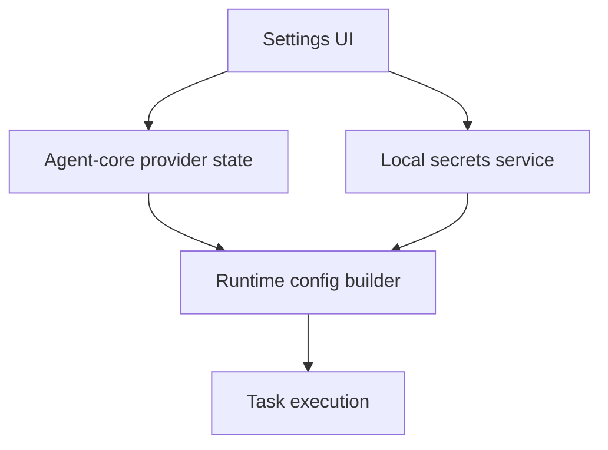

# Overview: Agent Configuration

**Feature Area**: Agent Configuration
**PDRs Referenced**: PDR-001, PDR-003, PDR-008
**Generated**: 2026-06-10
**Section Number**: 2 (in final PRD)

---

## 2. Overview

**Purpose**: Describe how MyBoTeam exposes provider, model, and skill configuration without making advanced setup the product's first impression.

### 2.1 Product Description

Agent Configuration is the layer that lets MyBoTeam operate as a provider-neutral assistant instead of a single-vendor shell. It covers provider connection, model selection, bundled skill access, and the boundary between mainstream defaults and advanced control.

### 2.2 Purpose

This area exists so users can choose or change AI backends while preserving the product's local-first and extensible posture. It must support advanced capability without forcing technical setup too early in the journey.

### 2.3 Scope

**In Scope:**

- Provider selection and credential flow for supported hosted or local models.
- Model selection and provider state display.
- Bundled-skill configuration as a guided product capability.

**Out of Scope:**

- A zero-backend hosted MyBoTeam service that hides provider choice entirely.
- An open marketplace-first plugin ecosystem as the current main surface.

---

**PDR Traceability:**

| PDR | Category | Impact on Overview |
|-----|----------|-------------------|
| PDR-001 | Positioning | Agent language remains visible but simple. |
| PDR-003 | Product Capability | Defines provider-neutral AI gateway behavior. |
| PDR-008 | Business Model | Keeps current scope on free built-in value, not paid catalogs. |

### 2.4 Feature Hierarchy

### 2.5 Architecture Overview

**Architecture Notes**:
- Provider metadata and selected-model state live in local product data.
- Secrets are isolated from normal UI state.
- Runtime configuration is assembled per task from the active settings.

### 2.6 Cross-Area Interactions

| Feature Area A | Feature Area B | Interaction Type | Description |
|----------------|----------------|------------------|-------------|
| Agent Configuration | Task Orchestration | Runtime context | Tasks inherit provider and model choices. |
| Agent Configuration | Local Privacy and Data Ownership | Secret boundary | Credentials are stored locally with explicit control. |
| Agent Configuration | Connectors and Automation Tools | Capability routing | Skill and tool availability depends on configured runtime context. |
