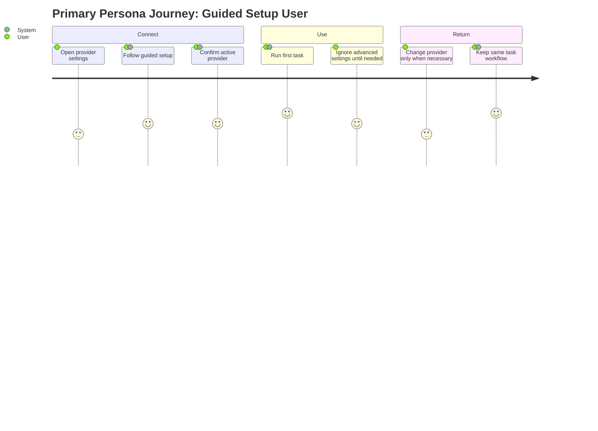

# Personas: Agent Configuration

**Feature Area**: Agent Configuration
**PDRs Referenced**: PDR-001, PDR-003
**Generated**: 2026-06-10
**Dependencies**: Problem

---

## 6. Personas

**Purpose**: Define the users affected most by provider and model setup.

### 6.1 Primary Persona

**Name**: Guided Setup User

| Attribute | Description |
|-----------|-------------|
| **Role** | Mainstream user connecting AI capability for the first time |
| **Experience** | Low to medium familiarity with provider terms |
| **Goals** | Get connected once and move on to useful tasks |
| **Pain Points** | API keys, models, and provider names feel technical |
| **Needs** | Guided setup, clear defaults, and minimal repeated decisions |
| **Success Quote** | "Tell me what I need to connect, then get out of the way." |

**PDR Reference**: PDR-001, PDR-003

### 6.2 Secondary Persona

**Name**: Provider Optimizer

| Attribute | Description |
|-----------|-------------|
| **Role** | Advanced user comparing quality, cost, and privacy tradeoffs |
| **Experience** | Comfortable with provider and model choices |
| **Goals** | Choose the right model path for different tasks |
| **Pain Points** | Locked-down assistants prevent experimentation |
| **Needs** | Explicit configuration, model control, and stable runtime behavior |
| **Success Quote** | "I want flexibility without rebuilding the app around it." |

**PDR Reference**: PDR-003

### 6.3 Anti-Personas (Who This Is NOT For)

| Anti-Persona | Why Not Targeted |
|--------------|------------------|
| User expecting zero provider decisions with a MyBoTeam-hosted backend | That is not the current product architecture. |
| Marketplace plugin builder as the main current user | Marketplace-first scope is still roadmap only. |

---

**PDR Traceability:**

| PDR | Decision | Impact on Personas |
|-----|----------|-------------------|
| PDR-001 | Simple-user positioning | Defines the mainstream setup persona. |
| PDR-003 | Provider neutrality | Defines the advanced flexibility persona. |

### 6.4 User Journey Visualization

