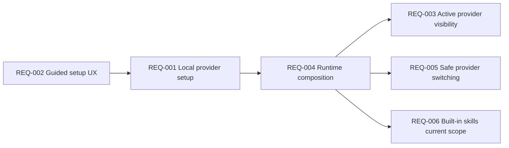
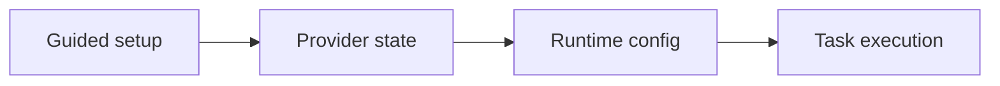
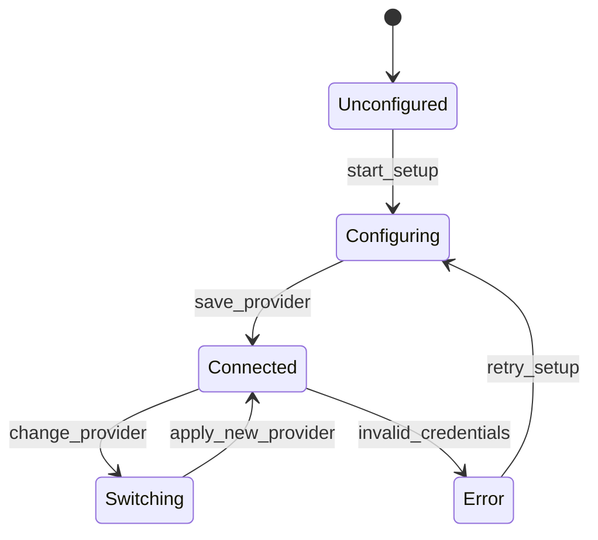

# Functional Requirements: Agent Configuration

**Feature Area**: Agent Configuration
**PDRs Referenced**: PDR-001, PDR-003, PDR-008
**Generated**: 2026-06-10
**Dependencies**: Personas, Goals
**Section Number**: 7 (in final PRD)

---

## 7. Functional Requirements

**Purpose**: Define what the product must do to support provider-neutral AI configuration for simple and advanced users.

### 7.1 User Stories

| ID | Story | Persona | Priority | PDR |
|----|-------|---------|----------|-----|
| US-001 | As a Guided Setup User, I want a clear provider connection flow so that I can get to useful tasks quickly. | Guided Setup User | Must | PDR-001, PDR-003 |
| US-002 | As a Provider Optimizer, I want to select models and providers explicitly so that I can tune cost, quality, or privacy. | Provider Optimizer | Must | PDR-003 |
| US-003 | As a Guided Setup User, I want advanced options hidden until needed so that setup stays simple. | Guided Setup User | Should | PDR-001 |

### 7.2 Feature Requirements

#### Feature 1: Guided Provider Setup

**Description:** The product must let users connect a supported provider through a guided flow that preserves explicit control without front-loading unnecessary complexity.

**Requirements:**

- **REQ-001:** The system must support connecting a provider and storing the resulting configuration locally. Traced to PDR-003.
- **REQ-002:** The system must present provider setup in user-friendly language with advanced options deferred when possible. Traced to PDR-001 and PDR-003.
- **REQ-003:** The system must show the currently active provider and model clearly in settings and runtime-adjacent surfaces. Traced to PDR-003.

**Acceptance Criteria:**

- [ ] A user can complete provider setup without editing raw config files.
- [ ] A configured provider appears as active in product settings.
- [ ] A user can understand which provider and model will back their tasks.

#### Feature 2: Stable Runtime Selection

**Description:** The product must apply selected provider and model settings consistently across task execution.

**Requirements:**

- **REQ-004:** The system must compose runtime configuration from persisted provider, model, and related settings. Traced to PDR-003.
- **REQ-005:** The system must allow changing the active provider or model without corrupting existing task history. Traced to PDR-003.
- **REQ-006:** The system must keep current scope focused on built-in skills rather than requiring a marketplace path. Traced to PDR-008.

**Acceptance Criteria:**

- [ ] Changing provider settings affects future task execution predictably.
- [ ] Existing task records remain readable after provider changes.
- [ ] Built-in skills remain usable without marketplace dependencies.

### 7.3 Requirements Priority Matrix

| Priority | Count | Description |
|----------|-------|-------------|
| Must | 5 | Required for a usable provider-neutral product |
| Should | 1 | Important for guided mainstream UX |
| Could | 0 | Deferred |
| Won't | 2 | Hosted MyBoTeam backend and marketplace-first setup are out of scope |

---

**PDR Traceability:**

| PDR | Decision | Impact on Requirements |
|-----|----------|------------------------|
| PDR-001 | Simple-user positioning | Requires guided setup and restrained advanced exposure. |
| PDR-003 | Provider-neutral gateway | Drives local provider, model, and runtime configuration requirements. |
| PDR-008 | Free core now | Keeps built-in skills current and marketplace scope deferred. |

### 7.4 Requirement Dependencies

### 7.5 Feature Dependencies

### 7.6 State Transitions

