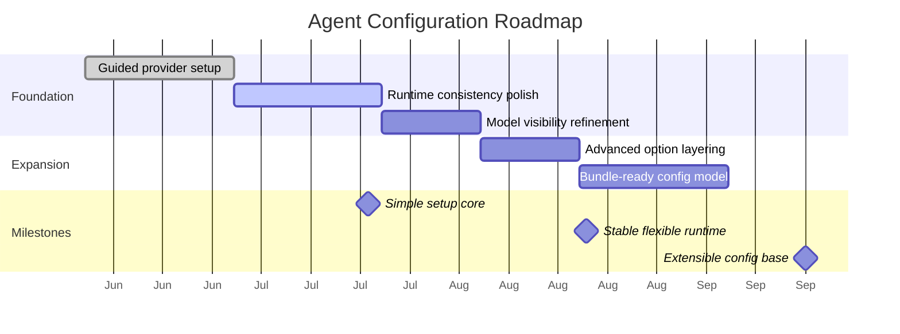

# Roadmap & Milestones: Agent Configuration

**Feature Area**: Agent Configuration
**PDRs Referenced**: PDR-001, PDR-003, PDR-008
**Generated**: 2026-06-10
**Dependencies**: Requirements, Metrics

---

## 11. Roadmap & Milestones

**Purpose**: Sequence provider configuration improvements in a user-first order.

### 11.1 Roadmap Overview

### 11.2 Milestone 1: Simple Setup Core - 2026-07-20

**Demo Sentence:** "After this milestone, the user can connect a provider in guided mode and see which model will power tasks."

**Status:** Planned

**Release Goal:** Reduce first-run configuration friction.

| Feature | Priority | Demo Sentence | Dependencies |
|---------|----------|---------------|--------------|
| Guided provider setup | Must | "user can connect a provider without raw config editing" | None |
| Active provider visibility | Must | "user can tell what model and provider are active" | Guided provider setup |

**Success Criteria:**

| Metric | Target | Measurement |
|--------|--------|-------------|
| Setup completion | Improved | Activation review |
| First task after setup | Improved | Product review |

**PDR Reference:** PDR-001, PDR-003

### 11.3 Milestone 2: Stable Flexible Runtime - 2026-08-20

**Demo Sentence:** "After this milestone, the user can change provider settings without breaking task execution."

**Status:** Planned

**Release Goal:** Make runtime configuration predictable and safe.

| Feature | Priority | Demo Sentence | Dependencies |
|---------|----------|---------------|--------------|
| Runtime composition stability | Must | "user can rely on selected provider settings" | Milestone 1 |
| Safe provider/model switching | Should | "user can change providers without losing task history" | Milestone 1 |

**Features Deferred from Previous:**

- Deeper advanced configuration polish

**Success Criteria:**

| Metric | Target | Measurement |
|--------|--------|-------------|
| Switching reliability | Improved | Quality review |
| Support burden | Reduced | Support and product review |

**PDR Reference:** PDR-003

### 11.4 Milestone 3: Extensible Config Base - 2026-09-20

**Demo Sentence:** "After this milestone, the configuration layer can support future curated bundle growth without changing the core setup model."

**Status:** Planned

**Release Goal:** Prepare the configuration base for future expansion.

| Feature | Priority | Demo Sentence | Dependencies |
|---------|----------|---------------|--------------|
| Bundle-ready configuration model | Must | "future capabilities can attach to the same configuration base" | Milestone 2 |

**PDR Reference:** PDR-008

### 11.5 Milestones Traced to PDRs

| Milestone | PDR | Target Date | Status |
|-----------|-----|-------------|--------|
| Simple Setup Core | PDR-001, PDR-003 | 2026-07-20 | Planned |
| Stable Flexible Runtime | PDR-003 | 2026-08-20 | Planned |
| Extensible Config Base | PDR-008 | 2026-09-20 | Planned |

---

**PDR Traceability:**

| PDR | Decision | Impact on Roadmap |
|-----|----------|-------------------|
| PDR-001 | Mainstream user focus | Setup simplification must come first. |
| PDR-003 | Provider neutrality | Runtime consistency is the central technical milestone. |
| PDR-008 | Future bundles later | Extensibility comes after core stability. |
