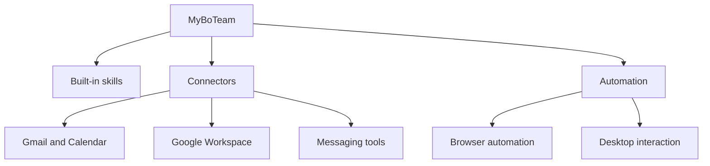
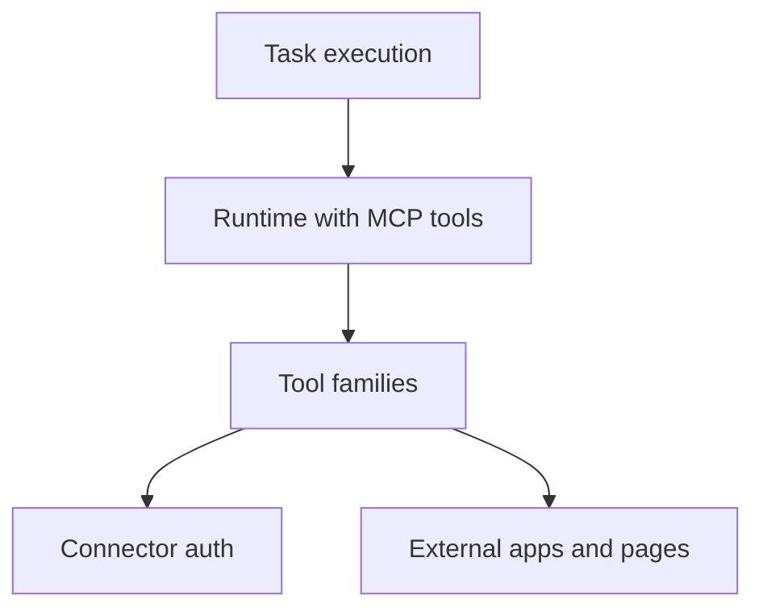

# Overview: Connectors and Automation Tools

**Feature Area**: Connectors and Automation Tools
**PDRs Referenced**: PDR-001, PDR-004, PDR-007, PDR-008
**Generated**: 2026-06-10
**Section Number**: 2 (in final PRD)

---

## 2. Overview

**Purpose**: Describe the capability layer that lets MyBoTeam go beyond text generation into useful work across external tools and interfaces.

### 2.1 Product Description

This area covers built-in skills, MCP tools, connectors, and browser or desktop automation surfaces that let agents act in the world instead of only responding in text.

### 2.2 Purpose

It exists to make MyBoTeam materially more useful than a chat-only assistant while still keeping mainstream UX focused on outcomes rather than tool mechanics.

### 2.3 Scope

**In Scope:**

- Built-in skills that ship with the app.
- First-party connector families such as Gmail, Calendar, Google Workspace, WhatsApp, and browser automation.
- Outcome-first use of connector and automation capabilities during tasks.

**Out of Scope:**

- A user-facing open marketplace as the current main discovery surface.
- Product messaging that requires users to understand MCP internals before using the product.

---

**PDR Traceability:**

| PDR | Category | Impact on Overview |
|-----|----------|-------------------|
| PDR-001 | Positioning | Capabilities must remain understandable to simple users. |
| PDR-004 | Product Capability | Defines skills, MCP tools, and connectors as extensibility primitives. |
| PDR-007 | Differentiation | Defines browser and desktop automation as a core wedge. |
| PDR-008 | Business Model | Keeps current scope on built-in value rather than commercial catalogs. |

### 2.4 Feature Hierarchy

### 2.5 Architecture Overview

**Architecture Notes**:
- Tool families are bundled or configured as first-party runtime capabilities.
- Connector auth is part of the task experience when needed.
- Automation should be framed by user outcomes, not implementation jargon.

### 2.6 Cross-Area Interactions

| Feature Area A | Feature Area B | Interaction Type | Description |
|----------------|----------------|------------------|-------------|
| Connectors and Automation Tools | Task Orchestration | Execution | Tasks invoke tools to complete outcomes. |
| Connectors and Automation Tools | Agent Configuration | Capability setup | Skills and provider context shape available execution paths. |
| Connectors and Automation Tools | Local Privacy and Data Ownership | Trust boundary | Connector auth and automation must respect local-first expectations. |
