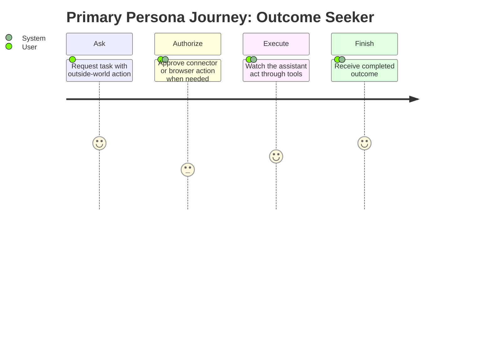

# Personas: Connectors and Automation Tools

**Feature Area**: Connectors and Automation Tools
**PDRs Referenced**: PDR-001, PDR-004, PDR-007
**Generated**: 2026-06-10
**Dependencies**: Problem

---

## 6. Personas

**Purpose**: Define who benefits most from action-oriented built-in capabilities.

### 6.1 Primary Persona

**Name**: Outcome Seeker

| Attribute | Description |
|-----------|-------------|
| **Role** | Everyday user trying to get real work done across apps |
| **Experience** | Low awareness of automation internals |
| **Goals** | Have the assistant actually perform useful steps |
| **Pain Points** | Chat answers still leave manual work behind |
| **Needs** | Outcome-first execution and clear approvals when needed |
| **Success Quote** | "Don't just tell me what to do. Help do it." |

**PDR Reference**: PDR-001, PDR-007

### 6.2 Secondary Persona

**Name**: Capability Reuser

| Attribute | Description |
|-----------|-------------|
| **Role** | User who repeatedly relies on built-in tools and connectors |
| **Experience** | Comfortable authorizing connectors and repeated flows |
| **Goals** | Reuse built-in capabilities across recurring tasks |
| **Pain Points** | Repeating the same browser or connector work manually |
| **Needs** | Stable connector auth, repeatable tool behavior, and strong task continuity |
| **Success Quote** | "If this worked once, I want to use it again without rebuilding it." |

**PDR Reference**: PDR-004, PDR-007

### 6.3 Anti-Personas (Who This Is NOT For)

| Anti-Persona | Why Not Targeted |
|--------------|------------------|
| User expecting a raw marketplace catalog as the main product | Current scope emphasizes built-in capabilities first. |
| User who wants invisible unrestricted automation by default | Trust and approvals remain part of the product posture. |

---

**PDR Traceability:**

| PDR | Decision | Impact on Personas |
|-----|----------|-------------------|
| PDR-001 | Simple-user positioning | Keeps the primary persona outcome-focused. |
| PDR-004 | Built-in extensibility | Defines the repeat-use persona. |
| PDR-007 | Automation differentiation | Makes action capability central to persona value. |

### 6.4 User Journey Visualization

