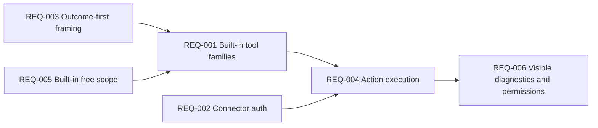
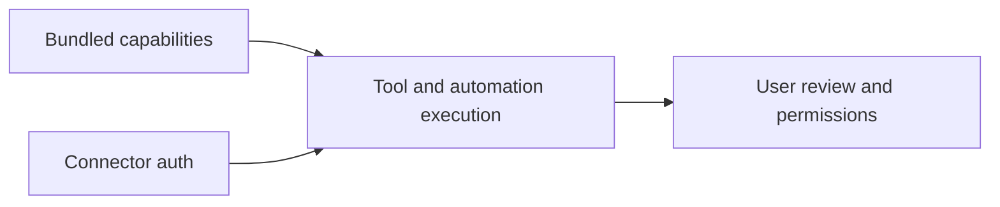
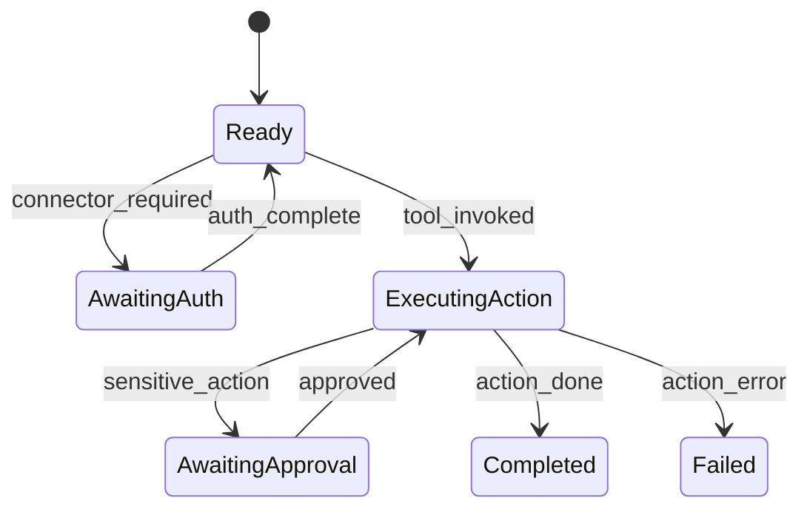

# Functional Requirements: Connectors and Automation Tools

**Feature Area**: Connectors and Automation Tools
**PDRs Referenced**: PDR-004, PDR-007, PDR-008
**Generated**: 2026-06-10
**Dependencies**: Personas, Goals
**Section Number**: 7 (in final PRD)

---

## 7. Functional Requirements

**Purpose**: Define what the product must do to offer real action capability through built-in tools.

### 7.1 User Stories

| ID | Story | Persona | Priority | PDR |
|----|-------|---------|----------|-----|
| US-001 | As an Outcome Seeker, I want the assistant to use built-in tools so that tasks can be completed, not just suggested. | Outcome Seeker | Must | PDR-004, PDR-007 |
| US-002 | As an Outcome Seeker, I want clear approval points for sensitive connector or browser actions so that I can trust the automation. | Outcome Seeker | Must | PDR-007 |
| US-003 | As a Capability Reuser, I want built-in capabilities to remain available without a marketplace dependency so that I can reuse them immediately. | Capability Reuser | Should | PDR-004, PDR-008 |

### 7.2 Feature Requirements

#### Feature 1: Built-in Tool Families

**Description:** The product must ship with first-party skills, connectors, and automation capabilities that tasks can invoke directly.

**Requirements:**

- **REQ-001:** The system must expose built-in capability families such as skills, connector tools, and browser automation to task execution. Traced to PDR-004.
- **REQ-002:** The system must support connector-auth flows when external access is required. Traced to PDR-004 and PDR-007.
- **REQ-003:** The system must frame these capabilities through user outcomes instead of requiring raw tool discovery first. Traced to PDR-001 and PDR-007.

**Acceptance Criteria:**

- [ ] A task can invoke built-in capability families when relevant.
- [ ] Connector auth is requested when needed before tool execution continues.
- [ ] Users can benefit from capabilities without navigating a marketplace or raw tool registry first.

#### Feature 2: Action-Oriented Execution

**Description:** The product must support supervised browser or connector actions that improve task completion rates.

**Requirements:**

- **REQ-004:** The system must support browser or desktop-oriented actions as part of task execution where built-in tools enable them. Traced to PDR-007.
- **REQ-005:** The system must keep built-in free capabilities as the current shipped scope. Traced to PDR-004 and PDR-008.
- **REQ-006:** The system must preserve diagnostics and permission visibility for action-capable flows. Traced to PDR-007.

**Acceptance Criteria:**

- [ ] Action-enabled tasks can complete work beyond text generation alone.
- [ ] Built-in capabilities are usable without marketplace setup.
- [ ] Permission and progress states remain visible for sensitive actions.

### 7.3 Requirements Priority Matrix

| Priority | Count | Description |
|----------|-------|-------------|
| Must | 5 | Critical to action-oriented product value |
| Should | 1 | Important for immediate reuse |
| Could | 0 | Deferred |
| Won't | 2 | Marketplace-first discovery and unrestricted default automation are excluded |

---

**PDR Traceability:**

| PDR | Decision | Impact on Requirements |
|-----|----------|------------------------|
| PDR-004 | Skills, MCP tools, connectors as primitives | Defines built-in capability requirements. |
| PDR-007 | Automation differentiation | Requires real action support and supervision. |
| PDR-008 | Marketplace later | Keeps current scope on built-in capabilities. |

### 7.4 Requirement Dependencies

### 7.5 Feature Dependencies

### 7.6 State Transitions

