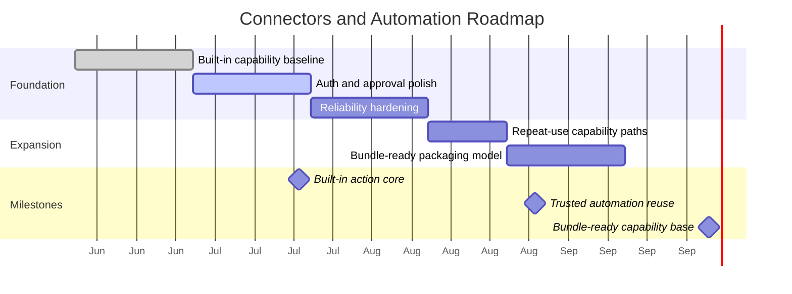

# Roadmap & Milestones: Connectors and Automation Tools

**Feature Area**: Connectors and Automation Tools
**PDRs Referenced**: PDR-004, PDR-007, PDR-008
**Generated**: 2026-06-10
**Dependencies**: Requirements, Metrics

---

## 11. Roadmap & Milestones

**Purpose**: Sequence built-in capability work in a trust-first order.

### 11.1 Roadmap Overview

### 11.2 Milestone 1: Built-in Action Core - 2026-07-20

**Demo Sentence:** "After this milestone, the user can complete tasks that rely on shipped connector or automation capabilities."

**Status:** Planned

**Release Goal:** Establish dependable built-in action value.

| Feature | Priority | Demo Sentence | Dependencies |
|---------|----------|---------------|--------------|
| Built-in capability baseline | Must | "user can complete a task using shipped capabilities" | None |
| Auth and approval polish | Must | "user can authorize access safely when needed" | Built-in capability baseline |

**Success Criteria:**

| Metric | Target | Measurement |
|--------|--------|-------------|
| Action-enabled completion | Improved | Product review |
| Auth success clarity | Improved | UX review |

**PDR Reference:** PDR-004, PDR-007

### 11.3 Milestone 2: Trusted Automation Reuse - 2026-08-31

**Demo Sentence:** "After this milestone, the user can return to action-heavy tasks with more confidence and less friction."

**Status:** Planned

**Release Goal:** Improve reliability and repeat use.

| Feature | Priority | Demo Sentence | Dependencies |
|---------|----------|---------------|--------------|
| Reliability hardening | Must | "user sees fewer action failures" | Milestone 1 |
| Repeat-use capability paths | Should | "user can reuse successful capability flows" | Milestone 1 |

**Features Deferred from Previous:**

- Marketplace-style discovery surfaces

**Success Criteria:**

| Metric | Target | Measurement |
|--------|--------|-------------|
| Repeat automation use | Improved | Retention review |
| Trust after automation tasks | Improved | Product review |

**PDR Reference:** PDR-007

### 11.4 Milestone 3: Bundle-Ready Capability Base - 2026-10-01

**Demo Sentence:** "After this milestone, built-in capabilities can support future curated packaging without redefining the core user experience."

**Status:** Planned

**Release Goal:** Prepare for future bundle distribution while keeping the present core built-in.

| Feature | Priority | Demo Sentence | Dependencies |
|---------|----------|---------------|--------------|
| Bundle-ready capability packaging model | Must | "future bundles can build on current capability families" | Milestone 2 |

**PDR Reference:** PDR-008

### 11.5 Milestones Traced to PDRs

| Milestone | PDR | Target Date | Status |
|-----------|-----|-------------|--------|
| Built-in Action Core | PDR-004, PDR-007 | 2026-07-20 | Planned |
| Trusted Automation Reuse | PDR-007 | 2026-08-31 | Planned |
| Bundle-Ready Capability Base | PDR-008 | 2026-10-01 | Planned |

---

**PDR Traceability:**

| PDR | Decision | Impact on Roadmap |
|-----|----------|-------------------|
| PDR-004 | Built-in capability focus | Current value ships before marketplace work. |
| PDR-007 | Automation differentiation | Trust and reliability milestones come early. |
| PDR-008 | Future bundles | Packaging work comes later. |
