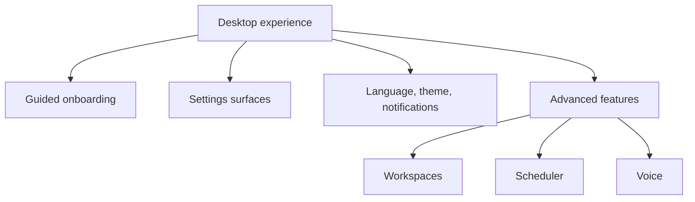
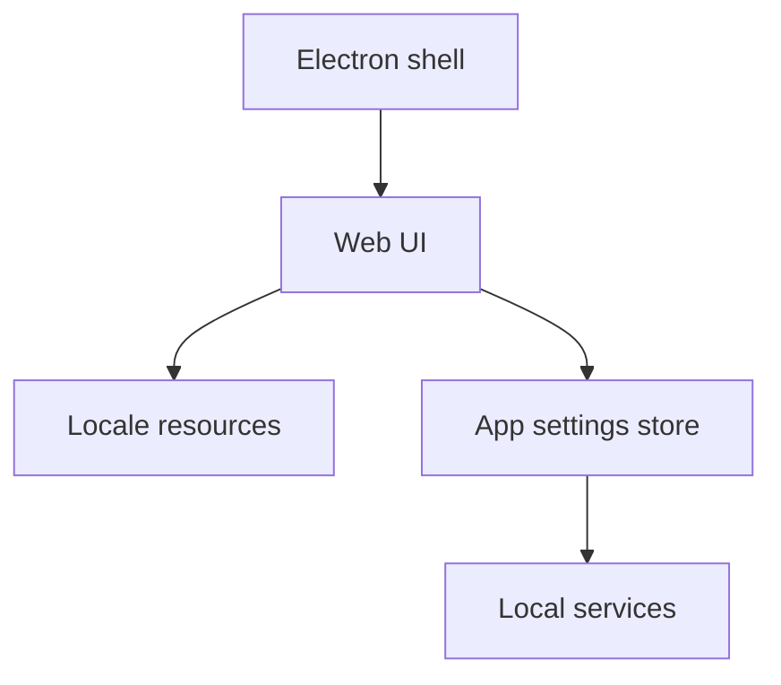

# Overview: Desktop Experience

**Feature Area**: Desktop Experience
**PDRs Referenced**: PDR-001, PDR-008, PDR-009
**Generated**: 2026-06-10
**Section Number**: 2 (in final PRD)

---

## 2. Overview

**Purpose**: Describe the desktop product shell and guided simple mode that users actually live inside.

### 2.1 Product Description

Desktop Experience covers the app shell, settings surfaces, onboarding posture, internationalization, themes, workspaces, scheduler, and other configurable product layers that shape the day-to-day feel of MyBoTeam.

### 2.2 Purpose

This area exists to make a powerful desktop automation product approachable for mainstream users while still serving advanced users through deeper settings and configuration.

### 2.3 Scope

**In Scope:**

- Guided simple-mode onboarding.
- Desktop shell with settings for providers, skills, browsers, integrations, scheduler, voice, language, and themes.
- Current locale support aligned with the shipped locale set.

**Out of Scope:**

- Treating workspaces, scheduler, or voice as first-run pillars.
- Claiming Hebrew or RTL as current shipped support.

---

**PDR Traceability:**

| PDR | Category | Impact on Overview |
|-----|----------|-------------------|
| PDR-001 | Positioning | Product language stays simple-user friendly. |
| PDR-009 | User Experience | Defines the configurable desktop control center. |
| PDR-008 | Business Model | Keeps current scope focused on the free core surface. |

### 2.4 Feature Hierarchy

### 2.5 Architecture Overview

**Architecture Notes**:
- The desktop shell packages the web UI and local services into one product container.
- Settings-heavy flexibility must be balanced against guided mainstream onboarding.
- Locale claims should follow shipped product evidence, not roadmap ambition.

### 2.6 Cross-Area Interactions

| Feature Area A | Feature Area B | Interaction Type | Description |
|----------------|----------------|------------------|-------------|
| Desktop Experience | Task Orchestration | Entry and continuity | The desktop shell hosts the task-first workflow. |
| Desktop Experience | Agent Configuration | Settings | Provider and skill setup live inside the desktop product surface. |
| Desktop Experience | Local Privacy and Data Ownership | Trust presentation | The product shell is where local-first behavior is communicated. |
