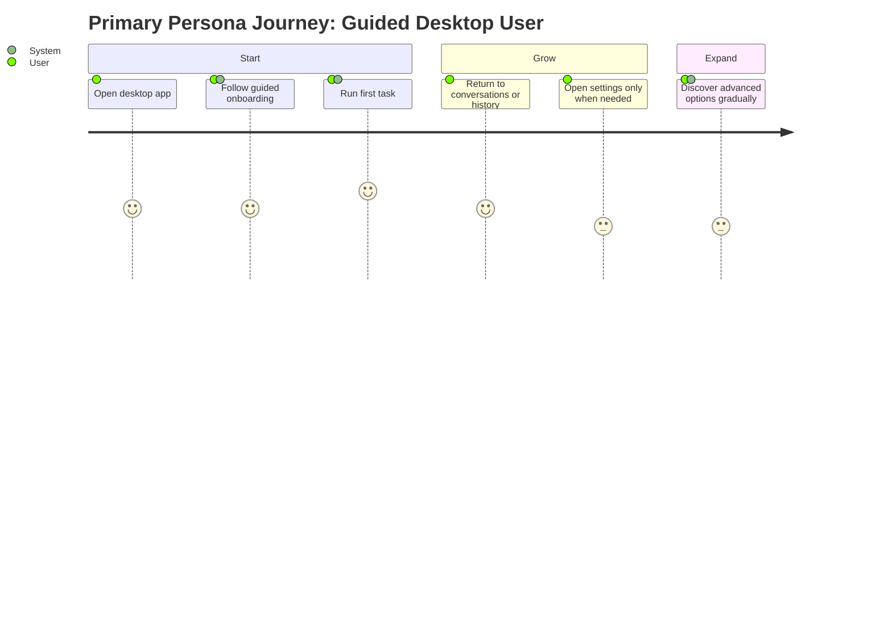

# Personas: Desktop Experience

**Feature Area**: Desktop Experience
**PDRs Referenced**: PDR-001, PDR-009
**Generated**: 2026-06-10
**Dependencies**: Problem

---

## 6. Personas

**Purpose**: Define who the desktop shell must serve.

### 6.1 Primary Persona

**Name**: Guided Desktop User

| Attribute | Description |
|-----------|-------------|
| **Role** | Mainstream desktop user new to a powerful assistant app |
| **Experience** | Comfortable with apps, not eager to explore complex settings first |
| **Goals** | Reach a useful first task quickly |
| **Pain Points** | Too many settings can feel like setup debt |
| **Needs** | Guided onboarding, clear defaults, and progressive disclosure |
| **Success Quote** | "Let me get value before you show me everything." |

**PDR Reference**: PDR-001, PDR-009

### 6.2 Secondary Persona

**Name**: Configurable Desktop User

| Attribute | Description |
|-----------|-------------|
| **Role** | Returning or advanced user who wants more control |
| **Experience** | Comfortable exploring settings and advanced features |
| **Goals** | Tailor providers, integrations, workspaces, or preferences over time |
| **Pain Points** | Over-simplified products hide needed controls |
| **Needs** | Deeper settings without losing product cohesion |
| **Success Quote** | "Keep the basics easy, but don't wall off the deeper controls." |

**PDR Reference**: PDR-009

### 6.3 Anti-Personas (Who This Is NOT For)

| Anti-Persona | Why Not Targeted |
|--------------|------------------|
| User expecting workspaces, scheduler, and voice to dominate first run | Those are advanced or secondary surfaces today. |
| User expecting unsupported locales or RTL to be fully shipped already | That is roadmap, not current reality. |

---

**PDR Traceability:**

| PDR | Decision | Impact on Personas |
|-----|----------|-------------------|
| PDR-009 | Guided simple-mode onboarding | Defines the primary persona. |
| PDR-001 | Broad simple-user audience | Keeps the desktop shell mainstream-friendly. |

### 6.4 User Journey Visualization

