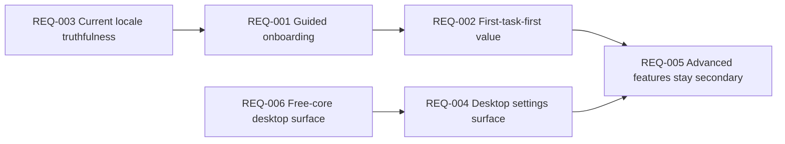
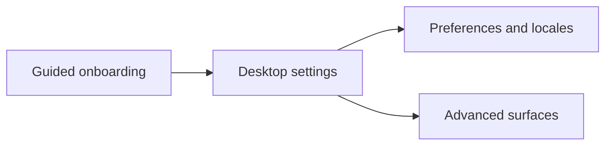
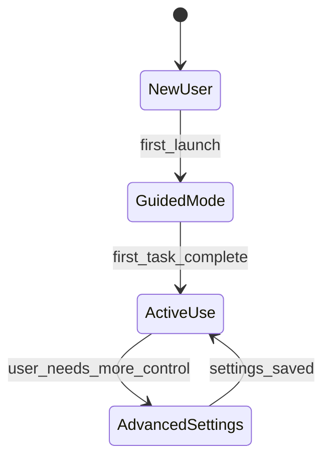

# Functional Requirements: Desktop Experience

**Feature Area**: Desktop Experience
**PDRs Referenced**: PDR-001, PDR-008, PDR-009
**Generated**: 2026-06-10
**Dependencies**: Personas, Goals
**Section Number**: 7 (in final PRD)

---

## 7. Functional Requirements

**Purpose**: Define what the desktop product surface must do for mainstream and advanced users.

### 7.1 User Stories

| ID | Story | Persona | Priority | PDR |
|----|-------|---------|----------|-----|
| US-001 | As a Guided Desktop User, I want a simple onboarding path so that I can reach a useful first task quickly. | Guided Desktop User | Must | PDR-001, PDR-009 |
| US-002 | As a Configurable Desktop User, I want settings for deeper control so that I can customize the product over time. | Configurable Desktop User | Must | PDR-009 |
| US-003 | As a Guided Desktop User, I want advanced surfaces revealed progressively so that the product does not feel overwhelming. | Guided Desktop User | Should | PDR-009 |

### 7.2 Feature Requirements

#### Feature 1: Guided Mainstream Desktop UX

**Description:** The product must prioritize a clear first-run path centered on useful work rather than full settings exposure.

**Requirements:**

- **REQ-001:** The system must provide a guided simple-mode onboarding path for new users. Traced to PDR-009.
- **REQ-002:** The system must prioritize first-task value over immediate exposure to advanced settings. Traced to PDR-001 and PDR-009.
- **REQ-003:** The system must keep current locale support aligned with the shipped locale set and treat Hebrew/RTL as roadmap scope. Traced to PDR-009.

**Acceptance Criteria:**

- [ ] New users can begin useful work before navigating the full settings surface.
- [ ] Advanced settings are present but not required for initial value.
- [ ] Product claims about locales reflect current shipped support.

#### Feature 2: Progressive Advanced Control

**Description:** The product must preserve advanced configurability without letting it dominate mainstream usage.

**Requirements:**

- **REQ-004:** The system must expose settings for providers, skills, browsers, integrations, and preferences inside the desktop shell. Traced to PDR-009.
- **REQ-005:** The system must treat workspaces, scheduler management, and voice as advanced or secondary surfaces in current scope. Traced to PDR-009.
- **REQ-006:** The current free core must remain the primary desktop product surface while future premium expansion stays roadmap-scoped. Traced to PDR-008.

**Acceptance Criteria:**

- [ ] Advanced users can reach deeper configuration without leaving the main desktop product.
- [ ] Workspaces and scheduler management do not dominate the first-run journey.
- [ ] Current product value is not gated behind future commercial surfaces.

### 7.3 Requirements Priority Matrix

| Priority | Count | Description |
|----------|-------|-------------|
| Must | 5 | Required for a usable desktop product posture |
| Should | 1 | Important for progressive disclosure |
| Could | 0 | Deferred |
| Won't | 2 | RTL-as-current and advanced-surface-first onboarding are excluded |

---

**PDR Traceability:**

| PDR | Decision | Impact on Requirements |
|-----|----------|------------------------|
| PDR-009 | Configurable internationalized desktop UX | Defines settings, onboarding, and locale scope. |
| PDR-001 | Broad simple-user audience | Requires first-task-first onboarding. |
| PDR-008 | Free core current scope | Keeps future paid surfaces out of the current shell. |

### 7.4 Requirement Dependencies

### 7.5 Feature Dependencies

### 7.6 State Transitions

