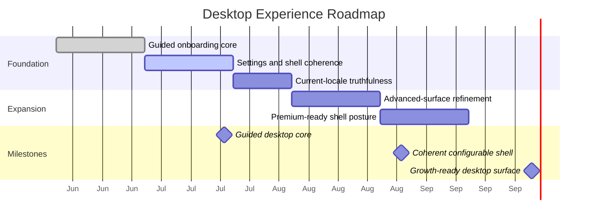

# Roadmap & Milestones: Desktop Experience

**Feature Area**: Desktop Experience
**PDRs Referenced**: PDR-001, PDR-008, PDR-009
**Generated**: 2026-06-10
**Dependencies**: Requirements, Metrics

---

## 11. Roadmap & Milestones

**Purpose**: Sequence onboarding, shell polish, and advanced-surface work.

### 11.1 Roadmap Overview

### 11.2 Milestone 1: Guided Desktop Core - 2026-07-20

**Demo Sentence:** "After this milestone, the user can install the desktop app, complete guided onboarding, and run a useful first task."

**Status:** Planned

**Release Goal:** Establish a mainstream-friendly first-run experience.

| Feature | Priority | Demo Sentence | Dependencies |
|---------|----------|---------------|--------------|
| Guided onboarding core | Must | "user can reach useful work without opening every setting" | None |
| Current-locale truthfulness | Must | "user sees only current shipped locale claims" | Guided onboarding core |

**Success Criteria:**

| Metric | Target | Measurement |
|--------|--------|-------------|
| First-task completion | Improved | Product review |
| Onboarding completion | Improved | Activation review |

**PDR Reference:** PDR-001, PDR-009

### 11.3 Milestone 2: Coherent Configurable Shell - 2026-08-31

**Demo Sentence:** "After this milestone, the user can access deeper settings without the app feeling cluttered."

**Status:** Planned

**Release Goal:** Improve settings breadth without losing coherence.

| Feature | Priority | Demo Sentence | Dependencies |
|---------|----------|---------------|--------------|
| Settings and shell coherence | Must | "user can find deeper controls without getting lost" | Milestone 1 |
| Advanced-surface refinement | Should | "advanced features feel available but not dominant" | Milestone 1 |

**Features Deferred from Previous:**

- Voice-first onboarding

**Success Criteria:**

| Metric | Target | Measurement |
|--------|--------|-------------|
| Settings confusion | Reduced | Support and product review |
| Advanced adoption | Improved without harming first-task completion | Roadmap review |

**PDR Reference:** PDR-009

### 11.4 Milestone 3: Growth-Ready Desktop Surface - 2026-10-01

**Demo Sentence:** "After this milestone, the desktop shell can support future premium growth without sacrificing current free-core usability."

**Status:** Planned

**Release Goal:** Keep the shell ready for future business expansion.

| Feature | Priority | Demo Sentence | Dependencies |
|---------|----------|---------------|--------------|
| Premium-ready shell posture | Must | "future premium surfaces can layer on without breaking the core UX" | Milestone 2 |

**PDR Reference:** PDR-008

### 11.5 Milestones Traced to PDRs

| Milestone | PDR | Target Date | Status |
|-----------|-----|-------------|--------|
| Guided Desktop Core | PDR-001, PDR-009 | 2026-07-20 | Planned |
| Coherent Configurable Shell | PDR-009 | 2026-08-31 | Planned |
| Growth-Ready Desktop Surface | PDR-008 | 2026-10-01 | Planned |

---

**PDR Traceability:**

| PDR | Decision | Impact on Roadmap |
|-----|----------|-------------------|
| PDR-009 | Guided configurable desktop UX | Drives first two milestones. |
| PDR-001 | Mainstream audience | Keeps first-run focus narrow. |
| PDR-008 | Future bundles later | Shapes long-term shell posture. |
