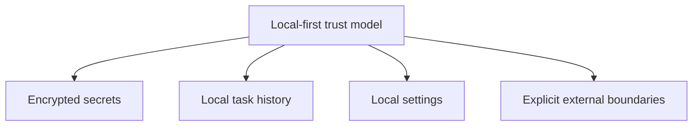
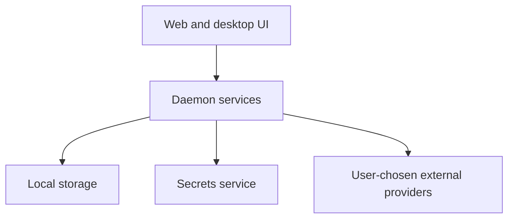

# Overview: Local Privacy and Data Ownership

**Feature Area**: Local Privacy and Data Ownership
**PDRs Referenced**: PDR-001, PDR-005, PDR-008
**Generated**: 2026-06-10
**Section Number**: 2 (in final PRD)

---

## 2. Overview

**Purpose**: Describe the local-first trust model that underpins MyBoTeam.

### 2.1 Product Description

This area covers the product promise that tasks, settings, credentials, and connector tokens stay under the user's local control unless the user explicitly configures an external provider or service.

### 2.2 Purpose

It exists because trust is a prerequisite for letting an assistant handle real work, credentials, and automation. Local-first operation is both a product differentiator and a practical boundary.

### 2.3 Scope

**In Scope:**

- Local storage of task history, settings, and secrets.
- Explicit external-provider and connector boundaries.
- Trust messaging that follows usefulness and simplicity.

**Out of Scope:**

- A hosted MyBoTeam backend as part of the current product.
- Automatic cloud sync of sensitive state by default.

---

**PDR Traceability:**

| PDR | Category | Impact on Overview |
|-----|----------|-------------------|
| PDR-001 | Positioning | Trust supports the personal AI workforce promise. |
| PDR-005 | Trust Model | Defines local-first data ownership. |
| PDR-008 | Business Model | Keeps current monetization away from hosted dependency. |

### 2.4 Feature Hierarchy

### 2.5 Architecture Overview

**Architecture Notes**:
- Local services own storage and secret handling.
- External providers are opt-in user connections, not product-default infrastructure.
- The product trust story depends on keeping these boundaries explicit.

### 2.6 Cross-Area Interactions

| Feature Area A | Feature Area B | Interaction Type | Description |
|----------------|----------------|------------------|-------------|
| Local Privacy and Data Ownership | Agent Configuration | Secret boundary | Provider credentials remain local. |
| Local Privacy and Data Ownership | Task Orchestration | Persistence | Task data remains user-owned and local. |
| Local Privacy and Data Ownership | Connectors and Automation Tools | External boundary | Connector auth and external actions require explicit user intent. |
