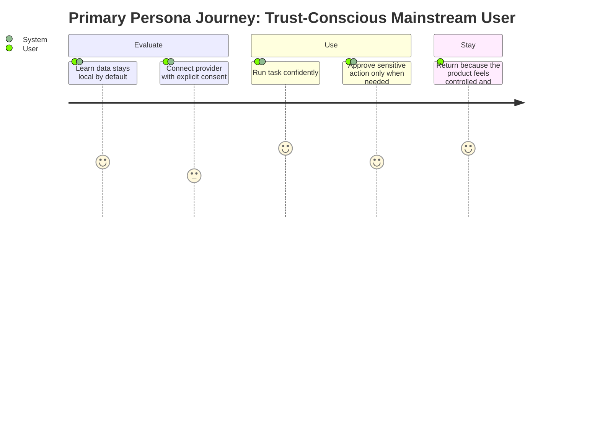

# Personas: Local Privacy and Data Ownership

**Feature Area**: Local Privacy and Data Ownership
**PDRs Referenced**: PDR-001, PDR-005
**Generated**: 2026-06-10
**Dependencies**: Problem

---

## 6. Personas

**Purpose**: Define who cares most about local trust boundaries.

### 6.1 Primary Persona

**Name**: Trust-Conscious Mainstream User

| Attribute | Description |
|-----------|-------------|
| **Role** | Mainstream desktop user who wants helpful AI without hidden service risk |
| **Experience** | Not deeply technical but sensitive to privacy and control |
| **Goals** | Use the product without worrying that data is silently leaving the device |
| **Pain Points** | Cloud AI products often feel opaque about storage and control |
| **Needs** | Practical trust signals, explicit approvals, and local control |
| **Success Quote** | "I want the help without feeling like I gave my data away." |

**PDR Reference**: PDR-001, PDR-005

### 6.2 Secondary Persona

**Name**: Ownership-Focused Power User

| Attribute | Description |
|-----------|-------------|
| **Role** | Advanced user who prefers local systems and explicit external boundaries |
| **Experience** | Comfortable with local models and provider tradeoffs |
| **Goals** | Preserve control over credentials, settings, and history |
| **Pain Points** | Hosted defaults create hidden dependencies |
| **Needs** | Clear architecture boundaries and user-owned state |
| **Success Quote** | "I want the assistant to work with my systems, not take custody of them." |

**PDR Reference**: PDR-005

### 6.3 Anti-Personas (Who This Is NOT For)

| Anti-Persona | Why Not Targeted |
|--------------|------------------|
| User who prefers a fully managed hosted assistant with no local responsibility | That is not the current product model. |
| Organization requiring immediate enterprise cloud administration features | Not current scope. |

---

**PDR Traceability:**

| PDR | Decision | Impact on Personas |
|-----|----------|-------------------|
| PDR-005 | Local-first ownership | Defines both personas. |
| PDR-001 | Simple-user positioning | Keeps the primary persona mainstream, not expert-only. |

### 6.4 User Journey Visualization

