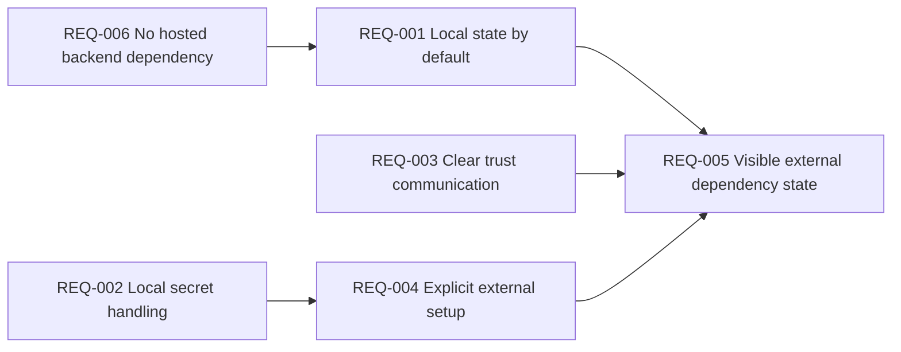
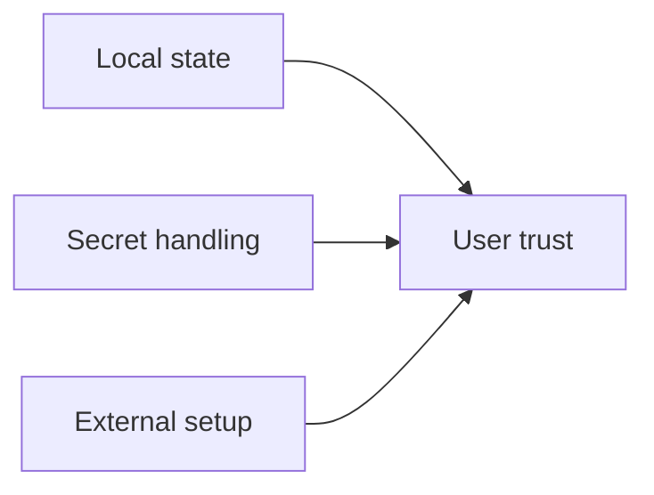
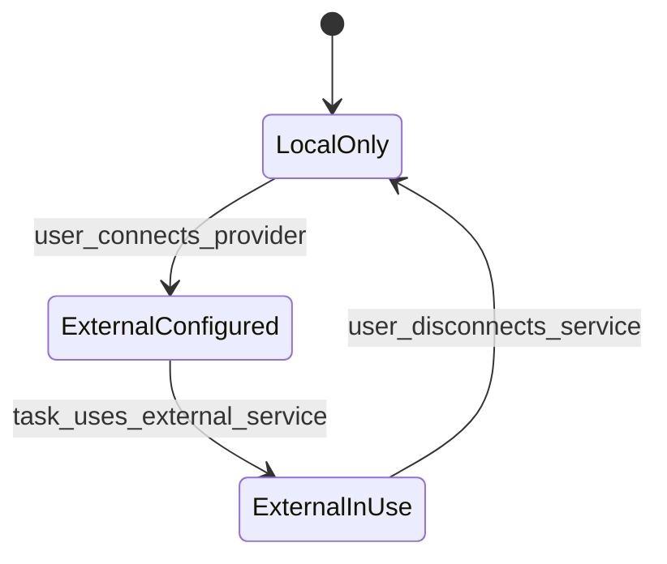

# Functional Requirements: Local Privacy and Data Ownership

**Feature Area**: Local Privacy and Data Ownership
**PDRs Referenced**: PDR-001, PDR-005, PDR-008
**Generated**: 2026-06-10
**Dependencies**: Personas, Goals
**Section Number**: 7 (in final PRD)

---

## 7. Functional Requirements

**Purpose**: Define what the product must do to preserve local ownership and explicit trust boundaries.

### 7.1 User Stories

| ID | Story | Persona | Priority | PDR |
|----|-------|---------|----------|-----|
| US-001 | As a Trust-Conscious Mainstream User, I want my data and credentials to stay local by default so that I can use the product with confidence. | Trust-Conscious Mainstream User | Must | PDR-005 |
| US-002 | As a Trust-Conscious Mainstream User, I want explicit prompts when external access is required so that I know what leaves my device. | Trust-Conscious Mainstream User | Must | PDR-005 |
| US-003 | As an Ownership-Focused Power User, I want clear boundaries between local state and external providers so that I can make informed tradeoffs. | Ownership-Focused Power User | Should | PDR-005, PDR-008 |

### 7.2 Feature Requirements

#### Feature 1: Local State Ownership

**Description:** The product must keep core state locally unless the user explicitly connects an external dependency.

**Requirements:**

- **REQ-001:** The system must store task history, settings, and related product state locally by default. Traced to PDR-005.
- **REQ-002:** The system must store secrets and connector tokens through local secret-handling paths. Traced to PDR-005.
- **REQ-003:** The system must communicate local-first behavior in user-understandable language. Traced to PDR-001 and PDR-005.

**Acceptance Criteria:**

- [ ] Core product state remains available locally across restarts.
- [ ] Credentials are not exposed as plain UI state or user-facing logs.
- [ ] Users can understand the default local ownership model from the product surface.

#### Feature 2: Explicit External Boundaries

**Description:** The product must make external-provider and connector usage an explicit user decision.

**Requirements:**

- **REQ-004:** The system must require explicit provider or connector setup before external service usage begins. Traced to PDR-005.
- **REQ-005:** The system must show when a task depends on external services or permissions. Traced to PDR-001 and PDR-005.
- **REQ-006:** The current product must not require a hosted MyBoTeam backend for core usage. Traced to PDR-005 and PDR-008.

**Acceptance Criteria:**

- [ ] External dependencies are user-initiated rather than silently assumed.
- [ ] Task and settings flows make external boundaries understandable.
- [ ] Core product usage remains possible without a MyBoTeam cloud backend.

### 7.3 Requirements Priority Matrix

| Priority | Count | Description |
|----------|-------|-------------|
| Must | 5 | Required for the current trust model |
| Should | 1 | Important for advanced clarity |
| Could | 0 | Deferred |
| Won't | 2 | Hosted-backend dependency and silent data-sync defaults are excluded |

---

**PDR Traceability:**

| PDR | Decision | Impact on Requirements |
|-----|----------|------------------------|
| PDR-005 | Local-first ownership | Defines local storage and explicit-boundary requirements. |
| PDR-001 | Simple-user positioning | Requires clear trust communication. |
| PDR-008 | No current hosted model dependency | Keeps hosted backend requirement out of scope. |

### 7.4 Requirement Dependencies

### 7.5 Feature Dependencies

### 7.6 State Transitions

