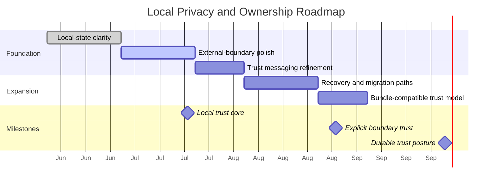

# Roadmap & Milestones: Local Privacy and Data Ownership

**Feature Area**: Local Privacy and Data Ownership
**PDRs Referenced**: PDR-001, PDR-005, PDR-008
**Generated**: 2026-06-10
**Dependencies**: Requirements, Metrics

---

## 11. Roadmap & Milestones

**Purpose**: Sequence trust-model work that reinforces local ownership.

### 11.1 Roadmap Overview

### 11.2 Milestone 1: Local Trust Core - 2026-07-20

**Demo Sentence:** "After this milestone, the user can tell that core product state stays local by default."

**Status:** Planned

**Release Goal:** Make local ownership explicit and credible.

| Feature | Priority | Demo Sentence | Dependencies |
|---------|----------|---------------|--------------|
| Local-state clarity | Must | "user can understand what stays on device" | None |
| External-boundary polish | Must | "user can see when outside services are involved" | Local-state clarity |

**Success Criteria:**

| Metric | Target | Measurement |
|--------|--------|-------------|
| Boundary understanding | Improved | Product review |
| Trust-sensitive setup continuation | Improved | Activation review |

**PDR Reference:** PDR-005

### 11.3 Milestone 2: Explicit Boundary Trust - 2026-08-31

**Demo Sentence:** "After this milestone, the user can connect external services without feeling that control became ambiguous."

**Status:** Planned

**Release Goal:** Improve trust at the point of external dependency.

| Feature | Priority | Demo Sentence | Dependencies |
|---------|----------|---------------|--------------|
| Trust messaging refinement | Must | "user sees plain-language trust explanations" | Milestone 1 |
| Recovery and migration paths | Should | "user has a clearer path when local state needs recovery" | Milestone 1 |

**Features Deferred from Previous:**

- Cross-device sync reconsideration

**Success Criteria:**

| Metric | Target | Measurement |
|--------|--------|-------------|
| Trust-driven retention | Improved | Retention review |
| Boundary confusion incidents | Reduced | Quality review |

**PDR Reference:** PDR-001, PDR-005

### 11.4 Milestone 3: Durable Trust Posture - 2026-10-01

**Demo Sentence:** "After this milestone, the product can expand commercially without weakening its local-first promise."

**Status:** Planned

**Release Goal:** Keep trust aligned with future business direction.

| Feature | Priority | Demo Sentence | Dependencies |
|---------|----------|---------------|--------------|
| Bundle-compatible trust model | Must | "future business features still respect local ownership" | Milestone 2 |

**PDR Reference:** PDR-008

### 11.5 Milestones Traced to PDRs

| Milestone | PDR | Target Date | Status |
|-----------|-----|-------------|--------|
| Local Trust Core | PDR-005 | 2026-07-20 | Planned |
| Explicit Boundary Trust | PDR-001, PDR-005 | 2026-08-31 | Planned |
| Durable Trust Posture | PDR-008 | 2026-10-01 | Planned |

---

**PDR Traceability:**

| PDR | Decision | Impact on Roadmap |
|-----|----------|-------------------|
| PDR-005 | Local-first ownership | Defines the first two milestones. |
| PDR-001 | Mainstream clarity | Shapes messaging and UX refinement. |
| PDR-008 | Future bundle business | Shapes long-term trust compatibility. |
