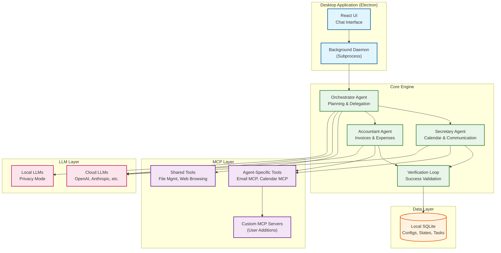

# Overview: System

**Feature Area**: System
**PDRs Referenced**: PDR-001, PDR-002, PDR-003, PDR-004, PDR-005
**Generated**: 2026-06-24
**Section Number**: 2 (in final PRD)

---

## 2. Overview

**Purpose**: High-level description of the AI Agent Harness - what it is and why it exists

### 2.1 Product Description

The AI Agent Harness is a local-first, privacy-first desktop application that lets
non-technical small business owners automate daily tasks through a team of
specialized AI agents. Users interact via a chat interface, describe what they
need done, and the system orchestrates the appropriate agents to execute the
task. The app is free, runs entirely on the user's machine, and users bring
their own LLM API key (or use a local LLM).

### 2.2 Purpose

Solopreneurs spend hours each week on administrative work — managing calendars,
tracking invoices, organizing expenses, and handling communication. Existing
solutions are either too technical (require coding), single-purpose (only
calendars or only expenses), or compromise privacy by sending data to the cloud.
The AI Agent Harness solves this by providing a multi-agent "virtual office"
that handles admin tasks autonomously while keeping data local.

### 2.3 Scope

**In Scope:**

- Desktop application (Electron/React) for macOS and Windows
- Chat-centric user interface with agent transparency
- Orchestrator agent for task planning and delegation
- Secretary agent: calendar management, scheduling, basic communication
- Accountant agent: invoice collection, folder organization, Excel/CSV expense tracking
- Local SQLite database for configurations, agent states, and tasks
- BYOK (Bring Your Own Key) for cloud LLM providers (OpenAI, Anthropic, etc.)
- Local LLM support for absolute privacy
- MCP-based tool system with shared and agent-specific tools
- Human-in-the-loop prompts for approvals and clarifications
- Privacy-respecting, opt-in analytics

**Out of Scope:**

- Cloud-hosted or SaaS version of the application
- Mobile or web versions of the app
- Developer/Tech agent (post-MVP)
- Agent Marketplace (future)
- Granular autonomy levels (future)

---

**PDR Traceability:**

| PDR | Category | Impact on Overview |
|-----|----------|-------------------|
| PDR-001 | Scope | Defines MVP agent set (Secretary + Accountant + Orchestrator) |
| PDR-002 | Persona | Defines target user (solopreneur) and their needs |
| PDR-003 | Business Model | Free core app, paid solution model |
| PDR-004 | Scope | Desktop app distribution strategy |
| PDR-005 | Metric | Engagement-first success metrics |

### 2.4 Feature Hierarchy

```mermaid
flowchart TD
    Harness["AI Agent Harness"]

    Harness --> UI["Desktop Application"]
    Harness --> Runtime["Agent Runtime"]
    Harness --> MCP["MCP & Tools System"]
    Harness --> LLM["LLM Connectivity"]

    UI --> Chat["Chat Interface"]
    UI --> Daemon["Background Daemon"]
    UI --> Notif["Notifications & HITL"]

    Runtime --> Orchestrator["Orchestrator Agent"]
    Runtime --> Secretary["Secretary Agent"]
    Runtime --> Accountant["Accountant Agent"]
    Runtime --> Loop["Verification Loop"]

    MCP --> Shared["Shared Tools"]
    MCP --> AgentTools["Agent-Specific Tools"]
    MCP --> Custom["Custom MCP Servers"]

    LLM --> BYOK["BYOK Provider"]
    LLM --> Local["Local LLM"]

    classDef app fill:#e1f5fe,stroke:#01579b,stroke-width:2px
    classDef ui fill:#fff3e0,stroke:#e65100,stroke-width:2px
    classDef runtime fill:#e8f5e9,stroke:#2e7d32,stroke-width:2px
    classDef mcp fill:#f3e5f5,stroke:#6a1b9a,stroke-width:2px
    classDef llm fill:#fce4ec,stroke:#c2185b,stroke-width:2px

    class Harness app
    class UI,Chat,Daemon,Notif ui
    class Runtime,Orchestrator,Secretary,Accountant,Loop runtime
    class MCP,Shared,AgentTools,Custom mcp
    class LLM,BYOK,Local llm
```

### 2.5 Architecture Overview

**Architecture Notes**:
- The Electron app runs a background daemon subprocess for persistent agent execution
- The Orchestrator routes tasks and manages the verification loop
- MCP servers are the exclusive mechanism for tool extensibility
- All data is stored locally in SQLite — no cloud synchronization
- LLM calls are made directly from the user's machine (BYOK or local)

### 2.6 Cross-Area Interactions

N/A — monolithic deployment (single feature area).
