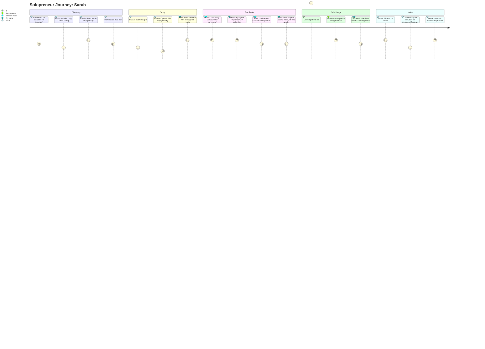

# Personas: System

**Feature Area**: System
**PDRs Referenced**: PDR-002
**Generated**: 2026-06-24
**Dependencies**: Problem

---

## 6. Personas

**Purpose**: Define target users and their needs

### 6.1 Primary Persona

**Name**: Sarah, the Solopreneur

| Attribute | Description |
|-----------|-------------|
| **Role** | Independent consultant (marketing/brand strategy), runs her own 1-person business |
| **Experience** | Tech-comfortable but not technical — uses Mac, Google Calendar, Gmail, QuickBooks |
| **Goals** | Spend less time on admin, more time on client work. Wants to automate scheduling, invoicing, and expense tracking. |
| **Pain Points** | Loses 15 hrs/week to calendar juggling, invoice chasing, and manual expense entry. Tried Zapier — too complex. Worried about sending client financial data to cloud AI. |
| **Needs** | "I want to tell my computer what to do in plain English and have it just happen — no config, no coding, no data leaving my machine." |
| **Success Quote** | "I used to spend Monday mornings on admin. Now I spend them on client work." |

**PDR Reference**: PDR-002

### 6.2 Secondary Persona

**Name**: Marcus, the Freelancer

| Attribute | Description |
|-----------|-------------|
| **Role** | Freelance web designer, 0-1 employee |
| **Experience** | Comfortable with design tools, not with automation tools |
| **Goals** | Never chase an invoice again. Automate expense tracking for tax season. |
| **Pain Points** | Sends 15-20 invoices/month manually. Forgets to follow up on late payments. Dreads quarterly tax prep because expenses are scattered across receipts and emails. |
| **Needs** | "I need something that watches my inbox for invoices, files them automatically, and keeps my P&L updated without me touching a spreadsheet." |
| **Success Quote** | "My accountant asked me for my expense report and I just sent her a link. First time ever." |

**PDR Reference**: PDR-002

### 6.3 Anti-Personas (Who This Is NOT For)

| Anti-Persona | Why Not Targeted |
|--------------|------------------|
| Enterprise IT Manager | Needs SSO, compliance, team management, cloud deployment |
| Developer / Engineer | Can build their own automation; needs API access, CLI, extensibility |
| Large company employee | IT restrictions on software install, no decision-making authority |
| Non-computer user | Not comfortable with desktop app installation or API key setup |

---

**PDR Traceability:**

| PDR | Decision | Impact on Personas |
|-----|----------|-------------------|
| PDR-002 | Target Persona | Solopreneur defined as primary persona |

### 6.4 User Journey Visualization

