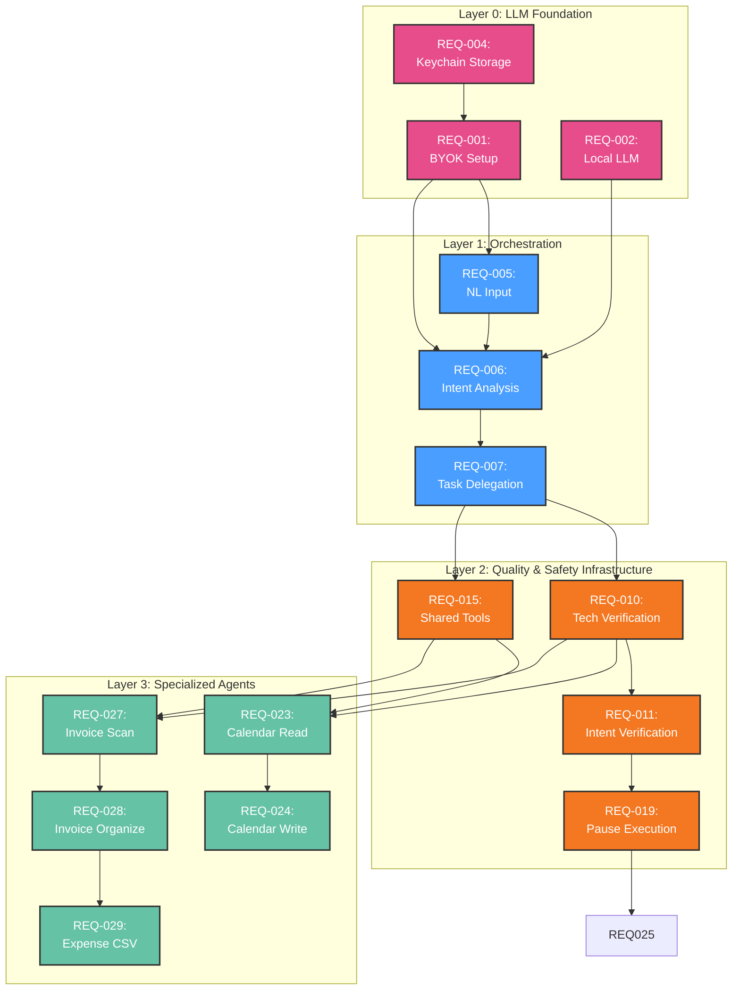
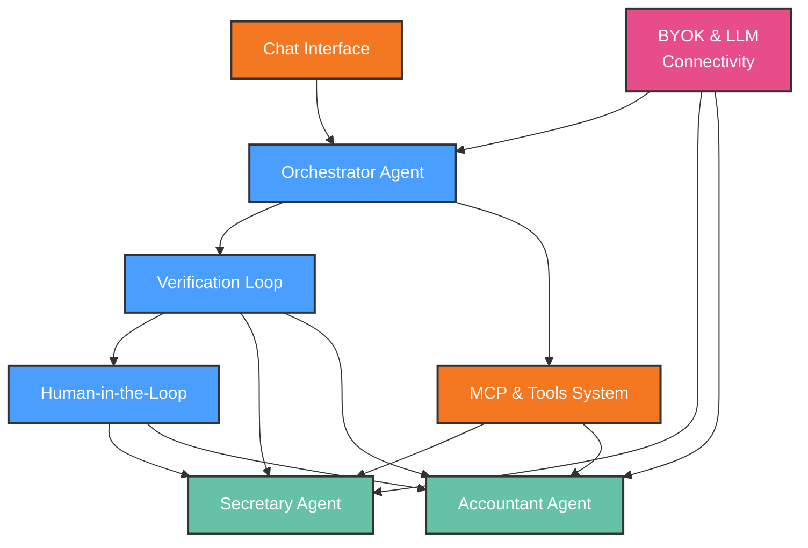
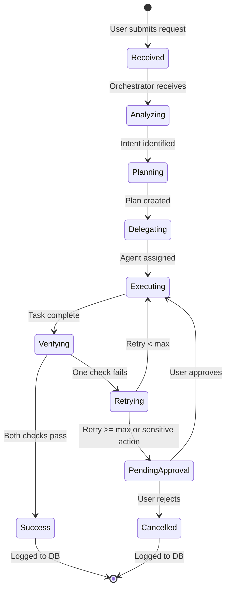

# Functional Requirements: System

**Feature Area**: System
**PDRs Referenced**: PDR-001, PDR-002, PDR-003, PDR-004, PDR-005
**Generated**: 2026-06-24
**Dependencies**: Personas, Goals
**Section Number**: 7 (in final PRD)

> 🛑 **CHECKPOINT SECTION v1.5.2**: This is the **cornerstone** section that shapes NFRs, Out-of-Scope, Risks, and Roadmap. After generating this section, execution MUST pause for user approval before continuing.
>
> **Why?** Requirements define what gets built, what doesn't (Out-of-Scope), associated risks, and roadmap priority. User approval ensures alignment.

---

## 7. Functional Requirements

**Purpose**: Define what the product must do

### 7.1 User Stories

| ID | Story | Persona | Priority | PDR |
|----|-------|---------|----------|-----|
| US-001 | As a solopreneur, I want to bring my own LLM API key so that I control costs and provider choice | Sarah | Must | PDR-003 |
| US-002 | As a privacy-conscious user, I want all data to stay on my machine so that my business information never leaves | Marcus | Must | PDR-002 |
| US-003 | As a solopreneur, I want to describe a task in plain English so that the system handles it without me configuring anything | Sarah | Must | PDR-001 |
| US-004 | As a solopreneur, I want the system to check my calendar and schedule meetings so that I save time on scheduling | Sarah | Must | PDR-001 |
| US-005 | As a freelancer, I want invoices from my email to be automatically collected and categorized so that I never chase payments | Marcus | Must | PDR-001 |
| US-006 | As a solopreneur, I want expenses tracked in a spreadsheet automatically so that tax time is painless | Sarah | Should | PDR-001 |
| US-007 | As a solopreneur, I want the system to confirm before sending emails or making changes so that I stay in control | Sarah | Must | PDR-004 |
| US-008 | As a solopreneur, I want to see which agent is working on my request so that I understand what's happening | Sarah | Should | PDR-004 |
| US-009 | As a solopreneur, I want to install the app from the app store so that it's easy to set up | Sarah | Should | PDR-004 |
| US-010 | As a solopreneur, I want to specifically ask an agent by name (e.g., "@Secretary") so that I can direct tasks | Sarah | Could | PDR-001 |

### 7.2 Feature Requirements

#### Feature 1: BYOK & LLM Connectivity (PREREQUISITE)

**Description:** Provider-agnostic LLM support. Users bring their own API key
or use a local LLM. All LLM calls are made directly from the user's machine.
No agent can function without LLM connectivity — this is the foundational layer.

**Requirements:**

- **REQ-001:** System MUST support OpenAI, Anthropic, and other major LLM providers via API key
- **REQ-002:** System MUST support local LLMs (e.g., Llama, Mistral) for offline use
- **REQ-003:** System MUST NOT send any data to LLM providers beyond the current request context
- **REQ-004:** System MUST securely store API keys in the local OS keychain

**Acceptance Criteria:**

- [ ] User can configure OpenAI API key and send requests within 2 minutes
- [ ] Switching to local LLM works with zero data leaving the machine
- [ ] API keys are stored in OS keychain, not in plaintext config files

**Traced to:** PDR-003 (Business Model)

#### Feature 2: Orchestrator Agent

**Description:** The central router that intercepts natural language requests,
analyzes intent via LLM, creates execution plans, and delegates tasks to
specialized agents. Runs as part of the background daemon. Depends on LLM
connectivity (Feature 1).

**Requirements:**

- **REQ-005:** System MUST accept natural language input from the chat interface
- **REQ-006:** System MUST analyze user intent via LLM and decompose into a task plan
- **REQ-007:** System MUST delegate tasks to the appropriate specialized agent based on intent
- **REQ-008:** System MUST support sequential and parallel task execution based on plan
- **REQ-009:** System MUST log all plans, delegations, and outcomes to local SQLite

**Acceptance Criteria:**

- [ ] User types "check my calendar and find unpaid invoices" → Orchestrator creates a 2-step plan delegating to Secretary and Accountant
- [ ] Parallel tasks execute without blocking each other
- [ ] All executions are recorded in the local database

**Traced to:** PDR-001 (Scope)

#### Feature 3: Verification Loop

**Description:** After each agent task, validates (a) technical success of
execution and (b) whether output satisfies user's original intent. Task is
"Success" only if both pass. Built before the agents themselves so the quality
framework exists from day one.

**Requirements:**

- **REQ-010:** System MUST verify technical success of every agent action
- **REQ-011:** System MUST verify agent output satisfies original user intent
- **REQ-012:** System MUST mark task as "Success" in local DB only when both checks pass
- **REQ-013:** System MUST retry or escalate failed tasks with configurable max iterations
- **REQ-014:** System MUST enforce strict timeouts and max-iteration limits to prevent infinite loops

**Acceptance Criteria:**

- [ ] Technical failure (e.g., calendar API down) is detected and logged as FAIL
- [ ] Intent mismatch detected (e.g., wrong date) retried or escalated
- [ ] Task status correctly reflects pass/fail in local DB

**Traced to:** PDR-001 (Scope), PDR-005 (Metric)

#### Feature 4: MCP & Tools System

**Description:** Extensibility layer using the Model Context Protocol. Supports
shared tools (all agents), agent-specific tools (bundled with specific agent),
and custom MCP servers (user-added). Built before agents so tools are available
from the start.

**Requirements:**

- **REQ-015:** System MUST provide shared tools (file management, web browsing) to all agents
- **REQ-016:** System MUST support agent-specific MCP servers (e.g., email MCP for Secretary)
- **REQ-017:** System MUST allow advanced users to add custom MCP servers
- **REQ-018:** System MUST sandbox MCP server execution for security

**Acceptance Criteria:**

- [ ] All agents can access file management shared tool
- [ ] Only Secretary agent can access email MCP server
- [ ] Custom MCP server registration is available in settings
- [ ] MCP server cannot access files outside its allowed scope

**Traced to:** PDR-001 (Scope)

#### Feature 5: Human-in-the-Loop (HITL)

**Description:** When the system encounters uncertainty, an approval boundary,
or a loop it cannot resolve, it pauses and prompts the user via desktop
notification and UI prompt. Built before agents so safety boundaries exist
from day one.

**Requirements:**

- **REQ-019:** System MUST pause execution when human approval is required
- **REQ-020:** System MUST send a desktop notification when paused for input
- **REQ-021:** System MUST display the pending action, context, and options in the UI
- **REQ-022:** System MUST resume execution after user provides input

**Acceptance Criteria:**

- [ ] Attempting to send an email triggers pause + notification + UI prompt
- [ ] User can approve, modify, or reject the pending action
- [ ] System continues or aborts based on user decision

**Traced to:** PDR-004 (Scope)

#### Feature 6: Secretary Agent

**Description:** Specialized agent for calendar management, scheduling, and
basic communication tasks. Built on top of the Orchestrator, Verification Loop,
MCP tools, and HITL safety layer.

**Requirements:**

- **REQ-023:** System MUST read calendar events from integrated calendar services
- **REQ-024:** System MUST create, modify, and cancel calendar events
- **REQ-025:** System MUST require human approval before sending any communication
- **REQ-026:** System MUST surface upcoming schedule on request

**Acceptance Criteria:**

- [ ] "What does my schedule look like tomorrow?" returns summarized calendar
- [ ] "Schedule a meeting with Client X on Thursday at 2pm" creates the event
- [ ] Sending an email requires explicit user approval via UI prompt

**Traced to:** PDR-001 (Scope)

#### Feature 7: Accountant Agent

**Description:** Specialized agent for invoice collection, folder organization,
and financial tracking. Built on top of the Orchestrator, Verification Loop,
MCP tools, and HITL safety layer.

**Requirements:**

- **REQ-027:** System MUST scan email inbox for invoice attachments
- **REQ-028:** System MUST organize invoices into designated folders by vendor/date
- **REQ-029:** System MUST update a local Excel/CSV file with income and expense entries
- **REQ-030:** System MUST flag duplicate or suspicious invoices for human review

**Acceptance Criteria:**

- [ ] Incoming invoice email is detected, file saved to `~/Finances/Invoices/{Vendor}/`
- [ ] Corresponding row added to expense CSV with date, vendor, amount, category
- [ ] Duplicate invoice from same vendor/amount triggers human review prompt

**Traced to:** PDR-001 (Scope)

### 7.3 Requirements Priority Matrix

| Priority | Count | Description |
|----------|-------|-------------|
| Must | 24 | Critical for MVP launch |
| Should | 5 | Important but not blocking |
| Could | 1 | Nice to have |
| Won't | 0 | Explicitly excluded |

---

**PDR Traceability:**

| PDR | Decision | Impact on Requirements |
|-----|----------|------------------------|
| PDR-001 | MVP Agent Set | Secretary + Accountant are top-level agents built on infrastructure layers |
| PDR-002 | Target Persona | Shapes UX requirements for non-technical users |
| PDR-003 | Monetization | BYOK is foundational — prerequisite for all agents |
| PDR-004 | Go-to-Market | App store distribution shapes HITL and UI requirements |
| PDR-005 | Success Metrics | Verification loop requirements tie to metric definition |

### 7.4 Requirement Dependencies

### 7.5 Feature Dependencies

### 7.6 State Transitions

