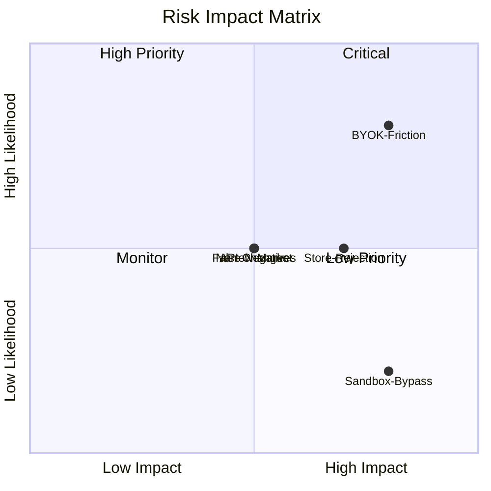

# Risks & Mitigation: System

**Feature Area**: System
**PDRs Referenced**: PDR-001, PDR-002, PDR-003, PDR-004
**Generated**: 2026-06-24
**Dependencies**: Requirements, NFRs

---

## 10. Risks & Mitigation

**Purpose**: Document product risks and mitigation strategies

### 10.1 Risk Summary

| Risk | Category | Likelihood | Impact | Risk Score | PDR |
|------|----------|------------|--------|------------|-----|
| Low user adoption due to BYOK friction | Market | High | High | HIGH | PDR-003 |
| App store rejection for agent behavior | Operational | Medium | High | HIGH | PDR-004 |
| MCP sandboxing bypass leads to security issue | Technical | Low | High | MEDIUM | PDR-001 |
| LLM provider API changes break agent functionality | Technical | Medium | Medium | MEDIUM | PDR-003 |
| Solopreneur market too narrow for sustainable growth | Market | Medium | Medium | MEDIUM | PDR-002 |
| Verification loop false negatives frustrate users | Technical | Medium | Medium | MEDIUM | PDR-001 |

### 10.2 Technical Risks

#### Risk: MCP Sandboxing Bypass

| Attribute | Description |
|-----------|-------------|
| **Description** | A malicious or buggy MCP server escapes its sandbox and accesses files or system resources outside its allowed scope |
| **Likelihood** | Low |
| **Impact** | High |
| **Mitigation Strategy** | Use OS-level process isolation (separate process per MCP server), restrict filesystem access to designated directories, and validate all MCP server manifests before execution |
| **Contingency Plan** | Kill the MCP server process, revoke its permissions, and notify the user with a security warning |
| **Owner** | Engineering lead |

#### Risk: Verification Loop False Negatives

| Attribute | Description |
|-----------|-------------|
| **Description** | The verification loop incorrectly marks successfully executed tasks as failures (false negatives), frustrating users and reducing trust |
| **Likelihood** | Medium |
| **Impact** | Medium |
| **Mitigation Strategy** | Allow users to override verification results ("this was actually correct"); log override patterns to tune verification thresholds |
| **Contingency Plan** | Implement a manual override button in the UI; collect override data to improve verification accuracy |
| **Owner** | Agent team lead |

### 10.3 Market Risks

#### Risk: Low Adoption Due to BYOK Friction

| Attribute | Description |
|-----------|-------------|
| **Description** | Non-technical solopreneurs find the BYOK setup (getting an API key from OpenAI/Anthropic) too difficult and abandon the app before completing onboarding |
| **Likelihood** | High |
| **Impact** | High |
| **Mitigation Strategy** | Provide in-app guided API key setup with step-by-step instructions and links to provider key pages. Support local LLM as zero-config alternative. Consider pre-configured free-tier API keys for a limited trial period. |
| **Contingency Plan** | Partner with LLM providers for embedded key provisioning; explore a managed LLM proxy as a paid add-on |
| **Owner** | Product manager |

#### Risk: Narrow Market Sizing

| Attribute | Description |
|-----------|-------------|
| **Description** | The solopreneur market proves too small or too fragmented to sustain the business, even with paid solutions |
| **Likelihood** | Medium |
| **Impact** | Medium |
| **Mitigation Strategy** | Design the agent platform to be persona-agnostic from the start — the same infrastructure can serve knowledge workers, students, or other segments with different agent sets |
| **Contingency Plan** | Pivot to a broader market segment (knowledge workers) by adding relevant agents; the infrastructure investment transfers |
| **Owner** | Product manager |

### 10.4 Operational Risks

#### Risk: App Store Rejection

| Attribute | Description |
|-----------|-------------|
| **Description** | Apple or Microsoft rejects the app because agent behavior (automated actions, MCP server execution) violates store policies |
| **Likelihood** | Medium |
| **Impact** | High |
| **Mitigation Strategy** | Design agents to be user-initiated only — no autonomous background behavior without explicit user action. All MCP server execution requires user approval. Submit to Apple for pre-release review. |
| **Contingency Plan** | Fall back to direct download distribution via website if store rejection cannot be resolved |
| **Owner** | Product manager |

### 10.5 Risk Matrix

---

**PDR Traceability:**

| PDR | Consequence | Risk Identified |
|-----|-------------|-----------------|
| PDR-003 | Free core + BYOK model | Low adoption due to BYOK friction |
| PDR-004 | App store distribution | App store rejection risk |
| PDR-001 | MCP extensibility | MCP sandboxing security risk |
| PDR-002 | Solopreneur persona focus | Market too narrow for growth |
