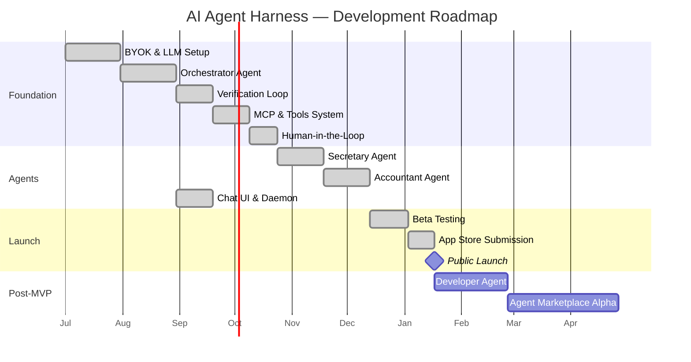

# Roadmap & Milestones: System

**Feature Area**: System
**PDRs Referenced**: PDR-001, PDR-003, PDR-005
**Generated**: 2026-06-24
**Dependencies**: Requirements, Metrics

---

## 11. Roadmap & Milestones

**Purpose**: Define product release milestones with feature groupings

### 11.1 Roadmap Overview

### 11.2 Milestone 1: Foundation Complete — Month 3 (2026-09-30)

**Demo Sentence:** "After this milestone, the user can: install the app, configure
their LLM API key, and see the Orchestrator analyze a natural language request and
create a task plan."

**Status:** Planned

**Release Goal:** Core infrastructure — LLM connectivity, orchestration, quality
framework, tools, and safety layer all functional.

| Feature | Priority | Demo Sentence | Dependencies |
|---------|----------|---------------|--------------|
| BYOK & LLM Connectivity | Must | "User configures API key and system responds to requests" | None |
| Orchestrator Agent | Must | "User types a task and sees a plan created and delegated" | LLM |
| Verification Loop | Must | "System validates task success and logs pass/fail" | Orchestrator |
| MCP & Tools System | Must | "Agents can access shared and specialized tools" | Orchestrator |
| Human-in-the-Loop | Must | "System pauses and asks user before sending a message" | Orchestrator |
| Chat UI + Daemon | Must | "User sees chat interface with agent activity indicators" | Orchestrator |

**Success Criteria:**

| Metric | Target | Measurement |
|--------|--------|-------------|
| BYOK setup completion | >80% of installs complete key setup | Onboarding funnel |
| Orchestrator plan accuracy | >70% of requests correctly parsed | Log analysis |
| Verification loop pass rate | >80% on test tasks | Automated testing |

**PDR Reference:** PDR-001

---

### 11.3 Milestone 2: Beta — Month 5 (2026-11-30)

**Demo Sentence:** "After this milestone, the user can: ask the Secretary agent
about their schedule and have the Accountant agent collect invoices from email
and update their expense spreadsheet."

**Status:** Planned

**Release Goal:** Both specialized agents functional with end-to-end task execution,
verification, and human-in-the-loop safety.

| Feature | Priority | Demo Sentence | Dependencies |
|---------|----------|---------------|--------------|
| Secretary Agent | Must | "User asks about their schedule and gets calendar summary" | Foundation |
| Accountant Agent | Must | "User asks about invoices and system finds and organizes them" | Foundation |
| Agent transparency in UI | Should | "User sees which agent is working on their request" | Foundation |
| @Agent mention syntax | Could | "User types @Secretary to direct a task" | Orchestrator |

**Success Criteria:**

| Metric | Target | Measurement |
|--------|--------|-------------|
| Beta tester engagement | >50 active testers | DAU tracking |
| Task completion rate | >70% of tasks complete successfully | Verification loop |
| HITL intervention rate | <30% of tasks require human input | HITL logs |

**PDR Reference:** PDR-001

---

### 11.4 Milestone 3: Public Launch — Month 6 (2026-12-31)

**Demo Sentence:** "After this milestone, the user can: download the app from the
app store, set up their API key, and have Secretary and Accountant agents handling
their daily admin tasks."

**Status:** Planned

**Release Goal:** App store approval, public availability, and initial user acquisition.

| Feature | Priority | Demo Sentence | Dependencies |
|---------|----------|---------------|--------------|
| App store packaging | Must | "User downloads from macOS/Windows store" | Beta complete |
| Analytics (opt-in) | Must | "Usage data collected with user consent" | Foundation |
| Website + docs | Should | "User finds product info and downloads from website" | N/A |

**PDR Reference:** PDR-004

---

### 11.5 Milestones Traced to PDRs

| Milestone | PDR | Target Date | Status |
|-----------|-----|-------------|--------|
| Foundation Complete | PDR-001, PDR-003 | 2026-09-30 | Planned |
| Beta | PDR-001 | 2026-11-30 | Planned |
| Public Launch | PDR-004 | 2026-12-31 | Planned |

---

**PDR Traceability:**

| PDR | Decision | Impact on Roadmap |
|-----|----------|-------------------|
| PDR-001 | MVP Agent Set | Foundation first, then Secretary, then Accountant ordering |
| PDR-003 | Monetization | Free core launch; paid solutions roadmap deferred |
| PDR-005 | Success Metrics | Beta success criteria tied to engagement metrics |
