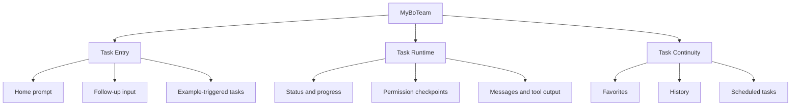
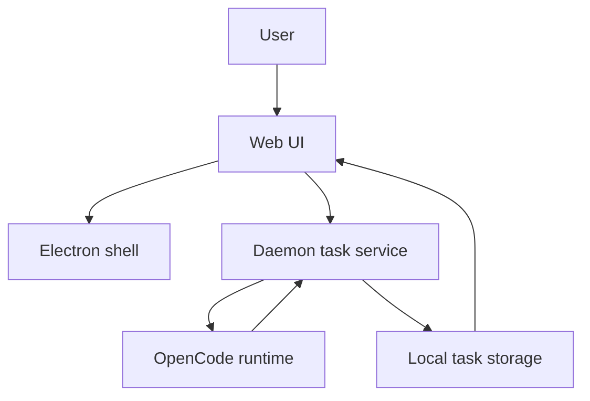

# Overview: Task Orchestration

**Feature Area**: Task Orchestration
**PDRs Referenced**: PDR-001, PDR-002, PDR-006, PDR-008
**Generated**: 2026-06-10
**Section Number**: 2 (in final PRD)

---

## 2. Overview

**Purpose**: Describe the task-first product surface that turns user intent into supervised agent execution.

### 2.1 Product Description

Task Orchestration is the core MyBoTeam workflow layer. It translates plain-language requests into durable tasks with execution state, follow-ups, favorites, attachments, reminders, and visible completion signals. The task object is the unit that binds together the simple-user promise from PDR-001 with the execution and supervision model defined in PDR-002 and PDR-006.

### 2.2 Purpose

This area exists so users can ask for useful work to be completed without learning provider configuration, connector internals, or workflow scripting first. It gives the product a concrete unit for progress tracking, recovery, scheduling, and confirmation that the outcome was actually useful.

### 2.3 Scope

**In Scope:**

- Plain-language task creation from home, conversations, and follow-up entry points.
- Persistent task lifecycle with messages, todos, favorites, attachments, status, and scheduled reruns.
- Guardrailed execution with permission pauses, progress visibility, and completion confirmation.

**Out of Scope:**

- Full workspace-first project management as the default entry point.
- Direct monetization or pricing workflows for task execution.

---

**PDR Traceability:**

| PDR | Category | Impact on Overview |
|-----|----------|-------------------|
| PDR-001 | Positioning | Keeps the experience framed as collaborative agent work, not chat only. |
| PDR-002 | Workflow Model | Defines the task as the primary user-facing unit. |
| PDR-006 | Safety and Control | Requires visible permissions, status, and interruption handling. |
| PDR-008 | Business Model | Keeps free core usage central while task value is proven. |

### 2.4 Feature Hierarchy

### 2.5 Architecture Overview

**Architecture Notes**:
- The UI is responsible for task entry, state presentation, and approval prompts.
- The daemon owns task lifecycle, runtime startup, resumption, and persistence.
- Storage provides durable continuity for task history, favorites, and scheduling.

### 2.6 Cross-Area Interactions

| Feature Area A | Feature Area B | Interaction Type | Description |
|----------------|----------------|------------------|-------------|
| Task Orchestration | Agent Configuration | Runtime context | Task runs inherit provider, model, and skill configuration. |
| Task Orchestration | Connectors and Automation Tools | Tool execution | Tasks invoke connector and browser capabilities to complete outcomes. |
| Task Orchestration | Local Privacy and Data Ownership | Persistence boundary | Task data and permissions stay local unless the user explicitly configures external services. |
