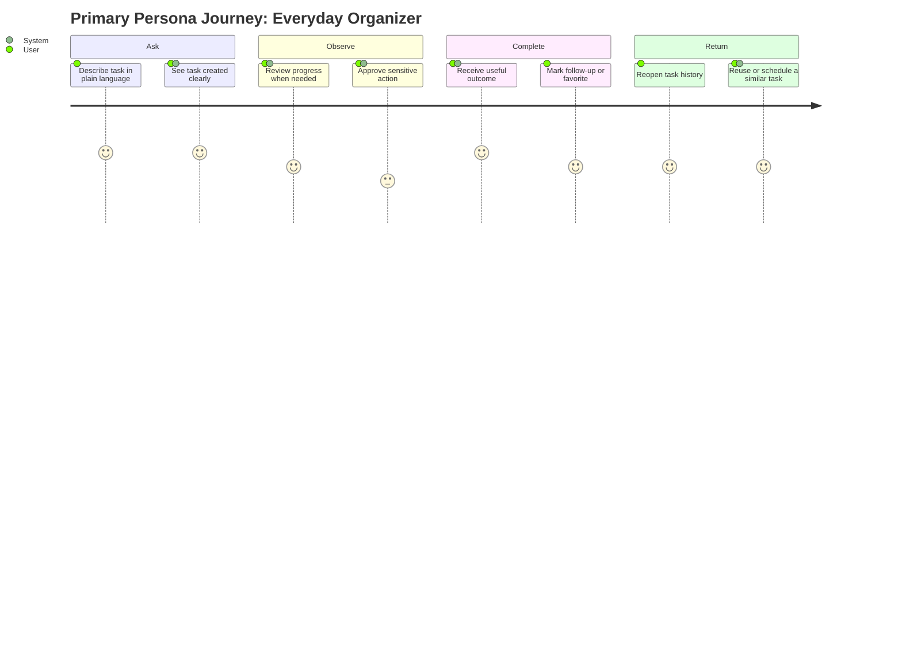

# Personas: Task Orchestration

**Feature Area**: Task Orchestration
**PDRs Referenced**: PDR-001, PDR-002, PDR-006
**Generated**: 2026-06-10
**Dependencies**: Problem

---

## 6. Personas

**Purpose**: Define the users whose work is shaped by the task-first execution model.

### 6.1 Primary Persona

**Name**: Everyday Organizer

| Attribute | Description |
|-----------|-------------|
| **Role** | Non-professional desktop user managing personal productivity and coordination work |
| **Experience** | Comfortable describing tasks in natural language, not interested in workflow tooling jargon |
| **Goals** | Get reminders, follow-ups, drafts, and small coordination jobs completed reliably |
| **Pain Points** | Forgets context across tools, loses track of pending items, and does not want to micromanage AI steps |
| **Needs** | Simple task entry, visible progress when needed, and confirmation that the result was useful |
| **Success Quote** | "I want to ask once, come back later, and see that it was handled." |

**PDR Reference**: PDR-001, PDR-002

### 6.2 Secondary Persona

**Name**: Automation Power User

| Attribute | Description |
|-----------|-------------|
| **Role** | Solo operator or advanced individual user with recurring automation-heavy tasks |
| **Experience** | Comfortable with models, schedules, and repeated workflows |
| **Goals** | Reuse tasks, schedule repeat work, and reduce manual oversight over time |
| **Pain Points** | Chat-only assistants lose state, require repeated prompting, and offer weak supervision controls |
| **Needs** | Durable task history, scheduling, favorites, and opt-in autonomy depth |
| **Success Quote** | "Give me a reusable task system, not another empty chat thread." |

**PDR Reference**: PDR-002, PDR-006

### 6.3 Anti-Personas (Who This Is NOT For)

| Anti-Persona | Why Not Targeted |
|--------------|------------------|
| Workflow engineer expecting full no-code automation studio on first run | The current product is optimized for guided simple use, not advanced workflow authoring first. |
| User seeking invisible unsupervised automation by default | Guardrails and explicit permissions remain part of the core trust model. |

---

**PDR Traceability:**

| PDR | Decision | Impact on Personas |
|-----|----------|-------------------|
| PDR-001 | Broad simple-user focus | Defines the primary persona and plain-language expectations. |
| PDR-002 | Task-first model | Drives continuity, history, and scheduling needs. |
| PDR-006 | Guardrailed autonomy | Separates mainstream users from high-autonomy seekers. |

### 6.4 User Journey Visualization

