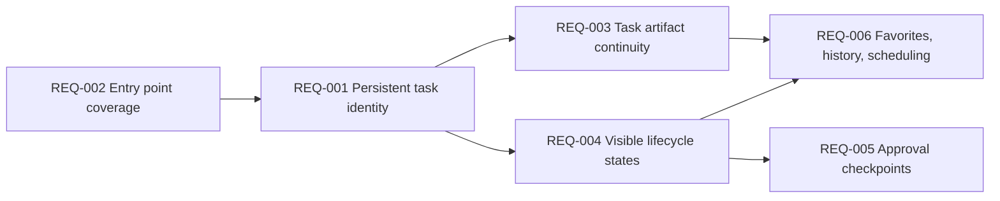
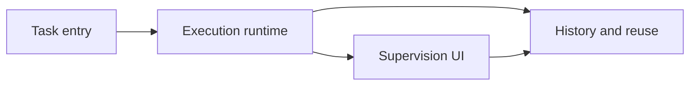
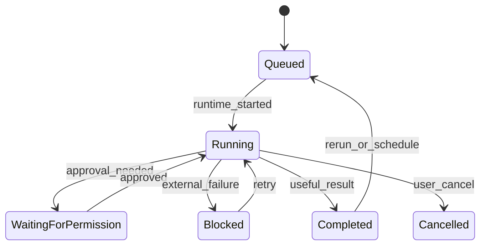

# Functional Requirements: Task Orchestration

**Feature Area**: Task Orchestration
**PDRs Referenced**: PDR-001, PDR-002, PDR-006, PDR-008
**Generated**: 2026-06-10
**Dependencies**: Personas, Goals
**Section Number**: 7 (in final PRD)

> Checkpoint section: downstream NFRs, risks, scope boundaries, and roadmap depend on this requirement set.

---

## 7. Functional Requirements

**Purpose**: Define what the product must do to make tasks the primary supervised workflow unit.

### 7.1 User Stories

| ID | Story | Persona | Priority | PDR |
|----|-------|---------|----------|-----|
| US-001 | As an Everyday Organizer, I want to create a task from plain language so that I can ask once and let the system work. | Everyday Organizer | Must | PDR-001, PDR-002 |
| US-002 | As an Everyday Organizer, I want to see when the agent is waiting on me so that I can safely approve sensitive actions without guessing. | Everyday Organizer | Must | PDR-006 |
| US-003 | As an Automation Power User, I want to revisit, favorite, and schedule tasks so that repeated work becomes easier over time. | Automation Power User | Should | PDR-002, PDR-008 |

### 7.2 Feature Requirements

#### Feature 1: Task Creation and Identity

**Description:** The product must create a durable task record whenever a user initiates meaningful work from the primary entry points.

**Requirements:**

- **REQ-001:** The system must create a task with a persistent identifier, prompt text, status, and timestamps at launch. Traced to PDR-002.
- **REQ-002:** The system must allow task creation from the main home prompt, conversation follow-up entry, and example-driven entry points. Traced to PDR-001 and PDR-002.
- **REQ-003:** The system must preserve messages, todos, attachments, and completion state under the task record so the user can reopen the work later. Traced to PDR-002.

**Acceptance Criteria:**

- [ ] Starting a task creates a persistent record that can be reopened after navigation or restart.
- [ ] A reopened task shows status, prior messages, and associated task artifacts.
- [ ] Follow-up prompts attach to the same task context rather than creating silent duplicate work.

#### Feature 2: Supervised Execution and Continuity

**Description:** The product must expose enough execution state for users to supervise automation without turning mainstream usage into a debugger-first experience.

**Requirements:**

- **REQ-004:** The system must surface task lifecycle states such as queued, running, waiting for permission, blocked, canceled, and completed in user-facing language. Traced to PDR-002 and PDR-006.
- **REQ-005:** The system must pause for explicit approval on sensitive actions such as file access, connector auth, or other guarded operations. Traced to PDR-006.
- **REQ-006:** The system must support continuity actions including favorites, history review, and scheduled reruns for completed or recurring tasks. Traced to PDR-002 and PDR-008.

**Acceptance Criteria:**

- [ ] Users can tell whether a task is actively running, waiting, or done without opening internal diagnostics.
- [ ] Sensitive actions require explicit user approval before the agent continues.
- [ ] Completed tasks can be revisited, favorited, or reused for later execution.

### 7.3 Requirements Priority Matrix

| Priority | Count | Description |
|----------|-------|-------------|
| Must | 5 | Critical to the task-first launch experience |
| Should | 1 | Important continuity capability for repeat usage |
| Could | 0 | Deferred from this checkpoint set |
| Won't | 2 | Workspace-first orchestration and paid task packaging are excluded at this stage |

---

**PDR Traceability:**

| PDR | Decision | Impact on Requirements |
|-----|----------|------------------------|
| PDR-001 | Personal AI workforce positioning | Requires simple task entry and outcome-oriented language. |
| PDR-002 | Task execution is primary | Drives persistent identity, history, favorites, scheduling, and lifecycle state. |
| PDR-006 | Human control in automation loops | Adds explicit permission pauses and visible supervised execution. |
| PDR-008 | Free-core before monetization | Defers monetized task packaging from current requirements. |

### 7.4 Requirement Dependencies

**Dependency Notes**:
- Entry-point coverage matters only if launched work becomes a durable task.
- Supervised execution depends on clear lifecycle state before permission checkpoints make sense.
- Reuse and scheduling depend on persisted task identity and artifacts.

### 7.5 Feature Dependencies

### 7.6 State Transitions

