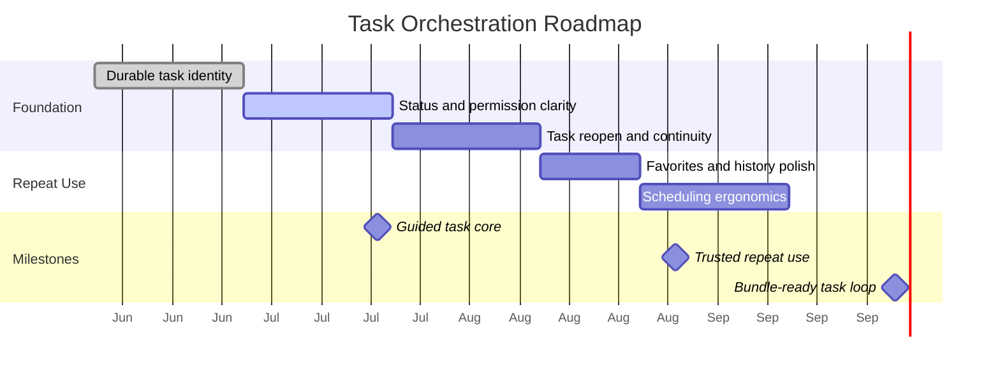

# Roadmap & Milestones: Task Orchestration

**Feature Area**: Task Orchestration
**PDRs Referenced**: PDR-001, PDR-002, PDR-006, PDR-008
**Generated**: 2026-06-10
**Dependencies**: Requirements, Metrics

---

## 11. Roadmap & Milestones

**Purpose**: Sequence task-orchestration work into clear capability milestones.

### 11.1 Roadmap Overview

### 11.2 Milestone 1: Guided Task Core - 2026-07-20

**Demo Sentence:** "After this milestone, the user can create a task, monitor progress, approve sensitive actions, and reopen the result later."

**Status:** Planned

**Release Goal:** Establish the core supervised task loop for mainstream users.

| Feature | Priority | Demo Sentence | Dependencies |
|---------|----------|---------------|--------------|
| Durable task identity | Must | "user can reopen a prior task and keep context" | None |
| Lifecycle and permission states | Must | "user can tell whether the agent is running or waiting" | Durable task identity |

**Success Criteria:**

| Metric | Target | Measurement |
|--------|--------|-------------|
| Useful completion tracking | Established | Product review |
| Status clarity | Fewer ambiguous task states | UX review |

**PDR Reference:** PDR-002, PDR-006

### 11.3 Milestone 2: Trusted Repeat Use - 2026-08-31

**Demo Sentence:** "After this milestone, the user can favorite, revisit, and reuse tasks with confidence."

**Status:** Planned

**Release Goal:** Turn completed tasks into a repeat-use loop.

| Feature | Priority | Demo Sentence | Dependencies |
|---------|----------|---------------|--------------|
| Favorites and history polish | Must | "user can find past successful tasks quickly" | Milestone 1 |
| Scheduling ergonomics | Should | "user can ask the agent to run recurring tasks" | Milestone 1 |

**Features Deferred from Previous:**

- Full power-user scheduling dashboard polish

**Success Criteria:**

| Metric | Target | Measurement |
|--------|--------|-------------|
| Repeat task usage | Upward trend | Product review |
| Retained task users | Upward trend | Retention review |

**PDR Reference:** PDR-002, PDR-008

### 11.4 Milestone 3: Bundle-Ready Task Loop - 2026-10-01

**Demo Sentence:** "After this milestone, the task model is strong enough to support future curated workflow bundles without redesigning the core loop."

**Status:** Planned

**Release Goal:** Prepare the task layer for future commercialization without making it paid-first now.

| Feature | Priority | Demo Sentence | Dependencies |
|---------|----------|---------------|--------------|
| Reusable task patterns | Must | "user can repeat successful task structures" | Milestone 2 |

**PDR Reference:** PDR-008

### 11.5 Milestones Traced to PDRs

| Milestone | PDR | Target Date | Status |
|-----------|-----|-------------|--------|
| Guided Task Core | PDR-002, PDR-006 | 2026-07-20 | Planned |
| Trusted Repeat Use | PDR-001, PDR-002 | 2026-08-31 | Planned |
| Bundle-Ready Task Loop | PDR-008 | 2026-10-01 | Planned |

---

**PDR Traceability:**

| PDR | Decision | Impact on Roadmap |
|-----|----------|-------------------|
| PDR-002 | Task-first workflow | Makes lifecycle and continuity the first milestone. |
| PDR-006 | Guardrailed control | Requires early investment in permissions and clarity. |
| PDR-008 | Future bundle monetization | Pushes commercialization readiness after free-core value proof. |
