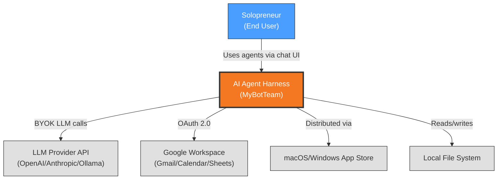
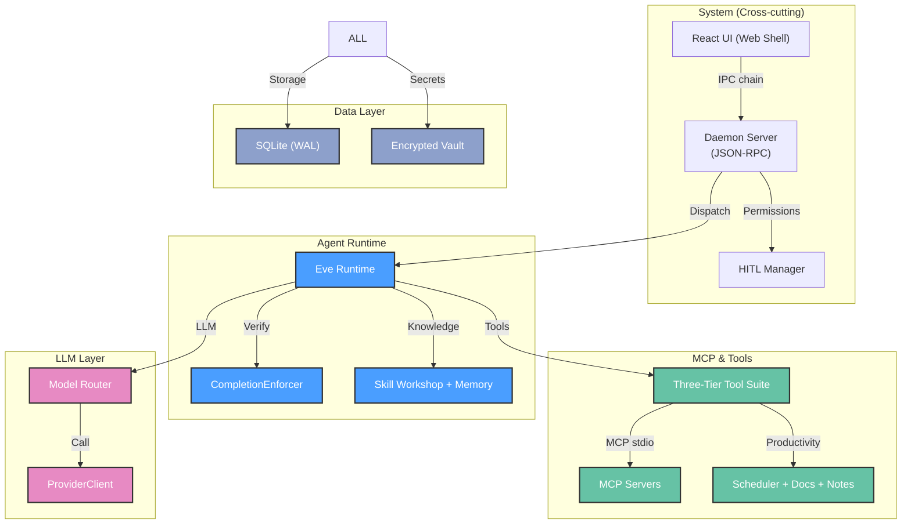
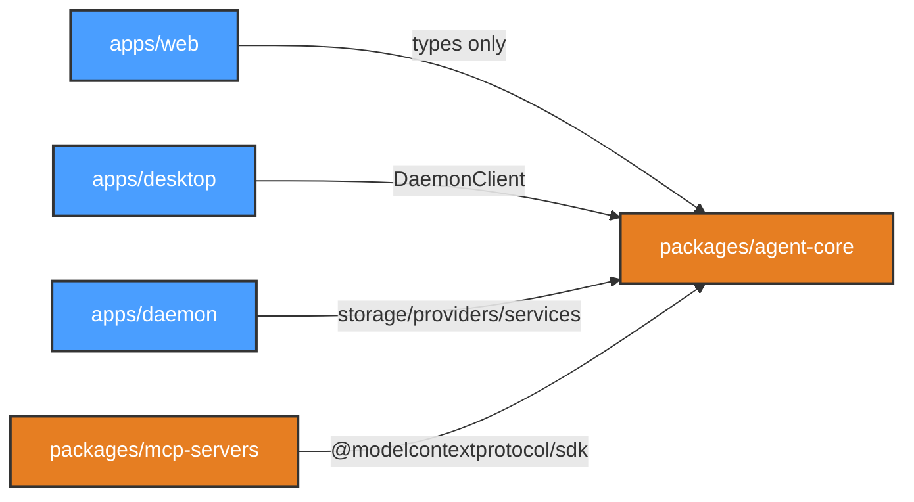
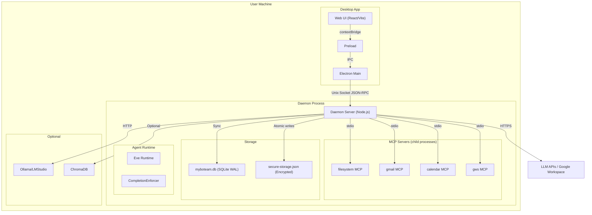

# Architecture Description: MyBotTeam — AI Agent Harness

## 1. Document Information

| Attribute | Value |
|-----------|-------|
| **Version** | 1.0.0 |
| **Date** | 2026-06-24 |
| **Author** | User/AI collaboration |
| **Status** | Accepted |
| **Source ADRs** | 11 Accepted (ADR-001 through ADR-011) |

## 2. Architectural Goals & Constraints

**Primary Goal**: Build a local-first AI Agent Harness as an Electron desktop app enabling solopreneurs to delegate administrative tasks to autonomous agents (Secretary, Accountant) via an Orchestrator, using BYOK LLM providers and tool execution via MCP.

**Key Constraints**:

| Constraint | Source | Impact |
|------------|--------|--------|
| Local-first, no cloud dependency | PRD, PDR-002 | All data on user machine; only agent LLM calls leave via HTTPS |
| Renderer has zero Node.js/filesystem access | ADR-001 | Strict 4-link IPC chain with contextBridge |
| Verification built before agents | PRD, ADR-005 | 3-Tier loop in Foundation, CompletionEnforcer in Agent milestone |
| Test-first quality | Constitution §II | Contracts + integration + unit organized per ADR-011 |
| Human oversight of sensitive actions | ADR-008 | HITL triggers before email, external calendar, files outside workspace |
| Monorepo with clear ownership boundaries | ADR-007 | 3 apps + shared packages, no cross-app dependencies |

## 3. Architectural Views

### 3.1 Context View

**Purpose**: Define system scope and external interactions

The AI Agent Harness is a local-first desktop application. The system appears as a single blackbox to external entities. All intelligence comes from LLM providers (user BYOK), external integrations (Google Workspace for email/calendar/docs), and the local file system.



| External Entity | Type | Interaction | Protocol |
|----------------|------|-------------|----------|
| LLM Provider API | External API | Agent inference (prompts/responses) | HTTPS (BYOK) |
| Google Workspace | External API | Email, calendar, doc integration | HTTPS OAuth 2.0 |
| App Stores | Distribution | App bundles, auto-updates | Store APIs |
| Local File System | Local OS | File operations, database, vault | POSIX/Windows API |

> **Subsystem Details**: [System](.specify/architect/views/system/context.md) | [Agent Runtime](.specify/architect/views/agent-runtime/context.md) | [MCP & Tools](.specify/architect/views/mcp-tools/context.md) | [Data Layer](.specify/architect/views/data-layer/context.md) | [LLM Layer](.specify/architect/views/llm-layer/context.md)

---

### 3.2 Functional View

**Purpose**: Describe functional elements, their responsibilities, and interactions

The system comprises five sub-systems, each with distinct responsibilities:

| Sub-system | Key Elements | ADRs |
|------------|-------------|------|
| **System** | React UI, Preload Bridge, Electron Main, Daemon Server, HITL Manager, MCP Process Manager, Test Runner, IPC Bus | ADR-001, ADR-007, ADR-008, ADR-011 |
| **Agent Runtime** | Agent Materializer, Eve Runtime, Deterministic Router, CompletionEnforcer (6 states), TaskInactivityWatchdog, Skill Workshop, Security Scanner, Memory System, Standing Orders Engine, Continuation Nudge Generator, Agent Status Manager | ADR-002, ADR-005, ADR-009 |
| **MCP & Tools** | Daemon-Native Tool Suite, MCP Server Manager, 5 MCP Servers, Eve Tool Stubs, Skill Discovery Pipeline, NL Scheduler, Document Editor, Notes & Todos Manager | ADR-003, ADR-010 |
| **Data Layer** | SQLite Engine (better-sqlite3 WAL), Migration Manager, Secrets Vault (AES-256-GCM), Key Derivation Engine, Data Directory Manager, PID Lock Manager, FTS5 Indexer, ChromaDB Connector (optional) | ADR-004 |
| **LLM Layer** | ProviderClient Interface, Anthropic Provider, OpenAI Provider, Local LLM Provider, Provider Config Manager, Key Injection Service, Model Router | ADR-006 |



> **Subsystem Details**: [System](.specify/architect/views/system/functional.md) | [Agent Runtime](.specify/architect/views/agent-runtime/functional.md) | [MCP & Tools](.specify/architect/views/mcp-tools/functional.md) | [Data Layer](.specify/architect/views/data-layer/functional.md) | [LLM Layer](.specify/architect/views/llm-layer/functional.md)

---

### 3.3 Information View

**Purpose**: Describe data storage, management, and flow

All persistent data is stored locally in two tiers:
- **SQLite** (better-sqlite3, WAL mode): structured data — agents, tasks, conversations, memory, notes, schedules, document versions, settings
- **Encrypted Vault** (AES-256-GCM): secrets — API keys, OAuth tokens, connector credentials
- **File System**: agent runtime files, SKILL.md files, standing orders

```mermaid
erDiagram
    AGENT {
        uuid id PK
        string slug UK
        string provider
        string model
        string status
    }

    TASK {
        uuid id PK
        uuid agent_id FK
        string status "pending|running|partial|completed|failed|max_retries"
        string verification_status
        int continuation_count
    }

    TASK_TODO {
        uuid id PK
        uuid task_id FK
        text description
        boolean is_completed
    }

    MESSAGE {
        uuid id PK
        uuid conversation_id FK
        string role
        text content
    }

    MEMORY_ENTRY {
        uuid id PK
        string category
        text content
    }

    MCP_SERVER {
        uuid id PK
        string name
        string status
    }

    AGENT_MCP_ASSIGNMENT {
        uuid agent_id FK
        uuid mcp_server_id FK
    }

    CONVERSATION {
        uuid id PK
        uuid agent_id FK
        string title
        timestamp created_at
        timestamp updated_at
    }

    NOTE {
        uuid id PK
        string title
        string type "text|checklist"
        json items
        boolean pinned
        boolean archived
        timestamp due_date
    }

    SCHEDULE {
        uuid id PK
        string type "at|every|cron"
        string expression
        string status "active|paused|completed"
    }

    DOCUMENT_VERSION {
        uuid id PK
        string file_path
        text content
        string model
    }

    AGENT ||--o{ TASK : executes
    TASK ||--o{ TASK_TODO : validates
    CONVERSATION ||--o{ MESSAGE : contains
    AGENT ||--o{ MEMORY_ENTRY : contributes to
    MCP_SERVER ||--o{ AGENT_MCP_ASSIGNMENT : assigned to
```

**Key Data Flows:**

1. **Task Execution**: User input → Deterministic Router → (LLM) → Task created → Agent materialized → Eve executes with tools → CompletionEnforcer validates → Done or continuation nudged
2. **Memory Extraction**: Conversation turn → Background LLM extraction → Memory entry stored → Nightly consolidation merges duplicates
3. **Secrets Flow**: User enters API key via UI → RPC to daemon → Encrypted to vault (AES-256-GCM) → Decrypted in-memory at materialization → Never persisted in logs/renderer
4. **Tool Execution**: Agent calls tool → Resolved to tier → Tier 1 (in-process), Tier 2 (MCP stdio), Tier 3 (Eve stub) → Result returned → Tool call logged

> **Subsystem Details**: [System](.specify/architect/views/system/information.md) | [Agent Runtime](.specify/architect/views/agent-runtime/information.md) | [MCP & Tools](.specify/architect/views/mcp-tools/information.md) | [Data Layer](.specify/architect/views/data-layer/information.md) | [LLM Layer](.specify/architect/views/llm-layer/information.md)

---

### 3.4 Development View

**Purpose**: Constraints for developers — code organization, dependencies, CI/CD

#### Code Organization

```text
myboteam_v0.5.0/
├── apps/
│   ├── web/             @myboteam/web       — React UI (Vite + React Router + Zustand)
│   ├── desktop/         @myboteam/desktop    — Electron shell (main + preload)
│   └── daemon/          @myboteam/daemon     — Background daemon (Node.js)
├── packages/
│   ├── agent-core/      @myboteam/agent-core — Shared contracts, storage, Eve materializer, providers, services
│   └── mcp-servers/     @myboteam/mcp-servers — Bundled MCP server packages
├── bundled-skills/                           — Shipped skill markdown files (read-only)
├── docs/                                     — Architecture docs (AD.md, ADRs), PRD, PDRs
├── scripts/                                  — Dev orchestrator, build helpers, setup scripts
├── tests/
│   ├── unit/
│   ├── contract/
│   ├── integration/
│   ├── simulation/
│   └── e2e/
├── pnpm-workspace.yaml
├── tsconfig.base.json
└── package.json
```

#### Technology Stack

| Functional Role | Technology | ADR |
|----------------|------------|-----|
| Web Shell | React 18 + Vite 5 + Zustand | ADR-001 |
| Desktop Shell | Electron (latest) | ADR-001 |
| Background Daemon | Node.js 20 LTS (TypeScript) | ADR-001 |
| IPC | Electron contextBridge + JSON-RPC over Unix socket | ADR-001 |
| Build System | pnpm workspaces + tsup | ADR-007 |
| Desktop Packaging | electron-builder | ADR-007 |
| Test Runner | Vitest (workspace) + Playwright (E2E) | ADR-011 |
| Agent Runtime | Eve framework v0.12 (generated) | ADR-002 |
| SQL Engine | better-sqlite3 (WAL mode) | ADR-004 |
| Secrets | AES-256-GCM + PBKDF2 | ADR-004 |
| Vector Search | ChromaDB (optional, gated) | ADR-009 |
| MCP Framework | @modelcontextprotocol/sdk | ADR-003 |
| Scheduling | node-cron (in-process) | ADR-010 |
| Provider SDKs | @anthropic-ai/sdk, openai | ADR-006 |

#### Module Dependencies



#### CI Pipeline

`lint` → `typecheck` → `unit` → `contract` → `integration` → `simulation` → `build` → `E2E` → `package`

> **Subsystem Details**: [System](.specify/architect/views/system/development.md) | [Agent Runtime](.specify/architect/views/agent-runtime/development.md) | [MCP & Tools](.specify/architect/views/mcp-tools/development.md) | [Data Layer](.specify/architect/views/data-layer/development.md) | [LLM Layer](.specify/architect/views/llm-layer/development.md)

---

### 3.5 Deployment View

**Purpose**: Physical environment — nodes, networks, storage

The entire application runs locally on a single user machine. No cloud infrastructure, no server-side components.



| Component | CPU | Memory | Storage |
|-----------|-----|--------|---------|
| Desktop App (Electron) | 2 cores (Apple Silicon) | 2-4GB | ~500MB bundle |
| Daemon (Node.js) | 1-2 cores | ~50MB + 10MB/MCP server | ~100MB (data) |
| Local LLM (optional) | 4+ cores | 8-16GB | 4-12GB per model |

> **Subsystem Details**: [System](.specify/architect/views/system/deployment.md) | [Agent Runtime](.specify/architect/views/agent-runtime/deployment.md) | [MCP & Tools](.specify/architect/views/mcp-tools/deployment.md) | [Data Layer](.specify/architect/views/data-layer/deployment.md) | [LLM Layer](.specify/architect/views/llm-layer/deployment.md)

---

## 4. Architectural Perspectives

### 4.1 Security Perspective

**Source ADRs**: ADR-001 (IPC chain), ADR-003 (MCP isolation), ADR-004 (encryption), ADR-008 (HITL)

#### 4.1.1 Authentication & Authorization

- **Identity**: No user authentication (local-first app). User identified by machine identity.
- **API Keys**: User enters via UI → encrypted in vault via RPC → decrypted in-memory at materialization.
- **Authorization Model**: Per-agent tool access via MCP assignment join table. HITL for sensitive operations.

#### 4.1.2 Data Protection

| Concern | Measure | Source |
|---------|---------|--------|
| Secrets at rest | AES-256-GCM with PBKDF2 (100k iterations) | ADR-004 |
| Secrets in transit | Never — decrypted in-memory only | ADR-004 |
| IPC security | Unix socket with FS permissions; contextBridge prevents renderer access | ADR-001 |
| File confinement | Configurable workspace root; sensitive paths always blocked | ADR-003 |
| Process isolation | Each MCP server in separate child process | ADR-003 |
| Data in renderer | No secrets, no filesystem, no socket access | ADR-001 |

#### 4.1.3 Threat Model

| Threat | Likelihood | Impact | Mitigation |
|--------|------------|--------|------------|
| Renderer compromise via XSS | Medium | High | contextBridge prevents Node.js access; no FS/socket in renderer |
| MCP server privilege escalation | Low | High | Process isolation + restricted FS + manifest validation |
| Vault decryption key leak | Low | Critical | Key derived from machine identity; optional env var override |
| Agent hallucination (tool misuse) | Medium | Medium | CompletionEnforcer validation + HITL before sensitive actions |

#### 4.1.4 Compliance

- **App Store**: User-initiated actions only. HITL before network-bound actions. No background daemon operations without consent.
- **Privacy**: Local-first — no user data transmitted to cloud. Opt-in anonymized telemetry for metrics.

### 4.2 Performance & Scalability Perspective

**Source ADRs**: ADR-001 (Unix socket IPC), ADR-002 (routing tiers), ADR-003 (3-tier tools), ADR-005 (timeouts), ADR-010 (scheduling)

#### 4.2.1 Performance Requirements

| Metric | Target | Measurement |
|--------|--------|-------------|
| IPC latency (daemon ↔ UI) | <1ms (Unix socket) | In-process measurement |
| Daemon-native tool latency | <500ms | Tool call logs |
| MCP server first-call latency | +200-500ms spawn overhead | MCP lifecycle logs |
| Agent materialization | 50-100ms | Materializer timing |
| TaskInactivityWatchdog soft timeout | 90s (configurable) | Enforcer state machine |
| TaskInactivityWatchdog hard timeout | 150s (90s + 60s grace) | Enforcer state machine |
| Scheduler capacity | 50+ concurrent schedules | Load testing |

#### 4.2.2 Scalability Model

- **Horizontal**: Not applicable (single-user desktop app)
- **Vertical**: Dependent on user's hardware. Performance scales with CPU/RAM for local LLM usage.
- **Auto-scaling**: N/A — no server deployment

#### 4.2.3 Caching Strategy

| Cache Layer | Purpose | TTL | Invalidation |
|-------------|---------|-----|--------------|
| Provider Config (in-memory) | Avoid re-reading SQLite on every LLM call | Per-agent materialization | On agent config change |
| MCP Server Process (already running) | Avoid spawn overhead on repeated tool calls | Lifetime of daemon session | Killed on daemon shutdown |
| SQLite WAL (buffer) | Concurrent read performance | Managed by SQLite | Write checkpoint |

## 5. Architecture Decision Records Summary

| ID | Decision | Status | Date |
|----|----------|--------|------|
| ADR-001 | Layered Desktop Architecture with Unix Socket JSON-RPC | Accepted | 2026-06-24 |
| ADR-002 | Eve Agent Harness for Agent Runtime | Accepted | 2026-06-24 |
| ADR-003 | MCP & Skills Tool Organization | Accepted | 2026-06-24 |
| ADR-004 | better-sqlite3 + Encrypted Secrets Vault | Accepted | 2026-06-24 |
| ADR-005 | Verification Loop — Phase 1 3-Tier + Phase 2 CompletionEnforcer | Accepted | 2026-06-24 |
| ADR-006 | LLM Provider Model — Hybrid Default + Per-Agent Override | Accepted | 2026-06-24 |
| ADR-007 | Monorepo Structure — pnpm Workspace | Accepted | 2026-06-24 |
| ADR-008 | Human-in-the-Loop & Security Architecture | Accepted | 2026-06-24 |
| ADR-009 | Skill & Knowledge System (Workshop, Memory, Standing Orders) | Accepted | 2026-06-24 |
| ADR-010 | Agent Productivity Tools (Scheduling, Docs, Notes) | Accepted | 2026-06-24 |
| ADR-011 | Testing Strategy — Multi-Layer Test Architecture | Accepted | 2026-06-24 |

## 6. Tech Stack Summary

> **Note**: This table provides a technology-centric reference organized by category. For technology-to-functional-element mapping, see §3.5.2 Technology Stack Mapping.

| Category | Technology | Version | Purpose | ADR |
|----------|------------|---------|---------|
| **Web UI** | React, Vite, Zustand, React Router | React 18, Vite 5 | Chat UI, settings, agent management | ADR-001 |
| **Desktop** | Electron, electron-builder | Latest | Native shell, packaging, auto-update | ADR-001 |
| **Daemon** | Node.js, TypeScript | Node 20 LTS | Background task execution, service orchestration | ADR-001 |
| **IPC** | JSON-RPC over Unix socket | — | Bidirectional daemon ↔ UI communication | ADR-001 |
| **Storage** | better-sqlite3, AES-256-GCM | WAL mode | Structured data + encrypted secrets | ADR-004 |
| **Agent Runtime** | Eve framework (generated) | v0.12 | Agent definition, materialization, execution | ADR-002 |
| **Tools** | MCP SDK (@modelcontextprotocol/sdk) | StdioServerTransport | MCP server framework | ADR-003 |
| **LLM** | @anthropic-ai/sdk, openai | Latest | Provider access for agent intelligence | ADR-006 |
| **Search** | SQLite FTS5, ChromaDB (optional) | — | Full-text + optional vector search | ADR-009 |
| **Build** | pnpm, tsup, Vitest, Playwright | pnpm 8+ | Monorepo build, test, CI | ADR-007, ADR-011 |
