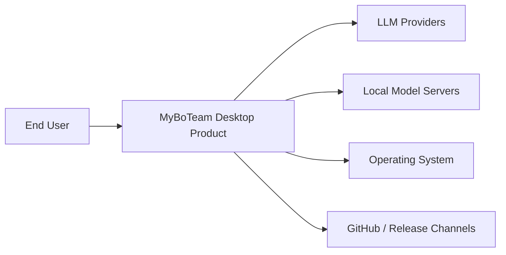
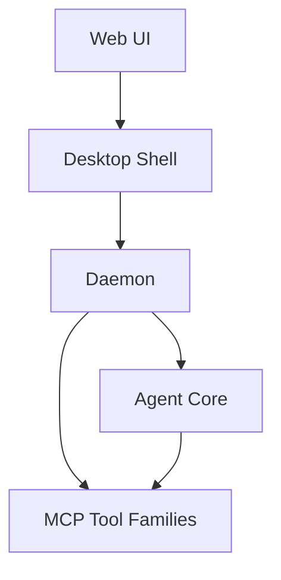
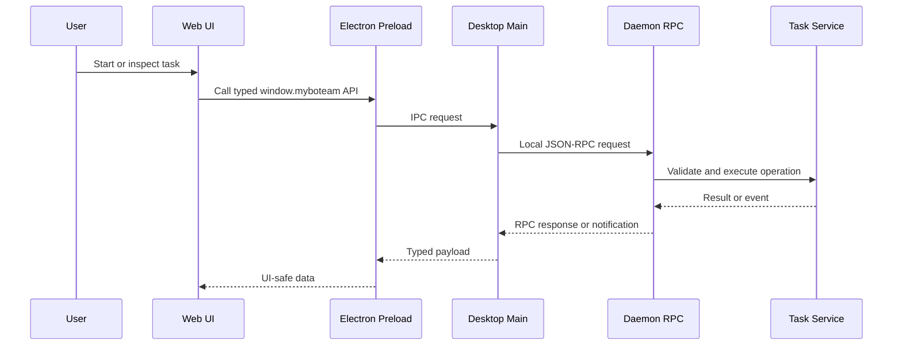
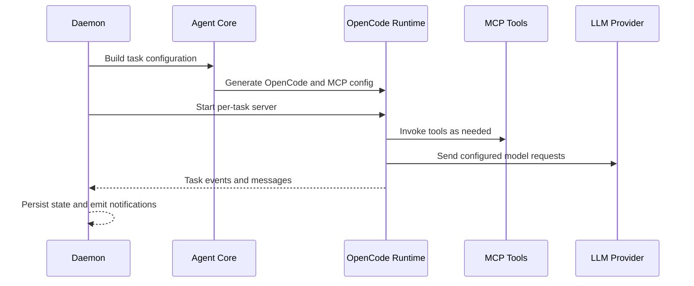
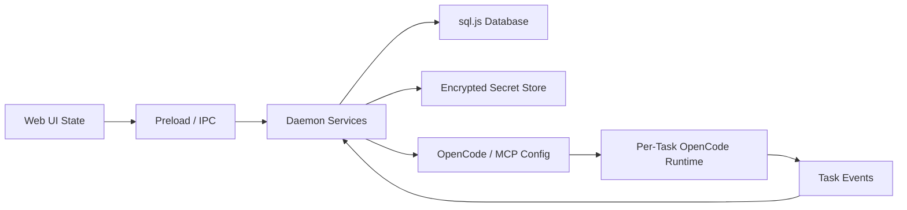
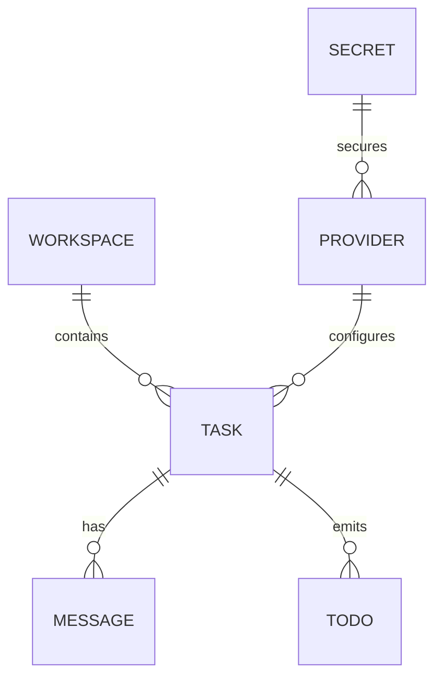
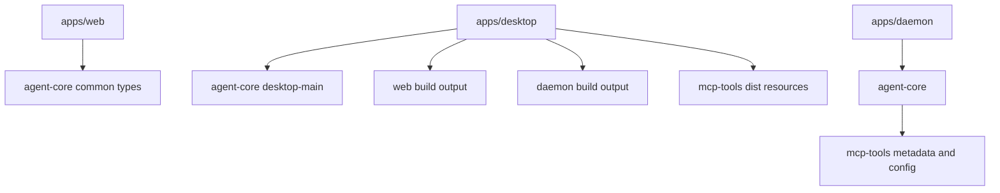
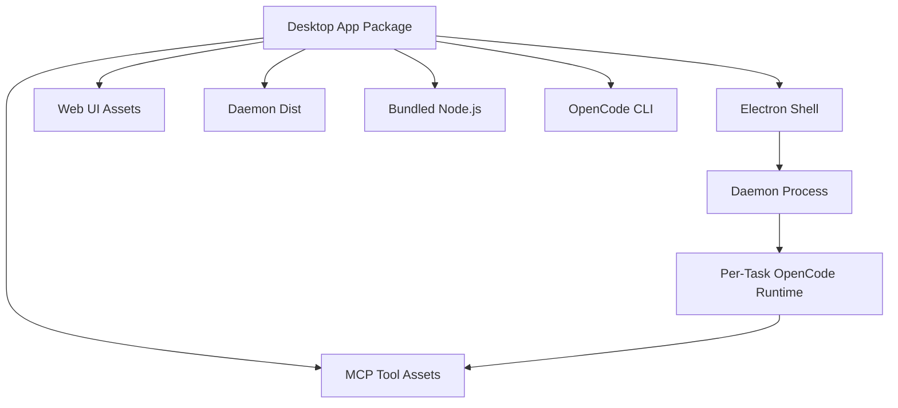

# Architecture Description: MyBoTeam

**Version**: 1.1.0
**Date**: 2026-06-09
**Status**: Generated from accepted ADRs and architecture view artifacts
**Scope**: Core architecture views for the MyBoTeam desktop product

## 1. Purpose

This Architecture Description captures the current brownfield architecture of
MyBoTeam. It is generated from accepted Architecture Decision Records and the
core architecture views under `.specify/architect/views/`.

The document describes MyBoTeam as a local-first desktop product with separate
workspace boundaries for the renderer UI, Electron shell, long-lived daemon,
shared agent-core package, and bundled MCP tool families.

## 2. Architectural Drivers

### 2.1 Goals

- Preserve local-first operation for user tasks, credentials, and sensitive data.
- Keep privileged execution outside the React renderer.
- Isolate long-running task execution in a daemon process.
- Reuse OpenCode as the task runtime while preserving per-task isolation.
- Ship first-party MCP tools as bundled desktop resources.
- Keep shared TypeScript contracts authoritative across local process boundaries.
- Preserve portable packaging by using sql.js for structured local state.
- Keep migration history immutable and bidirectional.

### 2.2 Constraints

- The product has no hosted MyBoTeam backend in the current architecture.
- Credentials and sensitive task data stay local unless the user configures an
  external provider or connector.
- Renderer code must not access Node.js, filesystem, daemon sockets, or secrets.
- Electron preload and daemon RPC boundaries validate untrusted payloads.
- `@myboteam/agent-core` is ESM and uses `.js` extensions for internal imports.
- Web image assets use ES module imports for packaged compatibility.
- Released migration files are immutable.
- New migrations include executable `up` and `down` paths covered by tests.
- Required daemon, bundled Node.js, OpenCode, and MCP assets are packaging
  invariants.

### 2.3 Accepted Decisions

Accepted ADRs are promoted to `.specify/memory/adr.md`.

| ADR | Decision | Main Impact |
|-----|----------|-------------|
| ADR-001 | Local-first modular desktop architecture | Defines workspace and runtime ownership boundaries |
| ADR-002 | Typed renderer-to-daemon boundary | Keeps privileged operations behind preload and daemon RPC |
| ADR-003 | Detached daemon with local socket JSON-RPC | Separates long-running execution from the desktop shell |
| ADR-004 | Per-task OpenCode server runtimes | Gives each active task its own runtime boundary |
| ADR-005 | sql.js data plus encrypted file secrets | Separates structured state from encrypted credentials |
| ADR-006 | Bundled first-party MCP tool families | Packages connector tools with fail-fast runtime validation |

## 3. Architectural Views

This AD uses the core view set produced by `architect-implement`.

| View | Purpose | Source Artifacts |
|------|---------|------------------|
| Context | System boundary and external relationships | `*/context.md` |
| Functional | Runtime responsibilities and component interactions | `*/functional.md` |
| Information | Data ownership, persistence, and information flow | `*/information.md` |
| Development | Repository structure and code ownership | `*/development.md` |
| Deployment | Packaged/runtime topology | `*/deployment.md` |

The generated view files are:

- `.specify/architect/views/system/context.md`
- `.specify/architect/views/system/functional.md`
- `.specify/architect/views/system/information.md`
- `.specify/architect/views/system/development.md`
- `.specify/architect/views/system/deployment.md`
- `.specify/architect/views/web/context.md`
- `.specify/architect/views/web/functional.md`
- `.specify/architect/views/web/information.md`
- `.specify/architect/views/web/development.md`
- `.specify/architect/views/web/deployment.md`
- `.specify/architect/views/desktop/context.md`
- `.specify/architect/views/desktop/functional.md`
- `.specify/architect/views/desktop/information.md`
- `.specify/architect/views/desktop/development.md`
- `.specify/architect/views/desktop/deployment.md`
- `.specify/architect/views/daemon/context.md`
- `.specify/architect/views/daemon/functional.md`
- `.specify/architect/views/daemon/information.md`
- `.specify/architect/views/daemon/development.md`
- `.specify/architect/views/daemon/deployment.md`
- `.specify/architect/views/agent-core/context.md`
- `.specify/architect/views/agent-core/functional.md`
- `.specify/architect/views/agent-core/information.md`
- `.specify/architect/views/agent-core/development.md`
- `.specify/architect/views/agent-core/deployment.md`
- `.specify/architect/views/mcp-tool-families/context.md`
- `.specify/architect/views/mcp-tool-families/functional.md`
- `.specify/architect/views/mcp-tool-families/information.md`
- `.specify/architect/views/mcp-tool-families/development.md`
- `.specify/architect/views/mcp-tool-families/deployment.md`

### 3.1 Context View

#### 3.1.1 System Context

MyBoTeam is a local-first desktop product. The system boundary includes the
packaged web UI, Electron shell, daemon, shared agent-core package, and bundled
MCP tool families.



#### 3.1.2 Sub-System Contexts

| Sub-System | Context Source | External Relationships |
|------------|----------------|------------------------|
| System | `.specify/architect/views/system/context.md` | User, LLM providers, local model servers, OS, release channels |
| Web | `.specify/architect/views/web/context.md` | User, preload API, i18n resources, static assets |
| Desktop | `.specify/architect/views/desktop/context.md` | OS, renderer, daemon, OAuth providers, release channels |
| Daemon | `.specify/architect/views/daemon/context.md` | Desktop shell, OpenCode runtime, filesystem, provider APIs, MCP tools |
| Agent Core | `.specify/architect/views/agent-core/context.md` | Web, desktop, daemon, OpenCode, provider APIs |
| MCP Tool Families | `.specify/architect/views/mcp-tool-families/context.md` | OpenCode, daemon, browser runtime, Google Workspace, WhatsApp |

> **Subsystem Details**: [System](.specify/architect/views/system/context.md) | [Web](.specify/architect/views/web/context.md) | [Desktop](.specify/architect/views/desktop/context.md) | [Daemon](.specify/architect/views/daemon/context.md) | [Agent Core](.specify/architect/views/agent-core/context.md) | [MCP Tool Families](.specify/architect/views/mcp-tool-families/context.md)

#### 3.1.3 Context Rules

- There is no hosted MyBoTeam backend in this architecture.
- External model providers are user-configured dependencies.
- Local model servers are treated as external local services.
- OAuth and connector APIs are external integration boundaries.
- Operating system services are accessed only through desktop or daemon code.
- User data and secrets remain local unless explicitly routed to configured
  providers or connectors.

### 3.2 Functional View

#### 3.2.1 Product Functional Structure

The product is decomposed into five primary functional areas: Web UI, Desktop
Shell, Daemon, Agent Core, and MCP Tool Families.



#### 3.2.2 Functional Responsibilities

| Element | Responsibility |
|---------|----------------|
| Web UI | Presents tasks, settings, history, provider selection, and runtime status |
| Desktop Shell | Owns windows, tray, preload, packaging, updater, and OS bridges |
| Daemon | Owns task execution, storage, secrets, connectors, and background services |
| Agent Core | Provides shared types, storage, providers, daemon transports, and factories |
| MCP Tool Families | Provide bundled tool capabilities to OpenCode runtimes |

> **Subsystem Details**: [System](.specify/architect/views/system/functional.md) | [Web](.specify/architect/views/web/functional.md) | [Desktop](.specify/architect/views/desktop/functional.md) | [Daemon](.specify/architect/views/daemon/functional.md) | [Agent Core](.specify/architect/views/agent-core/functional.md) | [MCP Tool Families](.specify/architect/views/mcp-tool-families/functional.md)

#### 3.2.3 Renderer to Daemon Flow



#### 3.2.4 Task Execution Flow



#### 3.2.5 Functional Boundaries

- Web owns renderer experience and transient UI state.
- Desktop owns shell lifecycle and OS-level bridges.
- Desktop does not own task execution, storage, provider settings, or connector
  domain logic.
- Daemon owns task execution, durable local state, secrets, provider settings,
  connector services, token lifecycle, and task-event fan-out.
- Agent Core is shared implementation and contract code, not a running product
  boundary by itself.
- MCP Tool Families own connector-specific tool behavior and do not own
  long-term token lifecycle.
- Each active task receives its own OpenCode server runtime.

### 3.3 Information View

#### 3.3.1 Information Ownership

The daemon is the authoritative owner of durable application information through
agent-core storage primitives. The web renderer stores transient UI state derived
from daemon APIs and events.

| Element | Owner | Persistence |
|---------|-------|-------------|
| Task records | Daemon | sql.js |
| Task messages | Daemon | sql.js |
| Task todos and summaries | Daemon | sql.js and task events |
| Workspaces | Daemon | sql.js |
| Provider settings | Daemon | sql.js |
| API keys | Daemon | encrypted file storage |
| OAuth and connector tokens | Daemon | encrypted file storage |
| Renderer UI state | Web | transient memory |
| OpenCode and MCP config | Agent Core / Daemon | generated runtime configuration |
| Tool diagnostics | MCP tools / Daemon | local logs and user-visible status |

> **Subsystem Details**: [System](.specify/architect/views/system/information.md) | [Web](.specify/architect/views/web/information.md) | [Desktop](.specify/architect/views/desktop/information.md) | [Daemon](.specify/architect/views/daemon/information.md) | [Agent Core](.specify/architect/views/agent-core/information.md) | [MCP Tool Families](.specify/architect/views/mcp-tool-families/information.md)

#### 3.3.2 Data Flow



#### 3.3.3 Storage Model



#### 3.3.4 Information Rules

- Structured local state uses sql.js with explicit migrations.
- Secrets use encrypted file storage and are accessed through daemon services.
- Decrypted secrets do not enter renderer state.
- Decrypted secrets do not appear in logs, traces, screenshots, fixtures, or
  generated support artifacts.
- Schema changes require a new migration version.
- Migrations provide executable `up` and `down` paths.
- Both migration directions are verified with agent-core tests.
- Backup and restore of encrypted file secrets require an app-managed
  export/import flow.
- Cross-boundary payloads are validated before persistence or privileged action.

#### 3.3.5 Shared Contracts

Agent Core defines the information contracts consumed by Web, Desktop, and
Daemon. Shared TypeScript types in `@myboteam/agent-core/common` and
`@myboteam/agent-core/desktop-main` are the authoritative cross-process
contracts.

Breaking contract changes require synchronized updates across all affected
workspace packages and tests in the touched areas.

### 3.4 Development View

#### 3.4.1 Repository Organization

```text
apps/web
  React renderer package
apps/desktop
  Electron shell, preload, packaging, updater, and E2E package
apps/daemon
  Long-lived background daemon package
packages/agent-core
  Shared contracts, storage, providers, daemon transports, and runtime helpers
packages/agent-core/mcp-tools
  First-party MCP tool families
```

#### 3.4.2 Development Ownership

| Package | Owns | Does Not Own |
|---------|------|--------------|
| `apps/web` | Routes, pages, renderer stores, components, i18n UI | Node.js, filesystem, daemon sockets, secrets |
| `apps/desktop` | Electron main, preload, OS bridges, packaging, updater | Connector domain logic, task execution, storage ownership |
| `apps/daemon` | RPC routes, services, task execution, connector services | Renderer presentation, desktop packaging UI |
| `packages/agent-core` | Shared contracts, storage, providers, OpenCode config | Shell lifecycle, renderer components |
| `packages/agent-core/mcp-tools` | Connector-family tool packages | Long-term token lifecycle |

> **Subsystem Details**: [System](.specify/architect/views/system/development.md) | [Web](.specify/architect/views/web/development.md) | [Desktop](.specify/architect/views/desktop/development.md) | [Daemon](.specify/architect/views/daemon/development.md) | [Agent Core](.specify/architect/views/agent-core/development.md) | [MCP Tool Families](.specify/architect/views/mcp-tool-families/development.md)

#### 3.4.3 Development Dependencies



#### 3.4.4 Development Rules

- TypeScript is used for application logic.
- Agent Core remains ESM and must not use `require()`.
- Agent Core internal imports include `.js` extensions.
- Web image assets use ES module imports.
- UI state uses Zustand store actions.
- IPC handlers in desktop main match the preload API and web wrapper.
- Shared types live in agent-core exports.
- Code changes that cross package boundaries update all affected consumers.
- Markdown architecture and product documents are exempt from source-file line
  limits when a cohesive document is clearer.
- Source files remain small and split by concern.

#### 3.4.5 Verification Expectations

| Change Area | Verification |
|-------------|--------------|
| Any code change | `pnpm check` |
| Web UI | `pnpm -F @myboteam/web test` |
| Desktop main or preload | `pnpm -F @myboteam/desktop test` |
| Agent Core | `pnpm -F @myboteam/agent-core test` |
| Storage migrations | Agent-core migration tests covering `up` and `down` |
| Packaging resources | Desktop packaging or smoke checks for daemon, Node.js, OpenCode, and MCP assets |

### 3.5 Deployment View

#### 3.5.1 Product Deployment

MyBoTeam deploys as one desktop application package containing the Electron
shell, static web UI, daemon distribution, bundled Node.js runtime, OpenCode
runtime, skills, and MCP tool assets.



#### 3.5.2 Runtime Environments

| Runtime | Deployment Form |
|---------|-----------------|
| Web UI | Static renderer assets bundled into desktop resources |
| Desktop Shell | Electron application process |
| Daemon | Bundled Node.js process launched by desktop |
| Agent Core | Shared package code bundled into desktop and daemon builds |
| OpenCode | Bundled platform-specific CLI package |
| MCP Tool Families | Extra resources invoked by OpenCode runtimes |
| User Data | Local data directory for database, encrypted secrets, logs, pid/socket files |

> **Subsystem Details**: [System](.specify/architect/views/system/deployment.md) | [Web](.specify/architect/views/web/deployment.md) | [Desktop](.specify/architect/views/desktop/deployment.md) | [Daemon](.specify/architect/views/daemon/deployment.md) | [Agent Core](.specify/architect/views/agent-core/deployment.md) | [MCP Tool Families](.specify/architect/views/mcp-tool-families/deployment.md)

#### 3.5.3 Deployment Rules

- No hosted MyBoTeam backend is deployed.
- Desktop packaging is the product distribution boundary.
- The daemon binds only to local transports.
- HTTP helper endpoints are localhost-only, authenticated, and validated.
- Required first-party MCP dist entrypoints are fail-fast invariants.
- Required bundled Node.js paths are fail-fast invariants.
- Missing daemon dist, OpenCode, or MCP resources must fail packaging or task
  startup rather than silently disabling required capability.
- Packaged web assets avoid absolute image paths.
- Daemon crash recovery is best-effort.
- Active task recovery after daemon crash is not guaranteed.

## 4. Architectural Perspectives

### 4.1 Security and Privacy

- Local-first privacy is a product constraint.
- Credentials and sensitive task data stay on the user's machine by default.
- All process-boundary payloads are treated as untrusted.
- Renderer code has no direct privileged access.
- Secrets are encrypted at rest.
- Decrypted values stay out of renderer state, logs, traces, screenshots, and
  fixtures.
- Local HTTP endpoints require authentication and validation.
- MCP tools receive connector tokens only through approved daemon paths.

### 4.2 Performance and Scalability

- Per-task OpenCode runtimes favor isolation and cleanup over lowest startup
  latency.
- sql.js favors packaging portability over native SQLite performance.
- UI state is transient and derived from daemon events to avoid duplicating
  durable state in the renderer.
- Long-running work is moved out of the renderer and desktop shell.

### 4.3 Availability and Recovery

- The daemon may remain alive after windows close when configured.
- Desktop reconnects to a live daemon on a best-effort basis.
- Stale sockets and pid locks are operational concerns for daemon startup.
- Daemon crash recovery does not guarantee active task resume.
- Packaging validation reduces missing-runtime failures in packaged builds.

### 4.4 Evolution

- OpenCode is pinned by default.
- OpenCode upgrades require explicit compatibility review.
- Shared type changes must be synchronized across web, desktop, and daemon.
- MCP tool families are split by connector family to preserve ownership.
- Migration history is immutable after release.
- New migrations are additive versioned files with tested forward and rollback
  paths.

### 4.5 Usability and Internationalization

- Web owns user-facing routes, task status, settings, history, permission
  prompts, and localized presentation.
- Locale resources are packaged with web assets.
- Renderer state should present daemon events as clear user-visible status.
- Runtime diagnostics should be understandable without exposing secrets.

### 4.6 Development Resource

- The monorepo coordinates builds and tests through pnpm workspaces.
- Biome enforces source-file style and line limits.
- Markdown architecture documents may exceed source-file line limits when
  preserving the document as one cohesive artifact is clearer.
- Workspace-specific tests are required for touched runtime areas.
- Architecture changes should update ADRs, view artifacts, and this AD together.

## 5. Architecture Decision Records Summary

The canonical ADR set is stored in `.specify/memory/adr.md`. It contains six
accepted ADRs and no unaccepted draft decisions.

| ADR | Summary |
|-----|---------|
| ADR-001 | Local-first modular desktop architecture |
| ADR-002 | Typed renderer-to-daemon boundary |
| ADR-003 | Detached daemon with local socket JSON-RPC |
| ADR-004 | Per-task OpenCode server runtimes |
| ADR-005 | sql.js data plus encrypted file secrets |
| ADR-006 | Bundled first-party MCP tool families |

### 5.1 Traceability Matrix

| Decision | Context | Functional | Information | Development | Deployment |
|----------|---------|------------|-------------|-------------|------------|
| ADR-001 | System local-first boundary | Five-part product decomposition | Daemon owns durable local data | Monorepo package boundaries | Single desktop package |
| ADR-002 | Web and desktop boundary | Typed preload and daemon RPC flow | Shared TypeScript contracts | Synchronized API wrappers | Renderer loaded by Electron |
| ADR-003 | Daemon local background service | Long-lived task and storage owner | Local task events and data | Daemon routes and services | Local socket/pipe daemon process |
| ADR-004 | OpenCode task runtime boundary | One runtime per active task | Runtime messages persisted by daemon | Runtime manager code | OpenCode child processes |
| ADR-005 | Local persistence and secrets | Daemon services own secure access | sql.js plus encrypted files | Migration files and tests | User data directory |
| ADR-006 | Bundled tool families | MCP tools injected into runtime | Tool config and connector tokens | Nested MCP packages | Extra packaged resources |

## 6. Tech Stack Summary

| Area | Technology |
|------|------------|
| Monorepo | pnpm workspaces |
| Web UI | React, Vite, React Router, Zustand, Tailwind CSS, shadcn/ui |
| Desktop Shell | Electron main and preload |
| Background Runtime | Local daemon package |
| Shared Core | TypeScript ESM package |
| Structured Storage | sql.js |
| Secret Storage | Encrypted local files through daemon services |
| Agent Runtime | OpenCode server runtime per active task |
| MCP Tools | First-party nested packages under agent-core |
| Testing | Vitest, Testing Library, Playwright |
| Formatting and Linting | Biome |

## 7. Lifecycle Notes

This AD was generated after the accepted ADR set was clarified and approved. The
core view artifacts were written before this aggregation step and remain the
source artifacts for view-level detail.

Future architecture updates should follow the same lifecycle:

1. Update or add ADRs.
2. Clarify and accept the ADR set.
3. Generate or update per-sub-system view artifacts.
4. Regenerate this Architecture Description from the view files.
5. Promote accepted ADRs into `.specify/memory/adr.md`.
6. Remove consumed draft ADR files when no draft decisions remain.
7. Run verification for state, traceability, and formatting constraints.
