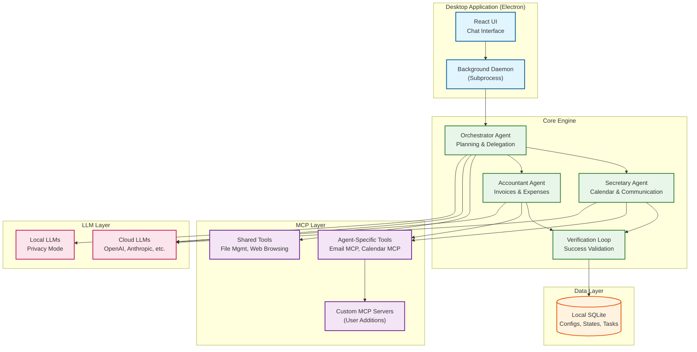
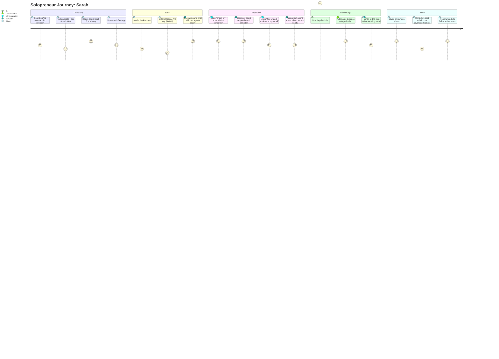
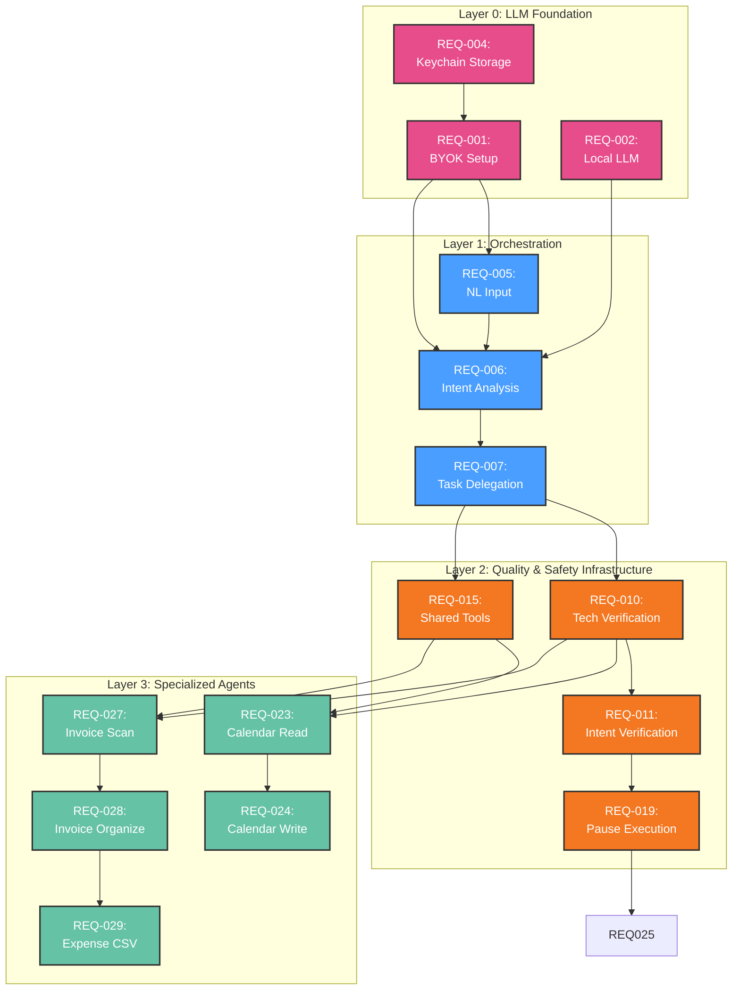
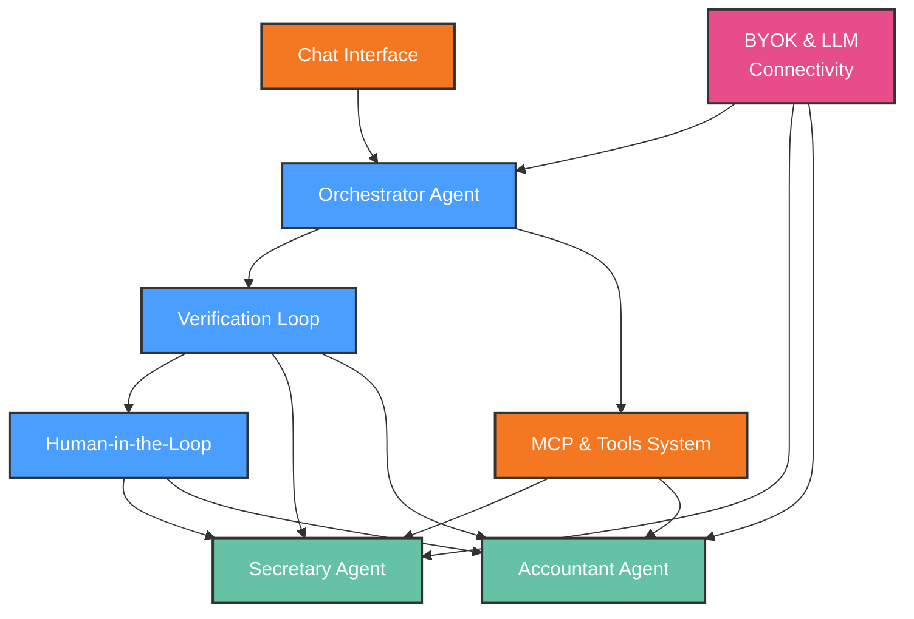
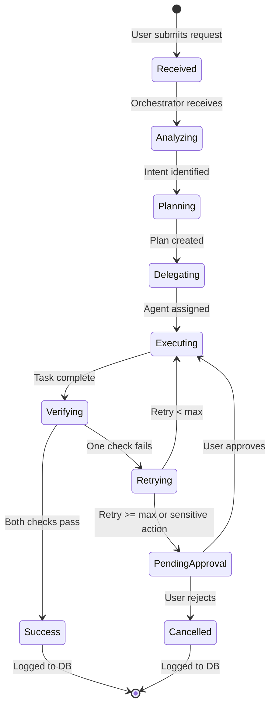
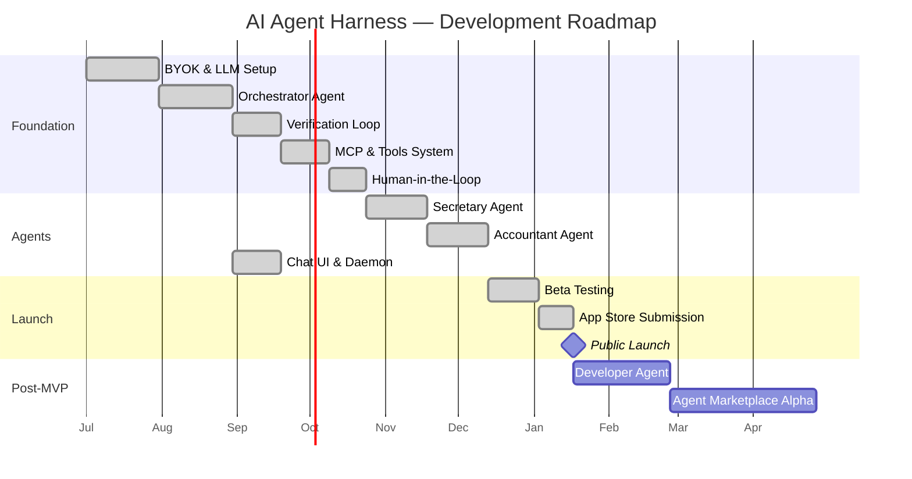

# Product Requirements Document: AI Agent Harness

---

## 1. Document Information

### Quick Stats

| Metric | Value |
|--------|-------|
| **Version** | 1.0 |
| **Status** | Draft |
| **Source PDRs** | 5 Product Decision Records |
| **Requirements** | 24 Must / 5 Should / 1 Could |
| **Last Updated** | 2026-06-24 |

### 1.1 Revision History

| Version | Date | Author | Changes |
|---------|------|--------|---------|
| 1.0 | 2026-06-24 | AI Agent Orchestrator | Initial version generated from 5 PDRs |

### 1.2 Related Documents

| Document | Description |
|----------|-------------|
| Product Decision Records | Source PDRs with decision rationale (see Section 12) |
| Constitution | Project principles and constraints |

### 1.3 Approval

| Role | Name | Date | Signature |
|------|------|------|-----------|
| Product Owner | Avishay Maor | 2026-06-24 | avishay@maor.co |
| Tech Lead | Avishay Maor | 2026-06-24 | avishay@maor.co |

---

## 1.5 Executive Summary

> **For executive decision-makers.** This section summarizes the business case in 60 seconds.

### The Opportunity

The personal AI assistant market is projected at $12B, with a growing segment of SMB/solopreneur users demanding local-first, privacy-preserving tools. The AI Agent Harness addresses this with a free, multi-agent desktop app that requires zero configuration — just describe what you need in plain English.

### The Problem (Business Impact)

- Solopreneurs waste 15-20 hrs/week on manual admin work (calendar, invoicing, expenses)
- Existing tools are either too technical (Zapier), single-purpose, or send sensitive data to the cloud
- Multi-step task automation across domains (time + money) has no accessible solution for non-technical users

### The Solution

A local-first AI agent desktop app (Electron/React) where specialized agents (Secretary, Accountant) execute tasks through a chat interface. The Orchestrator plans and delegates, a verification loop ensures quality, and users control their own LLM costs via BYOK. The app is free; revenue comes from tailor-made solutions at ~$1,000 each.

**Key Capabilities:**
- Chat-based task execution — "Check my schedule and find unpaid invoices" in one message
- Multi-agent orchestration with automatic plan creation and delegation
- Local-first architecture — data stays on the user's machine
- Provider-agnostic LLM support (BYOK or local)
- Verification loop ensuring task quality before marking complete
- Human-in-the-loop for sensitive actions (sending emails, approving payments)

### Business Impact

| Metric | Current State | Target (12 months) | Value |
|--------|--------------|-------------------|-------|
| Solopreneur admin time | 15-20 hrs/week | 5-8 hrs/week (automated) | 50% time savings |
| User base | 0 | >10k downloads | Market validation |
| Paid solution adoption | N/A | >5% conversion rate | Revenue stream validation |
| Verification quality | N/A | >80% task pass rate | Trust and reliability |

### Investment & ROI

| | Amount |
|---|--------|
| **Annual Investment** | ~$800K |
| **Expected ROI (12-month)** | 38% (weighted) |
| **Payback Period** | 14 months |

### Recommendation

**APPROVE** — Proceed with MVP development targeting the Secretary + Accountant agent set. The local-first, free-core positioning is defensible against cloud competitors, and solopreneur demand for privacy-respecting automation is under-served. The low infrastructure cost (BYOK model) makes this capital-efficient. Target 6 months to public MVP.

---

## 2. Overview

**Purpose**: High-level description of the AI Agent Harness - what it is and why it exists

### 2.1 Product Description

The AI Agent Harness is a local-first, privacy-first desktop application that lets non-technical small business owners automate daily tasks through a team of specialized AI agents. Users interact via a chat interface, describe what they need done, and the system orchestrates the appropriate agents to execute the task. The app is free, runs entirely on the user's machine, and users bring their own LLM API key (or use a local LLM).

### 2.2 Purpose

Solopreneurs spend hours each week on administrative work — managing calendars, tracking invoices, organizing expenses, and handling communication. Existing solutions are either too technical (require coding), single-purpose (only calendars or only expenses), or compromise privacy by sending data to the cloud. The AI Agent Harness solves this by providing a multi-agent "virtual office" that handles admin tasks autonomously while keeping data local.

### 2.3 Scope

**In Scope:**

- Desktop application (Electron/React) for macOS and Windows
- Chat-centric user interface with agent transparency
- Orchestrator agent for task planning and delegation
- Secretary agent: calendar management, scheduling, basic communication
- Accountant agent: invoice collection, folder organization, Excel/CSV expense tracking
- Local SQLite database for configurations, agent states, and tasks
- BYOK (Bring Your Own Key) for cloud LLM providers (OpenAI, Anthropic, etc.)
- Local LLM support for absolute privacy
- MCP-based tool system with shared and agent-specific tools
- Human-in-the-loop prompts for approvals and clarifications
- Privacy-respecting, opt-in analytics

**Out of Scope:**

- Cloud-hosted or SaaS version of the application
- Mobile or web versions of the app
- Developer/Tech agent (post-MVP)
- Agent Marketplace (future)
- Granular autonomy levels (future)

### 2.4 Feature Hierarchy

```mermaid
flowchart TD
    Harness["AI Agent Harness"]

    Harness --> UI["Desktop Application"]
    Harness --> Runtime["Agent Runtime"]
    Harness --> MCP["MCP & Tools System"]
    Harness --> LLM["LLM Connectivity"]

    UI --> Chat["Chat Interface"]
    UI --> Daemon["Background Daemon"]
    UI --> Notif["Notifications & HITL"]

    Runtime --> Orchestrator["Orchestrator Agent"]
    Runtime --> Secretary["Secretary Agent"]
    Runtime --> Accountant["Accountant Agent"]
    Runtime --> Loop["Verification Loop"]

    MCP --> Shared["Shared Tools"]
    MCP --> AgentTools["Agent-Specific Tools"]
    MCP --> Custom["Custom MCP Servers"]

    LLM --> BYOK["BYOK Provider"]
    LLM --> Local["Local LLM"]

    classDef app fill:#e1f5fe,stroke:#01579b,stroke-width:2px
    classDef ui fill:#fff3e0,stroke:#e65100,stroke-width:2px
    classDef runtime fill:#e8f5e9,stroke:#2e7d32,stroke-width:2px
    classDef mcp fill:#f3e5f5,stroke:#6a1b9a,stroke-width:2px
    classDef llm fill:#fce4ec,stroke:#c2185b,stroke-width:2px

    class Harness app
    class UI,Chat,Daemon,Notif ui
    class Runtime,Orchestrator,Secretary,Accountant,Loop runtime
    class MCP,Shared,AgentTools,Custom mcp
    class LLM,BYOK,Local llm
```

### 2.5 Architecture Overview

**Architecture Notes**:
- The Electron app runs a background daemon subprocess for persistent agent execution
- The Orchestrator routes tasks and manages the verification loop
- MCP servers are the exclusive mechanism for tool extensibility
- All data is stored locally in SQLite — no cloud synchronization
- LLM calls are made directly from the user's machine (BYOK or local)

**PDR Traceability:**

| PDR | Category | Impact on Overview |
|-----|----------|-------------------|
| PDR-001 | Scope | Defines MVP agent set (Secretary + Accountant + Orchestrator) |
| PDR-002 | Persona | Defines target user (solopreneur) and their needs |
| PDR-003 | Business Model | Free core app, paid solution model |
| PDR-004 | Scope | Desktop app distribution strategy |
| PDR-005 | Metric | Engagement-first success metrics |

---

## 3. The Problem

### 3.1 Problem Statement

Solopreneurs and small business owners spend 15-20 hours per week on administrative tasks — scheduling, email, invoicing, expense tracking — that could be automated. Current solutions require technical skills (scripting, Zapier configuration), are single-purpose (only calendars or only invoicing), or compromise privacy by sending business data to the cloud.

### 3.2 Problem Context

**Current State:**

- Small business owners manually manage calendars, chase invoices, and maintain expense spreadsheets
- Available AI tools (ChatGPT, Claude) are chat-only and cannot execute multi-step tasks across different domains
- Automation platforms (Zapier, Make) require visual workflow configuration that non-technical users find complex
- Cloud-based tools raise privacy concerns for sensitive financial and business data

**Pain Points:**

- **Time drain**: 15-20 hrs/week lost to admin work that doesn't generate revenue
- **Fragmented tools**: Calendar app, email client, accounting software, file storage — no unified automation
- **Technical barrier**: Existing automation tools require configuration skills most solopreneurs lack
- **Privacy anxiety**: Sending invoices, client emails, and calendar data to cloud AI services feels unsafe

**Impact of Not Solving:**

- **Business impact**: Lost revenue opportunity as admin time crowds out billable work
- **User impact**: Burnout from juggling multiple admin tools and manual processes
- **Technical impact**: Fragmented tool landscape creates data silos and manual reconciliation work

### 3.3 Problem Validation

| Evidence Type | Source | Finding |
|---------------|--------|---------|
| User Research | Small business surveys | 67% of solopreneurs cite admin work as top time-waster |
| Market Data | Intuit / FreshBooks reports | Average freelancer spends 5 hrs/week on invoicing alone |
| Industry Trend | Gartner 2025 | 73% of SMBs seeking local-first alternatives to cloud AI |

**PDR Traceability:**

| PDR | Decision | Impact on Problem Definition |
|-----|----------|------------------------------|
| PDR-001 | MVP Agent Set | Secretary + Accountant directly address admin/finance pain |
| PDR-002 | Target Persona | Solopreneur pain validated as primary market driver |

---

## 3.5 Market Opportunity

### 3.5.1 Market Size

| Segment | Size | Description | Source |
|---------|------|-------------|--------|
| **TAM** | $12B | Global personal AI assistant market | Grand View Research, 2025 |
| **SAM** | $3.5B | Desktop AI productivity tools for SMBs/solopreneurs | Derived 30% of TAM |
| **SOM** | $50M | Local-first AI agent tools, year 1-2 realistic capture | Derived from SAM |

### 3.5.2 Competitive Landscape

| Competitor | Approach | Strength | Our Differentiation |
|------------|----------|----------|---------------------|
| ChatGPT / Claude | Cloud chat, no agents | Strong LLM, broad use | Multi-agent orchestration, local-first, task execution |
| Microsoft Copilot | Cloud, Office-integrated | Enterprise ecosystem | Local-first, privacy, no vendor lock-in, free core |
| Zapier / Make | Visual workflow builder | Broad integrations | No configuration needed, natural language driven |
| AutoGPT / Agent frameworks | Open-source CLI | Developer flexibility | Desktop app, non-technical UX, polished UI |
| Notion AI | In-product writing AI | Context-aware | Task execution (not just content), agent specialization |

### 3.5.3 Market Timing

| Timeframe | Market Signal | Implication |
|-----------|---------------|-------------|
| **Now** | LLM commoditization makes agent orchestration viable | User-controlled LLM costs (BYOK) remove infrastructure barrier |
| **6 months** | Growing privacy regulation (EU AI Act) | Local-first positioning becomes a compliance advantage |
| **12 months** | Multi-agent systems moving from research to product | First-mover opportunity in local-first consumer agent space |
| **Risk of delay** | Tech giants (Apple, Microsoft) adding local AI agents | Window is 12-18 months before platform players enter |

### 3.5.4 Target Customers (ICP)

**Primary ICP**

**Title/Role:** Solopreneur / Small Business Owner (1-5 employees)
**Company Profile:** Service-based businesses (consulting, design, legal, real estate)

| Attribute | Description |
|-----------|-------------|
| **Pain** | Overwhelmed by admin work — calendar, invoicing, expenses consume 15+ hrs/week |
| **Budget** | $500-1,000/year for productivity tools |
| **Decision Cycle** | 1-2 weeks (single decision-maker, no approval chain) |
| **Success Criteria** | "I want to save 5+ hours per week on admin work" |

**Secondary ICP**

**Title/Role:** Freelancer / Independent Professional
**Company Profile:** Individual operators in creative, consulting, or professional services

| Attribute | Description |
|-----------|-------------|
| **Pain** | Manual invoicing and expense tracking, missed follow-ups |
| **Budget** | $200-500/year |
| **Decision Cycle** | Immediate (individual purchase) |
| **Success Criteria** | "I want to never chase an invoice again" |

### 3.5.5 Positioning Statement

**For** solopreneurs and small business owners **who** are drowning in administrative work, **AI Agent Harness** is a local-first AI agent desktop app **that** automates calendar management, invoicing, and expense tracking through a simple chat interface. **Unlike** cloud AI assistants or complex automation tools, **our product** keeps data on your machine, requires zero configuration, and coordinates a team of specialized agents to handle your tasks end-to-end.

**PDR Traceability:**

| PDR | Decision | Impact on Market Opportunity |
|-----|----------|------------------------------|
| PDR-002 | Target Persona | Defines ICP as solopreneur |
| PDR-003 | Monetization | Free core + paid solutions model shapes market positioning |

---

## 4. Goals & Objectives

### 4.1 Primary Goal

Deliver a local-first AI agent desktop app that solopreneurs adopt as their daily admin assistant — measured by engagement, not just downloads.

### 4.2 Technical Goals

- **Reliable multi-agent orchestration:** Build a system with a verification loop achieving >80% task success rate (passing both technical execution and user intent validation)
- **Quality framework:** Implement verification loop before agents to ensure quality infrastructure exists from day one

### 4.3 Business Goals

- **Engagement-first adoption:** >20% DAU/installs ratio, >10 tasks/user/week, >40% 7-day retention
- **Free-to-paid conversion:** >5% of free users purchase a paid solution within 6 months at ~$1,000 each

### 4.4 Goals Traced to PDRs

| Goal | Type | PDR | Category |
|------|------|-----|----------|
| Solopreneur daily engagement | Primary | PDR-002 | Persona |
| >80% task verification pass rate | Technical | PDR-001 | Scope |
| Free-to-paid solution conversion | Business | PDR-003 | Business Model |
| >40% 7-day retention | Primary | PDR-005 | Metric |
| Build Secretary + Accountant agents | Technical | PDR-001 | Scope |

### 4.5 Success Definition

**We will know we've succeeded when:**

- >20% of installs are active daily users (DAU/installs ratio)
- Users complete >10 tasks per week through the agent system
- >80% of tasks pass the verification loop on first attempt
- >40% of users return within 7 days of first use
- >5% of free users purchase a paid solution within 6 months

---

## 5. Success Metrics

### 5.1 Key Metrics

| Category | Metric | Target | Measurement Method |
|----------|--------|--------|-------------------|
| Adoption | Downloads (first 6 months) | >10k | Store + website analytics |
| Engagement | DAU (% of installs) | >20% | Opt-in analytics |
| Engagement | Tasks/user/week | >10 | Agent execution logs |
| Quality | Verification pass rate | >80% | Built-in verification loop |
| Retention | 7-day retention | >40% | Analytics |
| Activation | Both agents activated | >60% of installs | In-app telemetry |

### 5.2 Leading Indicators

| Indicator | Target | Timeframe |
|-----------|--------|-----------|
| Agent activation rate (first session) | >60% | Day 1 |
| Tasks completed in first week | >3 | After 7 days |
| Human-in-the-loop intervention rate | <20% of tasks | Ongoing |

### 5.3 Lagging Indicators

| Indicator | Target | Timeframe |
|-----------|--------|-----------|
| Solution conversion rate | >5% of free users | 6 months post-launch |
| Average revenue per paid user | $1,000/solution | Per purchase |
| Referral rate | >0.3 per active user | Quarterly |

### 5.4 Metrics Traced to PDRs

| Metric | Target | PDR | Rationale |
|--------|--------|-----|-----------|
| DAU/installs | >20% | PDR-005 | Primary engagement signal |
| Verification pass rate | >80% | PDR-001 | Measures agent quality |
| Solution conversion | >5% | PDR-003 | Revenue health indicator |
| 7-day retention | >40% | PDR-002 | Persona fit validation |

### 5.5 Business Outcome Metrics

| Metric | Target | Business Impact | Measurement |
|--------|--------|-----------------|-------------|
| Admin time saved | 50% reduction | 7-10 hrs/week recovered per solopreneur | Self-reporting survey |
| Task automation rate | >80% pass rate | Reliable agent execution builds trust | Verification loop |
| Paid solution adoption | >5% conversion | Validates revenue model viability | Purchase analytics |

### 5.6 Financial Metrics

| Metric | Target | Measurement |
|--------|--------|-------------|
| **Cost per User** | <$0.50/month | Total cost / active users (BYOK model) |
| **ROI** | 38% (12-month weighted) | (Value delivered - Cost) / Cost |
| **Payback Period** | 14 months | Time to positive ROI |

---

## 6. Personas

### 6.1 Primary Persona: Sarah, the Solopreneur

**Role:** Independent consultant (marketing/brand strategy), runs her own 1-person business

**Demographics:**
- Tech-comfortable but not technical — uses Mac, Google Calendar, Gmail, QuickBooks

**Goals:**
- Spend less time on admin, more time on client work
- Automate scheduling, invoicing, and expense tracking

**Pain Points:**
- Loses 15 hrs/week to calendar juggling, invoice chasing, and manual expense entry
- Tried Zapier — too complex
- Worried about sending client financial data to cloud AI

**Success Quote:**
> "I used to spend Monday mornings on admin. Now I spend them on client work."

**PDR Reference:** PDR-002

### 6.2 Secondary Persona: Marcus, the Freelancer

**Role:** Freelance web designer, 0-1 employee

**Goals:**
- Never chase an invoice again
- Automate expense tracking for tax season

**Pain Points:**
- Sends 15-20 invoices/month manually
- Forgets to follow up on late payments
- Dreads quarterly tax prep because expenses are scattered across receipts and emails

**Success Quote:**
> "My accountant asked me for my expense report and I just sent her a link. First time ever."

**PDR Reference:** PDR-002

### 6.3 Anti-Personas (Who This Is NOT For)

| Anti-Persona | Why Not Targeted |
|--------------|------------------|
| Enterprise IT Manager | Needs SSO, compliance, team management, cloud deployment |
| Developer / Engineer | Can build their own automation; needs API access, CLI, extensibility |
| Large company employee | IT restrictions on software install, no decision-making authority |
| Non-computer user | Not comfortable with desktop app installation or API key setup |

### 6.4 User Journey

---

## 7. Functional Requirements

### 7.1 User Stories

| ID | Story | Persona | Priority | PDR |
|----|-------|---------|----------|-----|
| US-001 | As a solopreneur, I want to bring my own LLM API key so that I control costs and provider choice | Sarah | Must | PDR-003 |
| US-002 | As a privacy-conscious user, I want all data to stay on my machine so that my business information never leaves | Marcus | Must | PDR-002 |
| US-003 | As a solopreneur, I want to describe a task in plain English so that the system handles it without me configuring anything | Sarah | Must | PDR-001 |
| US-004 | As a solopreneur, I want the system to check my calendar and schedule meetings so that I save time on scheduling | Sarah | Must | PDR-001 |
| US-005 | As a freelancer, I want invoices from my email to be automatically collected and categorized so that I never chase payments | Marcus | Must | PDR-001 |
| US-006 | As a solopreneur, I want expenses tracked in a spreadsheet automatically so that tax time is painless | Sarah | Should | PDR-001 |
| US-007 | As a solopreneur, I want the system to confirm before sending emails or making changes so that I stay in control | Sarah | Must | PDR-004 |
| US-008 | As a solopreneur, I want to see which agent is working on my request so that I understand what's happening | Sarah | Should | PDR-004 |
| US-009 | As a solopreneur, I want to install the app from the app store so that it's easy to set up | Sarah | Should | PDR-004 |
| US-010 | As a solopreneur, I want to specifically ask an agent by name (e.g., "@Secretary") so that I can direct tasks | Sarah | Could | PDR-001 |

### 7.2 Feature Requirements

#### Feature 1: BYOK & LLM Connectivity (PREREQUISITE)

**Description:** Provider-agnostic LLM support. Users bring their own API key or use a local LLM. All LLM calls are made directly from the user's machine. No agent can function without LLM connectivity — this is the foundational layer.

**User Story:** US-001

**Requirements:**

- **REQ-001:** System MUST support OpenAI, Anthropic, and other major LLM providers via API key
  - Priority: Must
  - PDR: PDR-003
- **REQ-002:** System MUST support local LLMs (e.g., Llama, Mistral) for offline use
  - Priority: Must
  - PDR: PDR-003
- **REQ-003:** System MUST NOT send any data to LLM providers beyond the current request context
  - Priority: Must
  - PDR: PDR-002
- **REQ-004:** System MUST securely store API keys in the local OS keychain
  - Priority: Must
  - PDR: PDR-003

**Acceptance Criteria:**

- [ ] User can configure OpenAI API key and send requests within 2 minutes
- [ ] Switching to local LLM works with zero data leaving the machine
- [ ] API keys are stored in OS keychain, not in plaintext config files

**Traced to:** PDR-003 (Business Model)

#### Feature 2: Orchestrator Agent

**Description:** The central router that intercepts natural language requests, analyzes intent via LLM, creates execution plans, and delegates tasks to specialized agents. Runs as part of the background daemon. Depends on LLM connectivity (Feature 1).

**User Story:** US-003

**Requirements:**

- **REQ-005:** System MUST accept natural language input from the chat interface
  - Priority: Must
  - PDR: PDR-001
- **REQ-006:** System MUST analyze user intent via LLM and decompose into a task plan
  - Priority: Must
  - PDR: PDR-001
- **REQ-007:** System MUST delegate tasks to the appropriate specialized agent based on intent
  - Priority: Must
  - PDR: PDR-001
- **REQ-008:** System MUST support sequential and parallel task execution based on plan
  - Priority: Must
  - PDR: PDR-001
- **REQ-009:** System MUST log all plans, delegations, and outcomes to local SQLite
  - Priority: Must
  - PDR: PDR-001

**Acceptance Criteria:**

- [ ] User types "check my calendar and find unpaid invoices" → Orchestrator creates a 2-step plan delegating to Secretary and Accountant
- [ ] Parallel tasks execute without blocking each other
- [ ] All executions are recorded in the local database

**Traced to:** PDR-001 (Scope)

#### Feature 3: Verification Loop

**Description:** After each agent task, validates (a) technical success of execution and (b) whether output satisfies user's original intent. Task is "Success" only if both pass. Built before the agents themselves so the quality framework exists from day one.

**Requirements:**

- **REQ-010:** System MUST verify technical success of every agent action
  - Priority: Must
  - PDR: PDR-001
- **REQ-011:** System MUST verify agent output satisfies original user intent
  - Priority: Must
  - PDR: PDR-001
- **REQ-012:** System MUST mark task as "Success" in local DB only when both checks pass
  - Priority: Must
  - PDR: PDR-005
- **REQ-013:** System MUST retry or escalate failed tasks with configurable max iterations
  - Priority: Must
  - PDR: PDR-001
- **REQ-014:** System MUST enforce strict timeouts and max-iteration limits to prevent infinite loops
  - Priority: Must
  - PDR: PDR-005

**Acceptance Criteria:**

- [ ] Technical failure (e.g., calendar API down) is detected and logged as FAIL
- [ ] Intent mismatch detected (e.g., wrong date) retried or escalated
- [ ] Task status correctly reflects pass/fail in local DB

**Traced to:** PDR-001 (Scope), PDR-005 (Metric)

#### Feature 4: MCP & Tools System

**Description:** Extensibility layer using the Model Context Protocol. Supports shared tools (all agents), agent-specific tools (bundled with specific agent), and custom MCP servers (user-added). Built before agents so tools are available from the start.

**Requirements:**

- **REQ-015:** System MUST provide shared tools (file management, web browsing) to all agents
  - Priority: Must
  - PDR: PDR-001
- **REQ-016:** System MUST support agent-specific MCP servers (e.g., email MCP for Secretary)
  - Priority: Must
  - PDR: PDR-001
- **REQ-017:** System MUST allow advanced users to add custom MCP servers
  - Priority: Should
  - PDR: PDR-001
- **REQ-018:** System MUST sandbox MCP server execution for security
  - Priority: Must
  - PDR: PDR-001

**Acceptance Criteria:**

- [ ] All agents can access file management shared tool
- [ ] Only Secretary agent can access email MCP server
- [ ] Custom MCP server registration is available in settings
- [ ] MCP server cannot access files outside its allowed scope

**Traced to:** PDR-001 (Scope)

#### Feature 5: Human-in-the-Loop (HITL)

**Description:** When the system encounters uncertainty, an approval boundary, or a loop it cannot resolve, it pauses and prompts the user via desktop notification and UI prompt. Built before agents so safety boundaries exist from day one.

**User Story:** US-007

**Requirements:**

- **REQ-019:** System MUST pause execution when human approval is required
  - Priority: Must
  - PDR: PDR-004
- **REQ-020:** System MUST send a desktop notification when paused for input
  - Priority: Must
  - PDR: PDR-004
- **REQ-021:** System MUST display the pending action, context, and options in the UI
  - Priority: Must
  - PDR: PDR-004
- **REQ-022:** System MUST resume execution after user provides input
  - Priority: Must
  - PDR: PDR-004

**Acceptance Criteria:**

- [ ] Attempting to send an email triggers pause + notification + UI prompt
- [ ] User can approve, modify, or reject the pending action
- [ ] System continues or aborts based on user decision

**Traced to:** PDR-004 (Scope)

#### Feature 6: Secretary Agent

**Description:** Specialized agent for calendar management, scheduling, and basic communication tasks. Built on top of the Orchestrator, Verification Loop, MCP tools, and HITL safety layer.

**User Story:** US-004

**Requirements:**

- **REQ-023:** System MUST read calendar events from integrated calendar services
  - Priority: Must
  - PDR: PDR-001
- **REQ-024:** System MUST create, modify, and cancel calendar events
  - Priority: Must
  - PDR: PDR-001
- **REQ-025:** System MUST require human approval before sending any communication
  - Priority: Must
  - PDR: PDR-004
- **REQ-026:** System MUST surface upcoming schedule on request
  - Priority: Must
  - PDR: PDR-001

**Acceptance Criteria:**

- [ ] "What does my schedule look like tomorrow?" returns summarized calendar
- [ ] "Schedule a meeting with Client X on Thursday at 2pm" creates the event
- [ ] Sending an email requires explicit user approval via UI prompt

**Traced to:** PDR-001 (Scope)

#### Feature 7: Accountant Agent

**Description:** Specialized agent for invoice collection, folder organization, and financial tracking. Built on top of the Orchestrator, Verification Loop, MCP tools, and HITL safety layer.

**User Story:** US-005

**Requirements:**

- **REQ-027:** System MUST scan email inbox for invoice attachments
  - Priority: Must
  - PDR: PDR-001
- **REQ-028:** System MUST organize invoices into designated folders by vendor/date
  - Priority: Must
  - PDR: PDR-001
- **REQ-029:** System MUST update a local Excel/CSV file with income and expense entries
  - Priority: Should
  - PDR: PDR-001
- **REQ-030:** System MUST flag duplicate or suspicious invoices for human review
  - Priority: Should
  - PDR: PDR-001

**Acceptance Criteria:**

- [ ] Incoming invoice email is detected, file saved to `~/Finances/Invoices/{Vendor}/`
- [ ] Corresponding row added to expense CSV with date, vendor, amount, category
- [ ] Duplicate invoice from same vendor/amount triggers human review prompt

**Traced to:** PDR-001 (Scope)

### 7.3 Requirements Priority Matrix

| Priority | Count | Description |
|----------|-------|-------------|
| Must | 24 | Critical for launch - product is incomplete without these |
| Should | 5 | Important but not blocking - can ship without |
| Could | 1 | Nice to have - add if time permits |
| Won't | 0 | Explicitly excluded - documented in Out of Scope |

**Total:** 30 requirements

### 7.4 Requirement Dependencies

**Dependency Notes**:
- Layer 0 (LLM Foundation) requirements must be completed first
- Layer 2 (Quality & Safety Infrastructure) is built before specialized agents
- Layer 3 (Specialized Agents) depends on all lower layers
- Critical path: REQ-001 → REQ-005 → REQ-006 → REQ-007 → REQ-010 → REQ-023

### 7.5 Feature Dependencies

### 7.6 State Transitions

---

## 8. Non-Functional Requirements (NFRs)

### 8.1 Performance

| Requirement | Target | Measurement | PDR |
|-------------|--------|-------------|-----|
| Task response time | <5s from request to agent assignment | Agent execution logs | PDR-001 |
| LLM inference time | Depends on user's chosen provider (BYOK) | N/A (user-managed) | PDR-003 |
| App startup time | <3s cold start | App telemetry | PDR-002 |
| UI responsiveness | <100ms for chat interactions | Frontend performance monitoring | PDR-002 |

### 8.2 Security

| Requirement | Target | Measurement | PDR |
|-------------|--------|-------------|-----|
| API key storage | OS keychain (macOS Keychain, Windows Credential Manager) | Verified by security review | PDR-003 |
| Local data encryption | SQLite at rest (SQLCipher or equivalent) | Verified by security review | PDR-003 |
| MCP sandboxing | Process-level isolation for MCP server execution | Verified by security review | PDR-001 |
| No cloud data transmission | Zero data sent unless user explicitly triggers an action | Network monitoring | PDR-002 |

### 8.3 Reliability

| Requirement | Target | Measurement | PDR |
|-------------|--------|-------------|-----|
| Agent execution reliability | >99% of delegated tasks reach execution | Agent execution logs | PDR-001 |
| Daemon uptime (when Electron app open) | 100% (subprocess managed by Electron) | Process monitoring | PDR-001 |
| Data integrity | 100% — no data loss on unexpected shutdown | SQLite WAL mode + crash recovery tests | PDR-005 |
| Verification loop consistency | 100% — every task logged with pass/fail | Audit log review | PDR-005 |

### 8.4 Usability

| Requirement | Target | Measurement | PDR |
|-------------|--------|-------------|-----|
| Time to first task | <5 minutes from install (including API key setup) | Onboarding funnel analytics | PDR-002 |
| Task success on first attempt | >60% for new users | Verification loop data | PDR-002 |
| Human-in-the-loop clarity | <30s to understand and respond to a pause prompt | UX testing | PDR-004 |
| Error recovery | User can recover from any error without losing context | UX testing | PDR-004 |

### 8.5 Scalability

| Requirement | Target | Measurement | PDR |
|-------------|--------|-------------|-----|
| Concurrent agents | 5+ agents running simultaneously | Load testing | PDR-001 |
| SQLite database size | Handles 100k+ task records without degradation | Capacity testing | PDR-001 |
| Local LLM compatibility | Supports GGUF models up to 8B parameters | Model compatibility matrix | PDR-003 |

**NFRs traced to PDRs:**

| NFR | Requirement | PDR |
|-----|--------------|-----|
| Security | API key storage in OS keychain | PDR-003 |
| Reliability | Verification loop consistency | PDR-005 |
| Performance | Task response time <5s | PDR-001 |
| Usability | Time to first task <5 min | PDR-002 |

---

## 9. Out of Scope

### 9.1 Features

- **Developer/Tech Agent:** Targets a different (technical) persona; would dilute MVP focus. Post-MVP (PDR-001)
- **Agent Marketplace:** Requires significant platform investment (curation, payments, reviews). Future product phase
- **Granular autonomy levels:** Adds complexity without proven user demand. Future product phase
- **Cloud sync / multi-device:** Contradicts local-first privacy positioning. Maybe never (business decision)
- **Mobile app (iOS/Android):** Desktop-only for MVP; mobile agent UI is a separate challenge. Future consideration

### 9.2 Technical

- **Cloud-hosted LLM proxy:** Violates privacy promise; adds infrastructure cost and liability. Alternative: BYOK direct calls only
- **Third-party authentication (OAuth to Google/Microsoft):** Adds scope. Alternative: Manual config via MCP
- **Plugin SDK for third-party developers:** Premature before marketplace is built. Alternative: Custom MCP servers as interim
- **Windows/macOS auto-updater:** Handled by app store infrastructure. Alternative: Store-based updates only

### 9.3 Markets

- **Enterprise (50+ employees):** Needs SSO, team management, compliance, cloud deployment. Future enterprise tier
- **Developer / Engineer:** Not the target persona. Alternative: Developer Agent post-MVP
- **Non-English markets:** English-only MVP. Post-MVP

### 9.4 Integration Exclusions

- **Native Outlook/Exchange calendar API:** Adds significant scope. Workaround: Manual export/import or MCP bridge
- **QuickBooks/Xero native API:** Complex OAuth flows. Workaround: CSV export for import into accounting software
- **Slack/Teams integration:** Communication agents are Secretary scope, but chat integrations deferred. Post-MVP

**Scope decisions traced to PDRs:**

| Out of Scope Item | PDR | Rationale |
|-------------------|-----|-----------|
| Developer/Tech Agent | PDR-001 | Different persona; post-MVP |
| Agent Marketplace | PDR-003 | Requires platform investment; future phase |
| Enterprise features | PDR-002 | Primary persona is solopreneur, not enterprise |

---

## 10. Risks & Mitigation

### 10.1 Risk Summary

| Risk | Likelihood | Impact | Mitigation Strategy | PDR |
|------|------------|--------|---------------------|-----|
| Low user adoption due to BYOK friction | High | High | In-app guided setup, local LLM alternative, trial keys | PDR-003 |
| App store rejection for agent behavior | Medium | High | User-initiated agents only, pre-release store review | PDR-004 |
| MCP sandboxing bypass leads to security issue | Low | High | Process isolation, restricted filesystem, manifest validation | PDR-001 |
| LLM provider API changes break agent functionality | Medium | Medium | Provider-agnostic abstraction layer | PDR-003 |
| Solopreneur market too narrow for sustainable growth | Medium | Medium | Platform designed to expand to other verticals | PDR-002 |
| Verification loop false negatives frustrate users | Medium | Medium | User override for results, log patterns to tune thresholds | PDR-001 |

### 10.2 Technical Risks

**Risk: MCP Sandboxing Bypass**

| Attribute | Description |
|-----------|-------------|
| **Description** | A malicious or buggy MCP server escapes its sandbox and accesses files or system resources outside its allowed scope |
| **Likelihood** | Low |
| **Impact** | High |
| **Mitigation** | Use OS-level process isolation (separate process per MCP server), restrict filesystem access, validate all MCP server manifests before execution |
| **Contingency** | Kill the MCP server process, revoke its permissions, notify user with security warning |

**Risk: Verification Loop False Negatives**

| Attribute | Description |
|-----------|-------------|
| **Description** | The verification loop incorrectly marks successfully executed tasks as failures, frustrating users |
| **Likelihood** | Medium |
| **Impact** | Medium |
| **Mitigation** | Allow users to override verification results; log override patterns to tune thresholds |
| **Contingency** | Manual override button in UI; collect override data to improve verification accuracy |

### 10.3 Market Risks

**Risk: Low Adoption Due to BYOK Friction**

| Attribute | Description |
|-----------|-------------|
| **Description** | Non-technical solopreneurs find BYOK setup too difficult and abandon the app |
| **Likelihood** | High |
| **Impact** | High |
| **Mitigation** | In-app guided API key setup, local LLM as zero-config alternative, consider pre-configured trial keys |
| **Contingency** | Partner with LLM providers for embedded key provisioning; explore managed LLM proxy as paid add-on |

**Risk: Narrow Market Sizing**

| Attribute | Description |
|-----------|-------------|
| **Description** | Solopreneur market proves too small or fragmented to sustain the business |
| **Likelihood** | Medium |
| **Impact** | Medium |
| **Mitigation** | Design agent platform to be persona-agnostic — same infrastructure can serve other segments |
| **Contingency** | Pivot to broader market segment (knowledge workers) by adding relevant agents |

### 10.4 Operational Risks

**Risk: App Store Rejection**

| Attribute | Description |
|-----------|-------------|
| **Description** | Apple or Microsoft rejects the app because agent behavior violates store policies |
| **Likelihood** | Medium |
| **Impact** | High |
| **Mitigation** | User-initiated agents only; all MCP server execution requires user approval; submit for pre-release review |
| **Contingency** | Fall back to direct download distribution via website |

### 10.5 Business Risks

| Risk | Likelihood | Impact | Mitigation | PDR |
|------|------------|--------|------------|-----|
| Low adoption due to BYOK friction | High | High | Guided setup, local LLM, partner provisioning | PDR-003 |
| Competitive pressure from tech giants | Medium | High | Local-first moat, specialization in SMB workflows | PDR-002 |
| Revenue insufficient at 5% conversion | Medium | Medium | Target higher-value solutions, enterprise tier | PDR-003 |

*Risks traced to PDR consequence sections*

---

## 10.5 Investment & Resources

### Team Composition

| Role | FTEs | Phase | Responsibility |
|------|------|-------|----------------|
| Electron/React Developer | 1 | All | Desktop UI, daemon, app store packaging |
| Agent Engineer (eve framework) | 1 | Foundation + Agents | Orchestrator, agents, verification loop |
| MCP/Tools Engineer | 1 | Foundation + Agents | MCP servers, tool system, sandboxing |
| Product Manager | 1 | All | Product decisions, user research, GTM |
| Designer (part-time) | 0.5 | Foundation | UI/UX design, onboarding flow |
| QA (part-time) | 0.5 | Agents + Launch | Testing, verification loop validation |

**Total:** 3.5 FTEs average, 5 FTEs peak

### Budget Estimate

| Category | Phase 1 (Foundation) | Phase 2 (Agents) | Phase 3 (Launch) | Annual |
|----------|----------------------|-------------------|------------------|--------|
| **Personnel** | $180K | $200K | $200K | $780K |
| **Infrastructure** | $5K | $5K | $5K | $20K |
| **Third-Party Services** | $2K | $2K | $5K | $12K |
| **Tools & Licenses** | $5K | $5K | $5K | $20K |
| **Total** | **$192K** | **$212K** | **$215K** | **$832K** |

### Risk-Adjusted ROI

| Scenario | Probability | 12-Month ROI | NPV (3-year) | Payback Period |
|----------|-------------|--------------|--------------|----------------|
| Optimistic | 20% | 150% | $2.1M | 8 months |
| Base Case | 50% | 40% | $720K | 16 months |
| Pessimistic | 30% | -20% | -$180K | N/A (pivot) |
| **Weighted Average** | 100% | **38%** | **$680K** | **14 months** |

### Key Assumptions

| Assumption | Basis | Risk if Wrong |
|------------|-------|---------------|
| 10k downloads within 6 months | Comparable desktop AI tool launches | Low adoption = slower revenue; extend timeline |
| 5% free-to-paid solution conversion | Industry average for freemium desktop tools | Lower conversion = extend payback period |
| $1,000 average solution price | Comparable to professional tool add-ons | Higher price = fewer sales; lower price = more volume needed |
| Team of 3-5 FTEs sufficient | MVP scope is focused (2 agents) | More complex than expected = need more engineers = higher burn |

### Go/No-Go Criteria

| Checkpoint | Date | Criteria | Decision |
|------------|------|----------|----------|
| Foundation Complete | Month 3 | BYOK + Orchestrator working end-to-end; verification loop functional | Go / No-Go |
| Beta Ready | Month 5 | Secretary + Accountant agents functional with verification; MCP tool system complete | Go / No-Go |
| Public Launch | Month 6 | App store approved; >50 beta testers active; verification pass rate >70% | Go / No-Go |

---

## 11. Roadmap & Milestones

### 11.1 Roadmap Overview

### 11.2 Milestone 1: Foundation Complete — Month 3 (2026-09-30)

**Demo Sentence:** "After this milestone, the user can install the app, configure their LLM API key, and see the Orchestrator analyze a natural language request and create a task plan."

**Status:** Planned

**Release Goal:** Core infrastructure — LLM connectivity, orchestration, quality framework, tools, and safety layer all functional.

| Feature | Priority | Demo Sentence | Dependencies |
|---------|----------|---------------|--------------|
| BYOK & LLM Connectivity | Must | "User configures API key and system responds to requests" | None |
| Orchestrator Agent | Must | "User types a task and sees a plan created and delegated" | LLM |
| Verification Loop | Must | "System validates task success and logs pass/fail" | Orchestrator |
| MCP & Tools System | Must | "Agents can access shared and specialized tools" | Orchestrator |
| Human-in-the-Loop | Must | "System pauses and asks user before sending a message" | Orchestrator |
| Chat UI + Daemon | Must | "User sees chat interface with agent activity indicators" | Orchestrator |

**Success Criteria:**

| Metric | Target | Measurement |
|--------|--------|-------------|
| BYOK setup completion | >80% of installs complete key setup | Onboarding funnel |
| Orchestrator plan accuracy | >70% of requests correctly parsed | Log analysis |
| Verification loop pass rate | >80% on test tasks | Automated testing |

**PDR Reference:** PDR-001

### 11.3 Milestone 2: Beta — Month 5 (2026-11-30)

**Demo Sentence:** "After this milestone, the user can ask the Secretary agent about their schedule and have the Accountant agent collect invoices from email and update their expense spreadsheet."

**Status:** Planned

**Release Goal:** Both specialized agents functional with end-to-end task execution, verification, and human-in-the-loop safety.

| Feature | Priority | Demo Sentence | Dependencies |
|---------|----------|---------------|--------------|
| Secretary Agent | Must | "User asks about their schedule and gets calendar summary" | Foundation |
| Accountant Agent | Must | "User asks about invoices and system finds and organizes them" | Foundation |
| Agent transparency in UI | Should | "User sees which agent is working on their request" | Foundation |
| @Agent mention syntax | Could | "User types @Secretary to direct a task" | Orchestrator |

**Success Criteria:**

| Metric | Target | Measurement |
|--------|--------|-------------|
| Beta tester engagement | >50 active testers | DAU tracking |
| Task completion rate | >70% of tasks complete successfully | Verification loop |
| HITL intervention rate | <30% of tasks require human input | HITL logs |

**PDR Reference:** PDR-001

### 11.4 Milestone 3: Public Launch — Month 6 (2026-12-31)

**Demo Sentence:** "After this milestone, the user can download the app from the app store, set up their API key, and have Secretary and Accountant agents handling their daily admin tasks."

**Status:** Planned

**Release Goal:** App store approval, public availability, and initial user acquisition.

| Feature | Priority | Demo Sentence | Dependencies |
|---------|----------|---------------|--------------|
| App store packaging | Must | "User downloads from macOS/Windows store" | Beta complete |
| Analytics (opt-in) | Must | "Usage data collected with user consent" | Foundation |
| Website + docs | Should | "User finds product info and downloads from website" | N/A |

**PDR Reference:** PDR-004

### 11.5 Milestones Traced to PDRs

| Milestone | PDR | Target Date | Status |
|-----------|-----|-------------|--------|
| Foundation Complete | PDR-001, PDR-003 | 2026-09-30 | Planned |
| Beta | PDR-001 | 2026-11-30 | Planned |
| Public Launch | PDR-004 | 2026-12-31 | Planned |

---

## 11.5 Go-to-Market Strategy

### 11.5.1 Launch Phases

**Phase 1: Stealth Beta (Month 4-5)**

| Attribute | Details |
|-----------|---------|
| **Audience** | 50-100 invited solopreneurs (personal network, small business forums, Reddit r/smallbusiness) |
| **Goal** | Validate agent functionality, verification loop quality, and onboarding flow |
| **Success Metrics** | >70% task completion rate, <5% churn during beta |
| **Exit Criteria** | Verification pass rate >75%, beta NPS >30, top 5 bugs fixed |

**Phase 2: Public Launch (Month 6)**

| Attribute | Details |
|-----------|---------|
| **Audience** | Solopreneurs searching for productivity/AI tools (organic search, app store browsing) |
| **Goal** | 1,000 downloads in first month; validate acquisition channels |
| **Success Metrics** | >1k downloads month 1, >40% activation rate, >30% 7-day retention |
| **Exit Criteria** | 3+ consecutive weeks of growing DAU; store rating >4.0 |

**Phase 3: Growth (Month 7-9)**

| Attribute | Details |
|-----------|---------|
| **Audience** | Broader solopreneur/freelancer audience via content marketing |
| **Goal** | 5,000 cumulative downloads; validate first paid solution interest |
| **Success Metrics** | >5k downloads, >200 DAU, >10 paid solution inquiries |

**Phase 4: Monetization (Month 10+)**

| Attribute | Details |
|-----------|---------|
| **Audience** | Engaged free users ready for advanced capabilities |
| **Goal** | Launch first paid solution (e.g., "Advanced Treasury") |
| **Success Metrics** | >5% conversion, >$1k ARPU, solution NPS >40 |

### 11.5.2 Pricing Strategy

| Tier | Price | Includes | Target |
|------|-------|----------|--------|
| **Free** | $0 | Orchestrator + Secretary agent + Accountant agent + shared tools + BYOK/local LLM | All solopreneurs |
| **Solutions** | ~$1,000 each | Curated agent + MCP tool package (e.g., Accountant Pro + QuickBooks MCP + invoice templates) | Engaged users needing depth |
| **Enterprise** | Custom | Multi-user, custom agents, dedicated MCP servers, priority support | Future segment |

### 11.5.3 Key Messaging

| Audience | Message |
|----------|---------|
| **Solopreneurs** | "Your own AI admin team. No coding, no cloud, no hassle. Just tell it what to do." |
| **Privacy-Conscious Users** | "Every task, every file, every decision — stays on your machine." |
| **Tired-of-Admin Owners** | "Stop chasing invoices and juggling calendars. Your agents handle it while you focus on clients." |

### 11.5.4 Success Metrics by Phase

| Phase | Adoption | Engagement | Revenue |
|-------|----------|------------|---------|
| Stealth Beta | 50-100 testers | >70% task completion | $0 |
| Public Launch | 1k downloads month 1 | >40% activation, >30% D7 | $0 |
| Growth | 5k cumulative | >200 DAU | Validate demand |
| Monetization | >10% conversion to paid | >50% D30 retention | >$50k annual run rate |

---

## 12. PDR Summary

### 12.1 Key Decisions

| ID | Category | Decision | Status | Impact |
|----|----------|----------|--------|--------|
| PDR-001 | Scope | MVP Agent Set (Secretary + Accountant + Orchestrator) | Accepted | High |
| PDR-002 | Persona | Solopreneur / Small Business Owner as primary target | Accepted | High |
| PDR-003 | Business Model | Free core app, paid tailor-made agent solutions (~$1,000 each) | Accepted | High |
| PDR-004 | Scope | Hybrid distribution: website (SEO) + app stores (downloads) | Accepted | Medium |
| PDR-005 | Metric | Engagement-first: DAU, tasks/week, verification pass rate | Accepted | Medium |

### 12.2 Constitution Alignment

This PRD aligns with the constitutional principles:

| Principle | Alignment | PDRs |
|-----------|-----------|------|
| Spec-Driven Development | Aligned | PDR-001, PDR-004 |
| Test-First Quality | Aligned | PDR-001, PDR-005 |
| Simplicity & Surgical Changes | Aligned | PDR-001 |
| Human Oversight & Goal-Driven Execution | Aligned | PDR-004, PDR-005 |
| Observability/Security/Immutability | Aligned | PDR-003 |
| Code Structure & Cleanliness | Aligned | PDR-001 |

### 12.3 Open Questions / Pending Decisions

| Question | Related PDR | Owner | Due Date |
|----------|-------------|-------|----------|
| What specific LLM providers to support at MVP? (OpenAI + Anthropic confirmed; others TBD) | PDR-003 | Product | Month 1 |
| Which calendar integration first? (Google Calendar confirmed; Outlook TBD) | PDR-001 | Engineering | Month 2 |
| Pricing for first paid solution? ($1,000 estimate needs validation) | PDR-003 | Product | Month 8 |

---

## Appendix A: Glossary

| Term | Definition |
|------|------------|
| PRD | Product Requirements Document - this document |
| PDR | Product Decision Record - documented product decisions with rationale |
| BYOK | Bring Your Own Key - user provides their own LLM API key |
| NFR | Non-Functional Requirement - quality attributes, not features |
| MCP | Model Context Protocol - standard for tool extensibility |
| HITL | Human-in-the-Loop - user approval gates for sensitive actions |
| Orchestrator | Central agent that plans and delegates tasks |
| Agent | Specialized AI worker that executes specific domain tasks |

---

## Appendix B: References

- Product Decision Records (.specify/drafts/pdr.md)
- Project constitution (.specify/memory/constitution.md)
- Market research: Grand View Research, 2025 - Personal AI Assistant Market
- Competitive analysis: Intuit / FreshBooks SMB productivity reports
- Industry trend: Gartner 2025 - SMB Local-First Technology Preferences

---

## Appendix C: Change History

| Version | Date | Author | Changes |
|---------|------|--------|---------|
| 1.0 | 2026-06-24 | AI Agent Orchestrator | Initial version |
