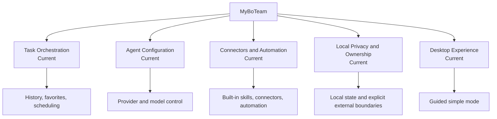
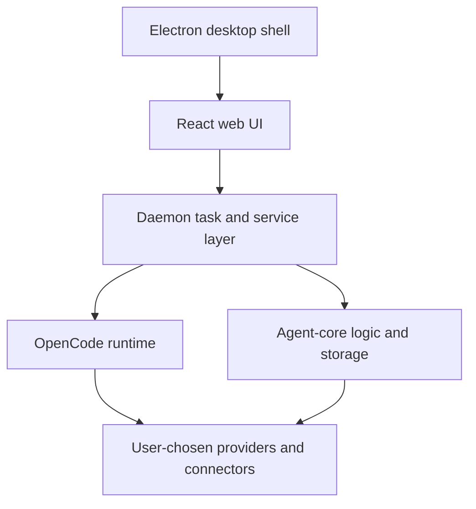
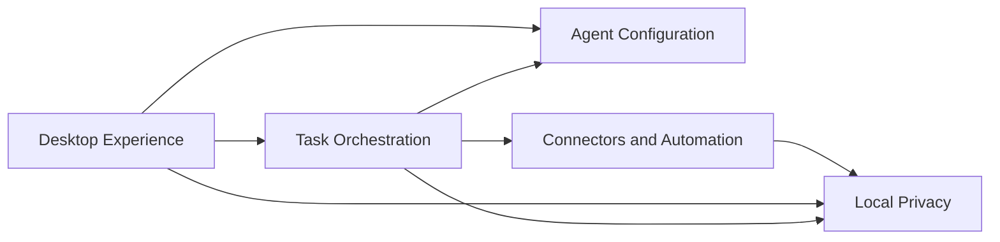
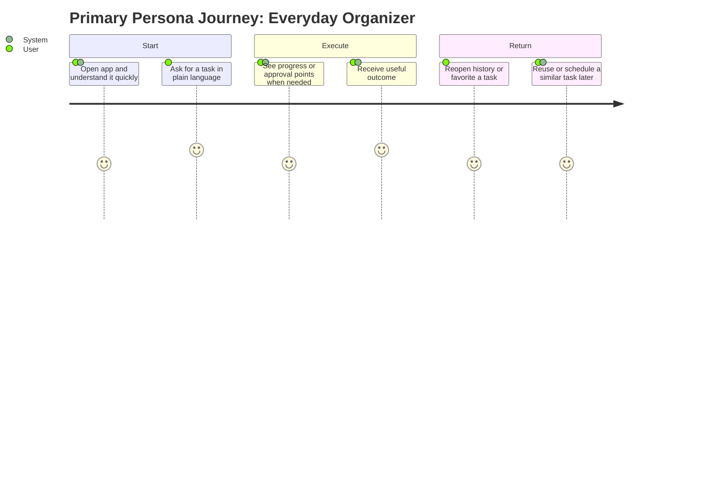
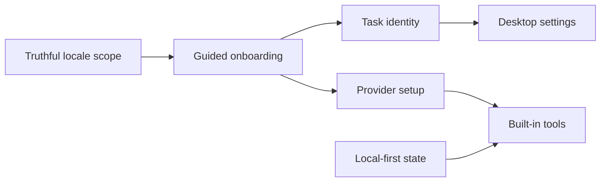
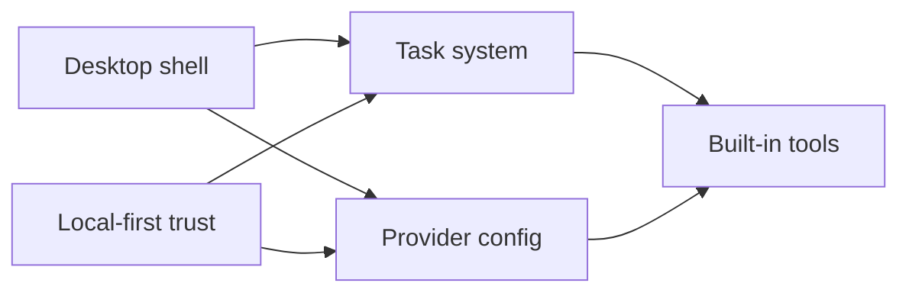
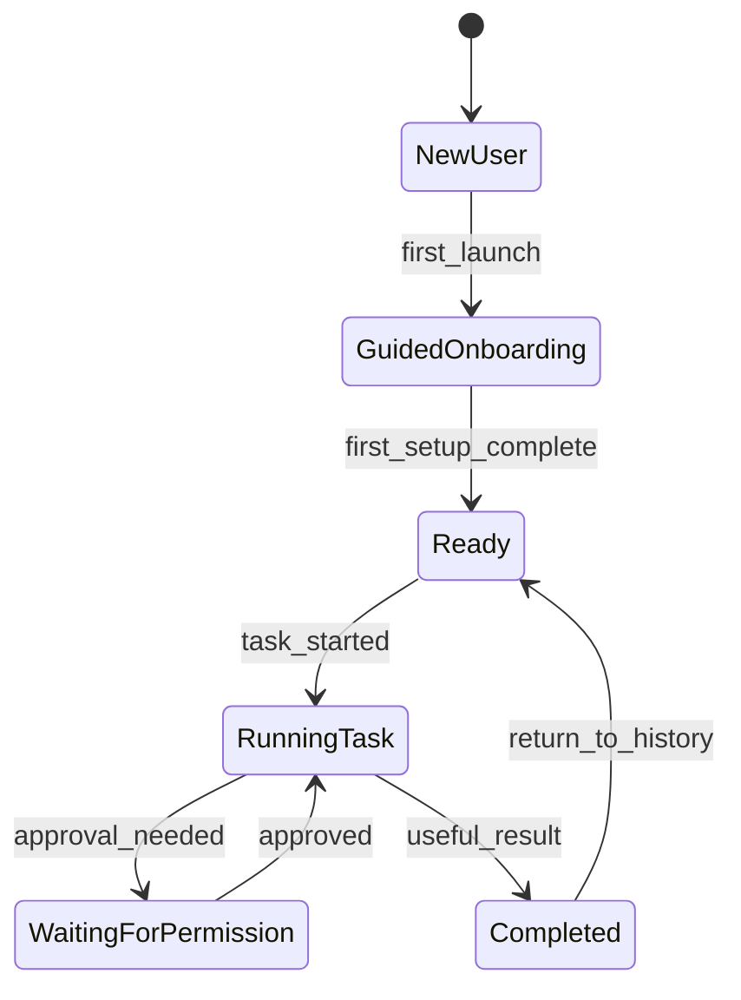
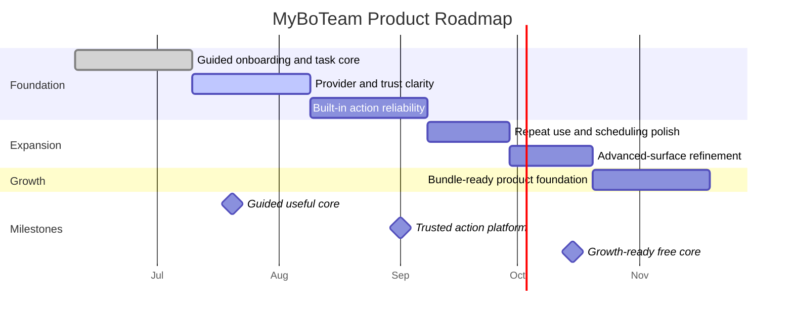

# Product Requirements Document: MyBoTeam

---

## 1. Document Information

### Quick Stats

| Metric | Value |
|--------|-------|
| **Version** | 1.0 |
| **Status** | Review |
| **Source PDRs** | 9 Product Decision Records |
| **Requirements** | 10 Must / 4 Should / 0 Could |
| **Last Updated** | 2026-06-10 |

### 1.1 Revision History

| Version | Date | Author | Changes |
|---------|------|--------|---------|
| 1.0 | 2026-06-10 | Codex | Initial PRD generated from accepted PDRs |

### 1.2 Related Documents

| Document | Description |
|----------|-------------|
| Product Decision Records | Canonical product decisions summarized in Section 12 |
| Architecture Description | System architecture and ADR context for the desktop, web, daemon, and agent-core boundaries |
| Constitution | Product and engineering principles governing local-first privacy, human oversight, and delivery quality |

### 1.3 Approval

| Role | Name | Date | Signature |
|------|------|------|-----------|
| Product Owner | Pending review | 2026-06-10 | Pending |
| Tech Lead | Pending review | 2026-06-10 | Pending |
| Stakeholder | Pending review | 2026-06-10 | Pending |

---

## 1.5 Executive Summary

### The Opportunity

MyBoTeam can differentiate as a local-first desktop assistant that completes useful work through tasks, built-in skills, connectors, and automation rather than acting like a generic chat shell.

### The Problem (Business Impact)

- Users want useful outcomes, not only generated responses, and current AI products often leave the real work unfinished.
- Trust breaks quickly when assistants ask for credentials, messages, documents, or browser access without a clear local-first boundary.
- Powerful desktop products can lose mainstream users if onboarding and settings exposure become too technical too early.

### The Solution

MyBoTeam should present itself as a private AI workforce for broad simple users. The product centers on durable tasks, guided onboarding, provider-neutral AI configuration, built-in action capabilities, and a local-first trust model that keeps user data under explicit control.

### Business Impact

| Metric | Current State | Target (12 months) | Value |
|--------|--------------|-------------------|-------|
| Useful task completion | Not yet standardized | Product-wide primary KPI | Better product prioritization |
| First-task completion | Not yet formalized | Improve with guided onboarding | Better activation |
| Repeat task usage | Not yet formalized | Improve through history, favorites, and scheduling | Better retention |
| Trust-sensitive setup continuation | Not yet formalized | Improve through local-first clarity | Better provider and connector adoption |

### Investment & ROI

| | Amount |
|---|--------|
| **Annual Investment** | Primarily existing product and engineering team time |
| **Expected ROI (12-month)** | Positive if completion, onboarding, and retention improve together |
| **Payback Period** | Tied to free-core value proof before future bundle monetization |

### Recommendation

**APPROVE** - MyBoTeam already contains the architectural and product signals for a differentiated desktop assistant. This PRD aligns those signals around a clear mainstream-first product strategy.

---

## 2. Overview

MyBoTeam is a local-first desktop AI assistant that helps users complete work through supervised tasks. The product combines a React UI, Electron desktop shell, long-lived daemon, and shared agent-core logic to support task execution, provider configuration, built-in tools, and persistent local state.

### 2.1 Product Description

MyBoTeam gives users a private AI team running locally on their desktop. The product is not positioned as a generic chatbot. It is positioned as a task-first assistant that can reason, ask for permission, use built-in skills and connectors, and return useful outcomes across productivity, communication, and coordination flows.

**Key Differentiators:**
- Durable task lifecycle instead of conversation-only interaction
- Provider-neutral AI gateway with local and hosted model support
- Built-in browser, connector, and desktop action capability

### 2.2 Purpose

The product exists to make advanced AI capability usable by mostly non-professional and simple users. It should help users get real work done while keeping trust, visibility, and local ownership intact.

**Target Outcome:** Users ask for work in plain language, the assistant completes as much as it safely can, and users return to results that feel useful and trustworthy.

### 2.3 Scope

**In Scope:**

- Guided task-first workflow with progress, approvals, and continuity
- Provider-neutral AI configuration with built-in skills and local-first data ownership
- Desktop shell with guided onboarding and progressively revealed advanced settings

**Out of Scope:**

- A hosted MyBoTeam backend as a requirement for core usage
- Marketplace-first discovery, paid-first product framing, or unsupported-current RTL claims

### 2.4 Feature Hierarchy

### 2.5 Architecture Overview

**Architecture Notes**:
- The web UI renders the user-facing product surface and settings.
- The daemon owns task execution, service orchestration, and local secret boundaries.
- Agent-core provides storage, provider, migration, and shared business logic.

### 2.6 Cross-Area Interactions

**PDR Traceability:**

| PDR | Category | Impact on Overview |
|-----|----------|-------------------|
| PDR-001 | Positioning | Defines the personal AI workforce framing for simple users |
| PDR-002 | Workflow Model | Makes the task the primary product unit |
| PDR-003 | Product Capability | Adds provider-neutral model configuration |
| PDR-004 | Product Capability | Adds built-in skills, connectors, and tools |
| PDR-005 | Trust Model | Requires local-first privacy and explicit boundaries |
| PDR-009 | User Experience | Shapes the desktop shell and guided onboarding |

---

## 3. The Problem

Users increasingly expect AI to help complete real work, but most products still stop at text output or feel too technical once they cross into automation, provider setup, or privacy-sensitive workflows.

**Problem Context:**

- Conversation alone is a weak model for scheduling, resumability, permissions, and accountable execution.
- Provider setup, connector auth, and advanced settings can overwhelm users before they see value.
- Trust erodes fast when an assistant handles credentials, files, or messages without explicit local-first boundaries.

### 3.1 Evidence

- Existing routes, storage, and execution surfaces already revolve around task lifecycle and persistent state.
- Provider settings, built-in tool families, connector services, and local storage boundaries are already implemented.
- The current desktop shell is broad enough that guided onboarding is required to keep the product usable for mainstream users.

---

## 3.5 Market Opportunity

The current repository does not provide validated TAM, SAM, or SOM research, so the market numbers remain product-research follow-up work. The opportunity is still clear at a strategic level: users want assistants that complete useful tasks, preserve control, and work across tools without collapsing into enterprise-only complexity.

### 3.5.1 Market Size (TAM/SAM/SOM)

| Segment | Size | Description | Source |
|---------|------|-------------|--------|
| **TAM** | To be validated | AI-assisted personal productivity and coordination software | Product research backlog |
| **SAM** | To be validated | Desktop users willing to adopt guided local-first assistant workflows | Product research backlog |
| **SOM** | To be validated | Early adopters attracted to private, action-oriented desktop AI | Launch planning |

### 3.5.2 Competitive Landscape

| Competitor | Approach | Strength | Our Differentiation |
|------------|----------|----------|---------------------|
| Chat-only assistants | Conversation-first | Familiarity | MyBoTeam adds task continuity and action capability |
| Single-provider assistants | Managed simplicity | Lower setup overhead | MyBoTeam preserves provider choice and local options |
| Technical automation tools | Power-user control | Deep execution | MyBoTeam targets broader simple users |
| Cloud-default AI products | Managed data handling | Convenience | MyBoTeam starts from local ownership and explicit boundaries |

### 3.5.3 Market Timing

| Timeframe | Market Signal | Implication |
|-----------|---------------|-------------|
| **Now** | Users expect AI help beyond text output | Action-oriented task completion is a real wedge |
| **6 months** | More assistant products will claim autonomy | Trust, guided UX, and completion quality will differentiate |
| **12 months** | Model choice and privacy control may become expected | Productized configuration and ownership will matter more |
| **Risk of delay** | Competitors may simplify these capabilities faster | MyBoTeam could remain powerful but less approachable |

### 3.5.4 Target Customers (ICP)

#### Primary ICP

**Title/Role:** Broad simple desktop user  
**Company Profile:** Individual user seeking personal productivity, coordination, and assistant help

| Attribute | Description |
|-----------|-------------|
| **Pain** | Too many small tasks spread across tools and tabs |
| **Budget** | Free-core expectation |
| **Decision Cycle** | Immediate if the first task feels useful |
| **Success Criteria** | The product helps complete work quickly and clearly |

#### Secondary ICP

**Title/Role:** Advanced repeat user  
**Company Profile:** Solo operator or power user willing to configure deeper capabilities

| Attribute | Description |
|-----------|-------------|
| **Pain** | Repeated work across providers, browsers, messages, and documents |
| **Budget** | Higher willingness to adopt future curated bundles |
| **Decision Cycle** | Short if repeat value and control are obvious |
| **Success Criteria** | Reusable, trustworthy, action-capable assistant workflows |

### 3.5.5 Positioning Statement

**For** broad desktop users who want useful work completed, **MyBoTeam** is a local-first desktop AI workforce **that** turns plain-language requests into supervised tasks with built-in action capability. **Unlike** chat-only or cloud-default assistants, **our product** combines task continuity, provider flexibility, and local ownership in one desktop shell.

---

## 4. Goals & Objectives

### 4.1 Primary Goal

Make useful task completion the core product outcome for broad simple users.

### 4.2 Technical Goal

Unify task execution, provider configuration, built-in tools, desktop settings, and local-first trust boundaries without breaking product clarity.

### 4.3 Business Goal

Grow a free local-first core product whose retention and repeat usage justify future curated bundles of agents, skills, and workflows.

### 4.4 Goals Traced to PDRs

| Goal | Type | PDR | Category |
|------|------|-----|----------|
| Useful completed work over chat-only interaction | Primary | PDR-002 | Workflow Model |
| Guided mainstream onboarding | Primary | PDR-001, PDR-009 | Positioning, User Experience |
| Provider-neutral and local-first flexibility | Technical | PDR-003, PDR-005 | Capability, Trust Model |
| Future curated bundle path after value proof | Business | PDR-008 | Business Model |

### 4.5 Success Definition

**We will know we've succeeded when:**

- New users complete meaningful first tasks without learning the whole system first.
- Returning users reuse task history, built-in capabilities, and settings without losing trust.
- The product remains clearly more useful than chat-only assistants while staying approachable.

---

## 5. Success Metrics

### 5.1 Key Metrics

| Category | Metric | Target | Measurement Method |
|----------|--------|--------|-------------------|
| Adoption | First-task completion after onboarding | Improve over baseline | Product review |
| Engagement | Repeat tasks per retained user | Improve over baseline | Retention analysis |
| Value | User-confirmed useful task completion rate | Primary KPI | Completion confirmation |
| Quality | Trust-sensitive setup continuation | Improve over baseline | Setup funnel review |

### 5.2 Leading Indicators

| Indicator | Target | Timeframe |
|-----------|--------|-----------|
| Provider setup completion | Upward trend | Weekly |
| Connector or automation task success | Upward trend | Weekly |
| Users returning to task history or favorites | Upward trend | Weekly |

### 5.3 Lagging Indicators

| Indicator | Target | Timeframe |
|-----------|--------|-----------|
| Retained users completing repeat tasks | Upward trend | Monthly |
| Advanced feature adoption without hurting onboarding | Upward trend | Quarterly |
| Future bundle demand signals | Positive qualitative trend | Quarterly |

### 5.4 Metrics Traced to PDRs

| Metric | Target | PDR | Rationale |
|--------|--------|-----|-----------|
| Useful task completion | Highest-priority KPI | PDR-002 | The task is the primary workflow unit |
| First-task completion | Improvement trend | PDR-009 | Guided onboarding must produce value |
| Trust-sensitive setup continuation | Improvement trend | PDR-005 | Local-first trust must support usage |
| Repeat task retention | Improvement trend | PDR-001, PDR-008 | Product value must support future business paths |

### 5.5 Business Outcome Metrics

| Business Outcome | Current State | Target |
|------------------|---------------|--------|
| Activation quality | Not yet standardized | Clear improvement in first-task completion |
| Retention quality | Not yet standardized | More returning users completing repeat tasks |
| Differentiation proof | Qualitative today | Stronger action-enabled completion and trust perception |

### 5.6 Financial Metrics

| Metric | Current State | Target |
|--------|--------------|--------|
| Hosted backend cost dependency | None in current architecture | Preserve local-first independence |
| Marketplace conversion | Not applicable yet | Define only after free-core demand is proven |
| Payback basis | Undefined | Tie future monetization to repeat value and bundle demand |

---

## 6. Personas

### 6.1 Primary Persona

**Name:** Everyday Organizer

| Attribute | Description |
|-----------|-------------|
| **Role** | Broad simple desktop user |
| **Experience** | Comfortable asking for help in plain language, not interested in technical workflow tooling |
| **Goals** | Get personal productivity, communication, and document tasks completed |
| **Pain Points** | Too many scattered small tasks and too much manual follow-through |
| **Needs** | Simple task entry, trustworthy automation, and clear status when the system needs input |
| **Success Quote** | "I want to ask once and come back to something useful." |

### 6.2 Secondary Persona

**Name:** Automation Power User

| Attribute | Description |
|-----------|-------------|
| **Role** | Returning advanced or solo operator user |
| **Experience** | Comfortable with deeper settings, scheduling, and provider tradeoffs |
| **Goals** | Reuse successful tasks, connect more capabilities, and reduce manual work |
| **Pain Points** | Chat-only tools lose continuity and require repeated setup |
| **Needs** | Durable tasks, repeat-use capability, and deeper control when needed |
| **Success Quote** | "Keep the simple path, but let me go deeper when the value is proven." |

### 6.3 Anti-Personas

| Anti-Persona | Why Not Targeted |
|--------------|------------------|
| User expecting a fully managed hosted assistant with no local responsibility | Not the current product architecture |
| User expecting an enterprise admin console or marketplace-first product | Not current scope |

### 6.4 User Journey

---

## 7. Functional Requirements

### 7.1 User Stories

| ID | Story | Persona | Priority | PDR |
|----|-------|---------|----------|-----|
| US-001 | As an Everyday Organizer, I want to create and complete tasks from plain language so that useful work gets done. | Everyday Organizer | Must | PDR-001, PDR-002 |
| US-002 | As an Everyday Organizer, I want clear approvals and trust boundaries so that I can safely use automation. | Everyday Organizer | Must | PDR-005, PDR-006 |
| US-003 | As an Automation Power User, I want provider choice and repeat-use capability so that I can adapt the product to my workflows. | Automation Power User | Must | PDR-003, PDR-008 |

### 7.2 Feature Requirements

#### Product Capability Set 1: Task-First Workflow

**REQ-001** The product must create durable task records with persistent identity, lifecycle state, and timestamps. PDR-002.
**REQ-002** The product must preserve messages, todos, attachments, and completion state under each task. PDR-002.
**REQ-003** The product must support continuity features including history, favorites, and scheduled reruns. PDR-002, PDR-008.

#### Product Capability Set 2: Guided Yet Flexible Configuration

**REQ-004** The product must support guided provider setup and explicit model selection for supported hosted or local providers. PDR-003.
**REQ-005** The product must keep advanced configuration discoverable but secondary to first-task value. PDR-001, PDR-009.

#### Product Capability Set 3: Built-In Action Capability

**REQ-006** The product must ship built-in skills, connectors, and automation capabilities that tasks can invoke directly. PDR-004, PDR-007.
**REQ-007** The product must support connector auth and supervised browser or external actions when required. PDR-004, PDR-007.

#### Product Capability Set 4: Local-First Trust

**REQ-008** The product must keep core state, settings, and secrets local by default unless the user explicitly configures an external provider or integration. PDR-005.
**REQ-009** The product must make external dependencies and sensitive actions explicit to the user through approvals, status, or settings. PDR-005, PDR-006.

#### Product Capability Set 5: Desktop Experience

**REQ-010** The product must provide a guided simple-mode onboarding path that prioritizes first-task completion. PDR-009.
**REQ-011** The product must expose settings for providers, skills, browsers, integrations, language, theme, and related preferences inside the desktop shell. PDR-009.
**REQ-012** The product must keep current locale claims aligned with shipped locale support and treat Hebrew/RTL as roadmap scope. PDR-009.

### 7.3 Requirements Priority Matrix

| Priority | Count | Description |
|----------|-------|-------------|
| Must | 10 | Core launch capabilities and trust boundaries |
| Should | 4 | Important repeat-use and progressive-disclosure improvements |
| Could | 0 | Deferred from current PRD |
| Won't | 4 | Hosted backend dependency, marketplace-first UX, unsupported-current RTL, and unsupervised default automation |

**PDR Traceability:**

| PDR | Decision | Impact on Requirements |
|-----|----------|------------------------|
| PDR-002 | Task execution is primary | Drives durable task and continuity requirements |
| PDR-003 | Provider-neutral gateway | Drives provider and model requirements |
| PDR-004 | Built-in capability primitives | Drives skills, connectors, and tool requirements |
| PDR-005 | Local-first trust | Drives local-state and explicit-boundary requirements |
| PDR-009 | Guided desktop UX | Drives onboarding, settings, and locale requirements |

### 7.4 Requirement Dependencies

### 7.5 Feature Dependencies

### 7.6 State Transitions

---

## 8. Non-Functional Requirements

### 8.1 Performance

| Requirement | Target | Measurement |
|-------------|--------|-------------|
| Core desktop interactions feel responsive | Normal navigation, settings, and task reopen actions feel timely | Manual UX review |
| Task state and approval changes are visible promptly | Users can follow execution without guessing | Execution review |
| Configuration changes apply predictably to new tasks | Active provider and settings are stable | Runtime review |

### 8.2 Security

| Requirement | Standard | Compliance |
|-------------|----------|------------|
| Local secret handling | Encrypted local secret path | Aligns with constitution and architecture |
| Explicit external boundaries | No silent external dependency usage | Aligns with local-first trust model |
| Approval for sensitive actions | Guarded task execution | Aligns with human oversight principle |

### 8.3 Reliability

| Requirement | Target | Measurement |
|-------------|--------|-------------|
| Task persistence survives restart | Task records remain durable | Verification review |
| Provider state and settings remain consistent | Changes do not corrupt task history | Quality review |
| Built-in tools behave predictably | Action-enabled tasks remain dependable | Integration review |

### 8.4 Usability

| Requirement | Target | Measurement |
|-------------|--------|-------------|
| First-task-first clarity | Mainstream users reach value quickly | Onboarding review |
| Outcome-first capability framing | Users benefit from tools without learning implementation jargon | UX review |
| Practical trust language | Users understand the local-first promise | Product review |

### 8.5 Scalability

| Requirement | Target | Measurement |
|-------------|--------|-------------|
| Capability families can grow without redesigning the core mental model | New providers, connectors, or locales fit existing product structure | Product review |
| Future bundles can layer on the free core | Strategic extensibility remains intact | Strategy review |
| Local state remains manageable as usage grows | Storage and settings remain durable and coherent | Architecture review |

### 8.6 NFRs Traced to PDRs

| NFR Category | Requirement | PDR | Rationale |
|--------------|-------------|-----|-----------|
| Usability | Guided onboarding clarity | PDR-009 | Mainstream users are the primary audience |
| Reliability | Durable task identity | PDR-002 | Task continuity is core product value |
| Security | Local-first storage and approvals | PDR-005, PDR-006 | Trust and safety are core constraints |
| Scalability | Future bundle-ready extensibility | PDR-008 | Business growth depends on a stable base |

---

## 9. Out of Scope

### 9.1 Feature Exclusions

| Excluded Feature | Rationale | Future Consideration |
|------------------|-----------|----------------------|
| Hosted MyBoTeam backend required for core usage | Conflicts with current local-first model | Separate future decision only |
| Marketplace-first discovery as the main current UX | Current scope emphasizes built-in free value | Roadmap |
| Workspaces, scheduler management, or voice as first-run pillars | Too advanced or secondary for mainstream onboarding | Later refinement |

### 9.2 Technical Exclusions

| Excluded Capability | Rationale | Alternative |
|---------------------|-----------|-------------|
| Unsupervised sensitive automation by default | Conflicts with guarded trust model | Opt-in higher autonomy later |
| Silent sync of sensitive local state | Conflicts with local-first ownership | Explicit external setup only |

### 9.3 Market Exclusions

| Excluded Market/Segment | Rationale | Future Consideration |
|-------------------------|-----------|----------------------|
| Enterprise admin-console-first positioning | Not current audience | Future evaluation |
| Marketplace sellers as the main current user | Not current product stage | Later ecosystem planning |

### 9.4 Integration Exclusions

| Excluded Integration | Rationale | Workaround |
|----------------------|-----------|------------|
| Broad open connector ecosystem beyond current built-in families | Not yet productized | Use shipped built-in families |

### 9.5 Scope Decisions Traced to PDRs

| Out of Scope Item | PDR | Decision | Rationale |
|-------------------|-----|----------|-----------|
| Hosted backend dependency | PDR-005 | Excluded | Protects local-first trust model |
| Marketplace-first productization | PDR-008 | Excluded | Current value is free core plus built-in capabilities |
| RTL as current support | PDR-009 | Excluded | Current locale claims must stay truthful |

---

## 10. Risks & Mitigation

### 10.1 Risk Summary

| Risk | Category | Likelihood | Impact | Risk Score | PDR |
|------|----------|------------|--------|------------|-----|
| Product feels too dense for mainstream users | UX | High | High | High | PDR-001, PDR-009 |
| Automation or connector failures damage trust | Product | High | High | High | PDR-007 |
| Provider setup or trust-sensitive prompts block activation | UX | Medium | High | High | PDR-003, PDR-005 |
| Future business pressure weakens current scope clarity | Business | Medium | Medium | Medium | PDR-008 |

### 10.2 Technical Risks

| Attribute | Description |
|-----------|-------------|
| **Description** | State drift across UI, daemon, provider config, and task runtime can make the product feel unreliable. |
| **Likelihood** | Medium |
| **Impact** | High |
| **Mitigation Strategy** | Keep state explicit, durable, and reviewable across task and settings flows. |
| **Contingency Plan** | Strengthen diagnostics, recovery messaging, and migration support. |
| **Owner** | Engineering |

### 10.3 Market Risks

| Attribute | Description |
|-----------|-------------|
| **Description** | Users may compare MyBoTeam to simpler chat tools and bounce before they experience deeper value. |
| **Likelihood** | High |
| **Impact** | High |
| **Mitigation Strategy** | Keep first-run UX centered on useful tasks and outcome-first messaging. |
| **Contingency Plan** | Further simplify onboarding and limit advanced-surface visibility. |
| **Owner** | Product |

### 10.4 Business Risks

| Attribute | Description |
|-----------|-------------|
| **Description** | Marketplace or premium-bundle ambitions can distort current free-core priorities if surfaced too early. |
| **Likelihood** | Medium |
| **Impact** | Medium |
| **Mitigation Strategy** | Keep current KPIs on completion, retention, and trust before commercialization. |
| **Contingency Plan** | Delay visible commercialization surfaces until repeat-use evidence exists. |
| **Owner** | Product leadership |

## 10.5 Investment & Resources

### 10.5.1 Team Composition

| Role | FTEs | Phase | Duration | Responsibility |
|------|------|-------|----------|----------------|
| Product lead | 1 | All phases | Ongoing | Product posture, prioritization, and roadmap |
| Frontend and desktop engineers | 2-3 | All phases | Ongoing | Desktop shell, onboarding, settings, and task UX |
| Core and daemon engineers | 2-3 | All phases | Ongoing | Task runtime, storage, provider state, secrets, and tools |
| UX and QA support | 1 | All phases | Ongoing | Guided onboarding, trust clarity, and quality review |

**Total:** 6 to 8 FTEs average, 8 FTEs peak

### 10.5.2 Budget Estimate

| Category | Phase 1 | Phase 2 | Phase 3 | Annual Run Rate |
|----------|---------|---------|---------|-----------------|
| **Personnel** | Existing team allocation | Existing team allocation | Existing team allocation | Main cost driver |
| **Infrastructure** | Low to moderate | Low to moderate | Low to moderate | No hosted MyBoTeam backend |
| **Third-Party Services** | Mostly user-owned provider costs | Mostly user-owned provider costs | Mostly user-owned provider costs | Not a major direct product backend cost |
| **Tools & Licenses** | Moderate incremental | Moderate incremental | Moderate incremental | QA, automation, and release tooling |
| **Total** | **Moderate** | **Moderate** | **Moderate** | **Mostly team time** |

### 10.5.3 Risk-Adjusted ROI

| Scenario | Probability | 12-Month ROI | NPV (3-year) | Payback Period |
|----------|-------------|--------------|--------------|----------------|
| **Optimistic** | Medium | Strong improvement in activation, trust, and retention | Positive | Value-led |
| **Base Case** | Medium | Better task completion and repeat use | Positive | Value-led |
| **Pessimistic** | Low to medium | Product remains too dense or unreliable in key flows | Weak | Delayed |
| **Weighted Average** | 100% | **Positive if first-task completion and repeat usage improve materially** | **Strategically positive** | **Tied to later bundle demand, not current hosting revenue** |

### 10.5.4 Key Assumptions

| Assumption | Basis | Risk if Wrong |
|------------|-------|---------------|
| Users care about useful task completion more than chat novelty | PDR clarifications | Product could drift into a crowded chat category |
| Guided onboarding can contain complexity | PDR-001 and PDR-009 | Mainstream users may still bounce early |
| Local-first trust strengthens usage | PDR-005 | Users may prefer convenience over control |
| Future bundles should follow free-core value proof | PDR-008 | Commercial pressure may arrive before product evidence |

### 10.5.5 Go/No-Go Criteria

| Checkpoint | Date | Criteria | Decision |
|------------|------|----------|----------|
| Product clarity review | After onboarding and task-core polish | Mainstream users reach value quickly | Go |
| Trust and reliability review | After connector and provider hardening | External actions and setup remain trustworthy | Go |
| Growth review | After repeat-use evidence exists | Future bundle strategy is justified by product behavior | Conditional |

---

## 11. Roadmap & Milestones

### 11.1 Roadmap Overview

### 11.2 Milestone 1: Guided Useful Core - 2026-07-20

**Demo Sentence:** "After this milestone, the user can install MyBoTeam, ask for a useful task, and complete it with clear guidance and approvals."

**Status:** Planned

**Release Goal:** Establish the mainstream-friendly task-first product loop.

| Feature | Priority | Demo Sentence | Dependencies |
|---------|----------|---------------|--------------|
| Guided onboarding | Must | "user can reach value before exploring advanced settings" | None |
| Durable task lifecycle | Must | "user can launch, follow, and reopen tasks" | Guided onboarding |
| Current-locale truthfulness | Must | "user sees support claims that match shipped product reality" | Guided onboarding |

**Success Criteria:**

| Metric | Target | Measurement |
|--------|--------|-------------|
| First-task completion | Improved | Product review |
| Onboarding completion | Improved | Activation review |

**PDR Reference:** PDR-001, PDR-002, PDR-009

### 11.3 Milestone 2: Trusted Action Platform - 2026-09-01

**Demo Sentence:** "After this milestone, the user can connect providers or external tools and complete more real-world tasks without losing trust."

**Status:** Planned

**Release Goal:** Harden provider setup, trust boundaries, and built-in action capability.

| Feature | Priority | Demo Sentence | Dependencies |
|---------|----------|---------------|--------------|
| Guided provider setup | Must | "user can connect AI capability without raw config work" | Milestone 1 |
| Local-first trust boundary clarity | Must | "user can understand when outside services are involved" | Milestone 1 |
| Built-in action reliability | Must | "user can complete tasks that require connectors or browser actions" | Milestone 1 |

**Features Deferred from Previous:**

- Marketplace-first discovery

**Success Criteria:**

| Metric | Target | Measurement |
|--------|--------|-------------|
| Trust-sensitive setup continuation | Improved | Activation review |
| Automation-enabled task completion | Improved | Quality review |

**PDR Reference:** PDR-003, PDR-004, PDR-005, PDR-007

### 11.4 Milestone 3: Growth-Ready Free Core - 2026-10-15

**Demo Sentence:** "After this milestone, the user can keep using a polished free core while the product is structurally ready for future curated bundles."

**Status:** Planned

**Release Goal:** Prepare for future commercial expansion without distorting the current free-core product.

| Feature | Priority | Demo Sentence | Dependencies |
|---------|----------|---------------|--------------|
| Repeat-use and scheduling polish | Must | "user can reuse successful tasks more easily" | Milestone 2 |
| Advanced-surface refinement | Should | "advanced users can go deeper without breaking mainstream UX" | Milestone 2 |
| Bundle-ready product foundation | Must | "future bundles can layer on the same product base" | Milestone 2 |

**PDR Reference:** PDR-008

## 11.5 Go-to-Market Strategy

### 11.5.1 Launch Phases

#### Phase 1: Useful First Task

| Attribute | Details |
|-----------|---------|
| **Audience** | Broad simple desktop users |
| **Goal** | Prove useful task completion quickly |
| **Entry Criteria** | Guided onboarding and clear task flow |
| **Success Metrics** | First-task completion, onboarding completion |
| **Exit Criteria** | Users return after first value |

#### Phase 2: Trusted Capability Expansion

| Attribute | Details |
|-----------|---------|
| **Audience** | Returning users and early advanced adopters |
| **Goal** | Normalize provider setup, local trust, and action-enabled tasks |
| **Entry Criteria** | Core onboarding and task quality are stable |
| **Success Metrics** | Setup continuation, action-task completion, repeat usage |
| **Exit Criteria** | Trust and capability both support retention |

#### Phase 3: Repeat Use and Differentiation

| Attribute | Details |
|-----------|---------|
| **Audience** | Users comparing MyBoTeam to chat-only or cloud-default assistants |
| **Goal** | Make durable task completion and local-first action capability the product wedge |
| **Entry Criteria** | Reliable provider, trust, and automation flows |
| **Success Metrics** | Repeat task usage, stronger product preference |
| **Exit Criteria** | Clear signs of demand for deeper packaged workflows |

#### Phase 4: Curated Bundle Monetization

| Attribute | Details |
|-----------|---------|
| **Audience** | Repeat and power users |
| **Goal** | Introduce curated bundles of agents, skills, and workflows later |
| **Success Metrics** | Bundle adoption, continued retention, and conversion |

### 11.5.2 Pricing Strategy

| Tier | Price | Includes | Target Segment |
|------|-------|----------|----------------|
| **Free** | $0 | Full core desktop product, guided onboarding, built-in capabilities, task workflows | Broad simple users |
| **Curated Bundles** | Future pricing | Packaged agents, skills, and workflow sets | Returning and power users |
| **Enterprise** | Not current scope | No current commitment | Not current target |

### 11.5.3 Key Messaging

**For mainstream users:** "Ask once, come back later, and get useful work done on your own desktop."

**For trust-sensitive users:** "Keep your data and credentials under your control while the assistant helps with real tasks."

**For repeat users:** "Start simple, then deepen your workflows with more capability over time."

### 11.5.4 Success Metrics by Phase

| Phase | Adoption Target | Engagement Target | Revenue Target |
|-------|----------------|-------------------|----------------|
| Useful First Task | Strong onboarding and task starts | Useful task completion | None |
| Trusted Capability Expansion | Better provider and connector adoption | Better repeat usage | None |
| Repeat Use and Differentiation | Stronger product preference | Higher repeat task usage | Pre-revenue validation |
| Curated Bundle Monetization | Bundle interest and adoption | Bundle reuse | Future commercial target |

### 11.5.5 Channel Strategy

| Channel | Purpose | Target | Investment |
|---------|---------|--------|------------|
| In-product onboarding and task surfaces | Deliver value directly | New users | High |
| Open-source community and README messaging | Explain local-first and built-in capability value | Early adopters | Medium |
| Product and roadmap communication | Set expectations about current scope versus roadmap | Returning users and stakeholders | Medium |

---

## 12. PDR Summary

### 12.1 PDR Index

| ID | Category | Decision | Status | Impact | Date |
|----|----------|----------|--------|--------|------|
| PDR-001 | Positioning | Position MyBoTeam as a personal AI workforce for broad simple users | Accepted | High | 2026-06-10 |
| PDR-002 | Workflow Model | Make task execution the primary workflow unit | Accepted | High | 2026-06-10 |
| PDR-003 | Product Capability | Support a provider-neutral AI gateway | Accepted | High | 2026-06-10 |
| PDR-004 | Product Capability | Treat skills, MCP tools, and connectors as extensibility primitives | Accepted | High | 2026-06-10 |
| PDR-005 | Trust Model | Preserve local-first privacy and user data ownership | Accepted | High | 2026-06-10 |
| PDR-006 | Safety and Control | Keep human control in automation loops | Accepted | High | 2026-06-10 |
| PDR-007 | Differentiation | Differentiate through desktop and browser automation | Accepted | High | 2026-06-10 |
| PDR-008 | Business Model | Keep open-source premium positioning without a defined current pricing model | Accepted | Medium | 2026-06-10 |
| PDR-009 | User Experience | Provide a configurable internationalized desktop experience | Accepted | High | 2026-06-10 |

### 12.2 Decisions by Category

| Category | Count | Key Decisions |
|----------|-------|---------------|
| Positioning | 1 | Broad simple-user assistant framing |
| Workflow | 1 | Task-first supervised execution |
| Capability | 2 | Provider flexibility and built-in tools |
| Trust and Safety | 2 | Local-first ownership plus guarded approvals |
| Differentiation | 1 | Browser and desktop action capability |
| Business | 1 | Free core now, curated bundles later |
| User Experience | 1 | Guided desktop onboarding with progressive disclosure |

### 12.3 Decision Status Summary

| Status | Count | Action Required |
|--------|-------|-----------------|
| Accepted | 9 | None |
| Proposed | 0 | None |
| Discovered | 0 | None |
| Deprecated | 0 | None |
| Superseded | 0 | None |

### 12.4 High-Impact Decisions

| PDR | Decision | Impact | Sections Affected |
|-----|----------|--------|-------------------|
| PDR-002 | Task-first workflow | High | Overview, Requirements, Roadmap |
| PDR-005 | Local-first trust model | High | Overview, Requirements, NFRs, GTM |
| PDR-009 | Guided desktop UX | High | Executive Summary, Requirements, Roadmap |

### 12.5 Open Questions / Pending Decisions

| Question | Related PDR | Owner | Due Date |
|----------|-------------|-------|----------|
| What measurement implementation will establish first baselines for completion, onboarding, and trust-related setup? | PDR-002, PDR-005, PDR-009 | Product and engineering | Next analytics planning pass |
| When should curated bundles become visible in product UI without hurting current free-core clarity? | PDR-008 | Product | Before commercialization planning |
| Which advanced surfaces should move closer to mainstream usage first? | PDR-009 | Product | Next desktop roadmap review |

### 12.6 Constitution Alignment

This PRD aligns with the project constitution by preserving human oversight for sensitive automation, maintaining local-first security and privacy boundaries, emphasizing testable and observable workflows, preferring simplicity over speculative scope, and making assumptions and success criteria explicit in the product plan.

---

## Appendix A: Glossary

- **Task:** The primary user-facing unit of work in MyBoTeam
- **Provider:** A configured AI backend such as hosted or local models
- **Built-in Capability:** A shipped skill, connector, or automation family available in the product today
- **Local-First:** Product behavior where core state and secrets stay on the user’s device unless explicitly connected outward

## Appendix B: References

- Accepted product decisions summarized in Section 12
- Architecture description and ADR context maintained in repository documentation
- Constitution principles governing local-first privacy, human oversight, and delivery quality

## Appendix C: Change History

| Date | Change |
|------|--------|
| 2026-06-10 | Initial PRD synthesized from accepted PDRs and per-area section artifacts |
