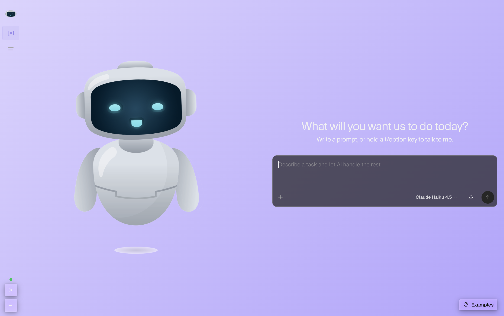

# Your private AI team, running locally on your desktop


Open-source desktop app to run your personal team of AI agents — locally, privately, powerfully.

---

## What Is MyBoTeam?
<p align="center">
  
</p>

MyBoTeam is a premium, open-source, local-first desktop application that empowers you to assemble, orchestrate, and deploy your own private team of specialized AI agents. Unlike standard context-isolated chatbots, MyBoTeam shifts the paradigm from _chatting with an AI_ to _collaborating with an autonomous workforce_.

The platform features an embedded **agent marketplace** where you can download and hot-swap micro-agents customized for highly specific domains — nutritionists, tax advisors, fitness coaches, and more. These agents don't just output text; they operate on your desktop environment via secure, programmatic **Computer Use** (mouse control, keyboard inputs, screen parsing) to automate complex professional and personal workflows.

## Features

- **💬 Conversations (Chat)** — Full conversation UI with real-time streaming, auto-title generation, conversation history, archive/delete, and i18n support
- **🤖 Agent Management** — Create and manage AI agents with custom system prompts, provider/model bindings, and configurable max tokens/timeout
- **🧩 Skills System** — Modular skill-based agent capabilities for specialized domain tasks
- **🔌 MCP Servers** — Model Context Protocol server management for extending agent capabilities
- **⚙️ Settings** — Dedicated settings page (General, Providers, Agents, Skills, MCP Servers, About) with theme toggle and language switcher
- **🔐 Vault & Secrets Management** — AES-256-GCM encrypted credential storage for provider API keys and sensitive configuration
- **🔒 Local-First & Privacy Absolute** — Everything runs on your machine. AES-256-GCM vault encrypts all credentials at rest. No cloud dependency. Zero telemetry without explicit consent. You maintain 100% data ownership.
- **🖥️ Native Desktop Automation** — Agents see your screen and control your keyboard and mouse just like a human operator. No fragile API integrations — direct OS-level interaction.
- **🌐 i18n + RTL** — Full Hebrew/English support with RTL layout via TailwindCSS logical properties. Language preference persists across restarts.
- **🔌 Multi-Provider AI Gateway** — Connect OpenAI, Anthropic, Google, Azure, Bedrock, OpenRouter, DeepSeek, Ollama, LM Studio, and custom OpenAI-compatible providers. Credentials vaulted, models auto-detected.
- **🎨 Dark/Light Theme** — Persisted theme preference with system-aware design tokens.
- **🌊 Open Source (MIT)** — Fully open contribution model.

# THIS PROJECT IS UNDER DEVELOPMENT

## Development

```bash
# Install dependencies
pnpm install

# Start development mode (Electron + web)
pnpm dev

# Start with clean state (reset daemon data)
pnpm dev:clean

# Build all packages
pnpm build

# Run all checks (lint + typecheck)
pnpm check

# Run tests
pnpm test          # unit tests
pnpm test:integration  # integration tests
pnpm test:e2e      # end-to-end tests
```
