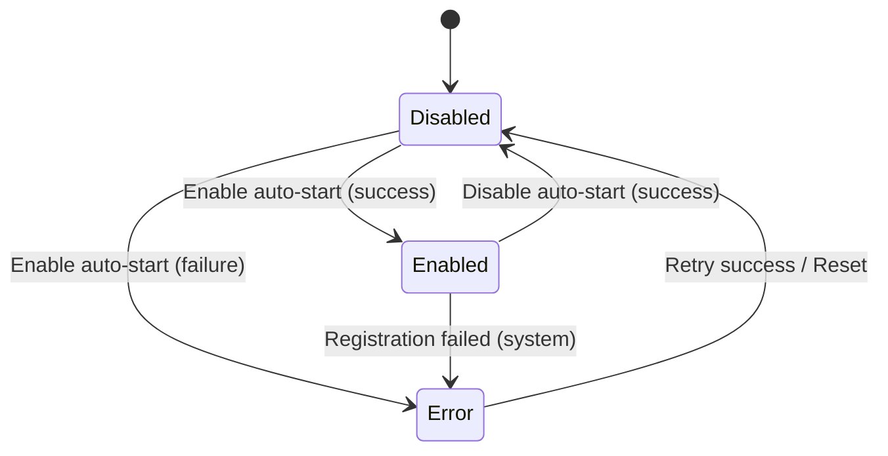

# Data Model: M3.4 Login Item Auto-Start

## Entities

### LoginItem

Represents a macOS login item registration.

| Field | Type | Description | Validation |
|-------|------|-------------|------------|
| id | string | Unique identifier | UUID format |
| applicationPath | string | Path to daemon binary | Must be absolute path |
| label | string | Login item label | Non-empty, unique |
| state | LoginItemState | Current state | Enum: Disabled, Enabled, Error |
| lastUpdated | string | ISO timestamp | Valid ISO 8601 |
| createdAt | string | ISO timestamp | Valid ISO 8601 |
| errorCode | string? | Error code if state=Error | Optional |
| errorMessage | string? | Error message if state=Error | Optional |

### AutoStartPreference

User preference for auto-start functionality.

| Field | Type | Description | Validation |
|-------|------|-------------|------------|
| id | string | Unique identifier | UUID format |
| enabled | boolean | Whether auto-start is enabled | Required |
| method | AutoStartMethod | Registration method used | Enum: AccomplishDefaults, ServiceManagement |
| lastChecked | string | ISO timestamp of last state check | Valid ISO 8601 |
| createdAt | string | ISO timestamp | Valid ISO 8601 |
| updatedAt | string | ISO timestamp | Valid ISO 8601 |

### LoginItemState

Valid states for a login item (Accomplish defaults primary, three states fallback).

| State | Description | Allowed Transitions |
|-------|-------------|---------------------|
| Disabled | Auto-start not registered | → Enabled, → Error |
| Enabled | Auto-start registered and active | → Disabled, → Error |
| Error | Registration failed or error occurred | → Disabled |

### AutoStartMethod

Method used for login item registration.

| Method | Description | When Used |
|--------|-------------|-----------|
| AccomplishDefaults | Primary approach using Accomplish patterns | Default for all versions |
| ServiceManagement | Fallback using macOS Service Management framework | When Accomplish defaults unavailable |

## Relationships

```
AutoStartPreference 1 ─── 1 LoginItem
     │                          │
     │                          │
     └── has state ──────────────┘
```

## State Transitions

### Transition Table

| From State | To State | Trigger | Guard Condition | Action |
|------------|----------|---------|-----------------|--------|
| Disabled | Enabled | User enables auto-start | Registration succeeds | Register login item with macOS |
| Disabled | Error | User enables auto-start | Registration fails | Log error, set errorCode/errorMessage |
| Enabled | Disabled | User disables auto-start | Unregistration succeeds | Remove login item from macOS |
| Enabled | Error | System detects registration failure | macOS reports invalid registration | Log error, set errorCode/errorMessage |
| Error | Disabled | User retries or system reset | Retry succeeds or user dismisses | Clear error, update state |
| Error | Disabled | App launch sync | External state detected as Disabled | Sync with system state |

### State Diagram



## Validation Rules

1. **LoginItem.applicationPath**: Must be a valid absolute path to an existing file
2. **LoginItem.label**: Must be unique across all login items
3. **LoginItem.state**: Must be a valid LoginItemState enum value
4. **AutoStartPreference.enabled**: Boolean, required
5. **AutoStartPreference.method**: Must be a valid AutoStartMethod enum value
6. **Timestamps**: All timestamp fields must be valid ISO 8601 format

## Storage

### Primary Storage
- **User Preferences**: UserDefaults/AppStorage for auto-start preference and login item state
- **Login Item State**: In-memory state with UserDefaults persistence

### Fallback Storage
- **Accomplish Defaults**: System-level defaults for cross-version compatibility
- **Service Management**: macOS system registration for login items

## Persistence Strategy

| Data | Storage Location | Sync Strategy |
|------|------------------|---------------|
| AutoStartPreference.enabled | UserDefaults | Write-through on change |
| LoginItem.state | UserDefaults | Write-through on change |
| LoginItem.errorCode | UserDefaults | Write-through on change |
| LoginItem.errorMessage | UserDefaults | Write-through on change |
| System registration | macOS Service Management | Query on app launch |

## Indexes

| Table | Index | Fields | Purpose |
|-------|-------|--------|---------|
| login_items | idx_login_items_state | state | Quick state queries |
| login_items | idx_login_items_label | label | Label uniqueness check |
| auto_start_preferences | idx_auto_start_enabled | enabled | Filter by enabled status |
